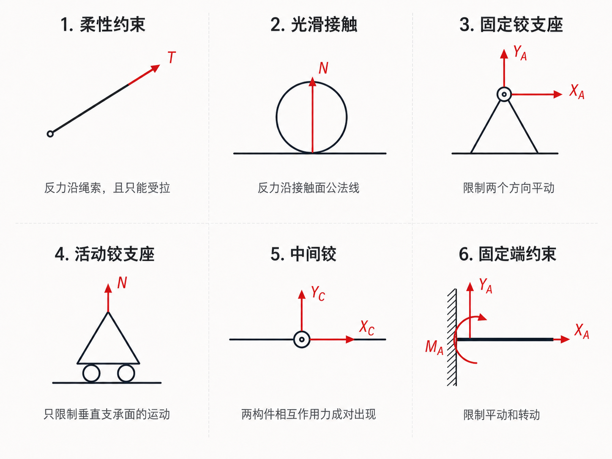
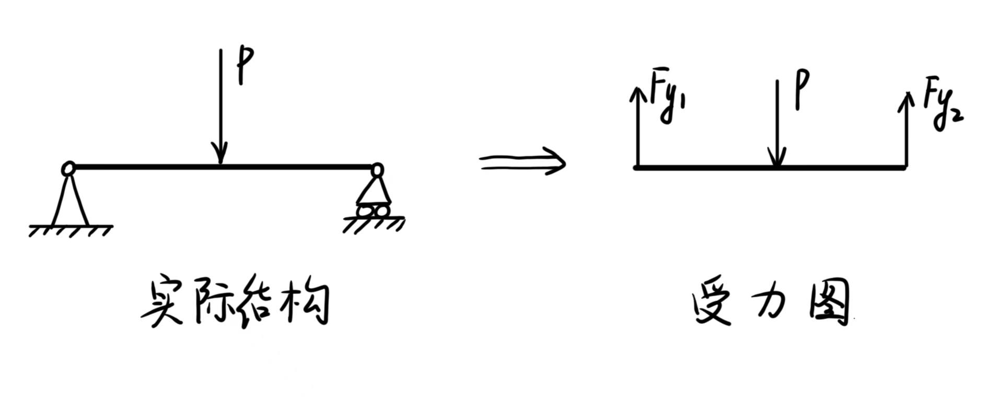

# 第 1 章 静力学基础与受力分析

## 1.1 基本概念

- 刚体：在力作用下形状和大小保持不变的理想物体；静力学中常把研究对象视为刚体。
- 平衡：物体相对于惯性参考系保持静止或作匀速直线运动。
- 力：物体间的相互机械作用，会改变物体运动状态或使物体变形。
- 力系：作用在同一物体上的一组力。

力是矢量，通常由三要素确定：大小、方向、作用点。对刚体而言，还需要关注力的作用线，因为同一作用线上的力可沿作用线移动而不改变对刚体的外效应。

力系首先按作用线是否共面分为平面力系和空间力系；平面力系内部再按作用线关系分为共点、平行和任意三类。

  

    

      <strong>平面力系</strong>
      各力作用线位于同一平面

      

        

          <strong>共点力系</strong>
          作用线交于一点
        

        

          <strong>平行力系</strong>
          作用线彼此平行
        

        

          <strong>任意力系</strong>
          既不共点，也不全平行
        

      

    

    

      <strong>空间力系</strong>
      各力作用线不全在同一平面
    

  

## 1.2 约束与约束力

约束是限制物体某些运动的条件；约束力是约束对被约束物体施加的力。约束力方向总是与被限制运动趋势相反。

常见约束及其反力特征如下：

{ .fig-medium }

| 约束类型 | 约束力特征 |
|---|---|
| 柔性约束 | 绳、链、皮带只能受拉，约束力沿柔性体方向，背离物体。 |
| 光滑接触面约束 | 只限制物体沿接触面公法线方向运动，约束力沿公法线。 |
| 光滑圆柱铰链约束 | 限制垂直于销轴方向的相对移动，通常用两个正交分力表示。 |
| 活动铰支座 | 只限制垂直支承面方向的运动，反力垂直于支承面。 |
| 固定铰支座 | 限制两个方向平动，不限制转动，反力常分解为 $X,Y$。 |
| 固定端约束 | 同时限制平动和转动，约束反力包括 $X,Y$ 与约束力偶矩 $M$。 |

解除约束时，要用对应的约束力代替原约束。

## 1.3 静力学公理

静力学公理用于建立力系等效和受力分析规则：

- 二力平衡公理：刚体受两个力作用而平衡的充要条件是两个力大小相等、方向相反、作用线共线。
- 加减平衡力系公理：在刚体上加上或去掉一个平衡力系，不改变原力系对刚体的作用效应。
- 平行四边形法则：作用于同一点的两个力可合成为一个合力，合力为以两力为邻边的平行四边形对角线。
- 作用与反作用定律：两物体间相互作用力大小相等、方向相反、沿同一直线，且分别作用在两个物体上。

由加减平衡力系公理可得到力的可传性原理：作用在刚体上的力可沿其作用线移动，不改变该力对刚体的外效应。

二力构件是常用判断工具：若构件只受两个力且处于平衡，则这两个力必然等大、反向、共线。

## 1.4 受力分析

受力分析的目标是把研究对象从结构中分离出来，画出其受到的全部外力，形成受力图。

{ .fig-medium }

受力分析步骤：

1. 取研究对象：可以取单个物体、构件、节点，也可以取物体系统。
2. 画主动力：如重力、外载荷、已知集中力、分布力等。
3. 解除约束：把支座、铰链、绳索、接触面等约束去掉。
4. 加约束力：按约束类型补上对应反力或力偶矩。
5. 检查完整性：不多画、不漏画，作用点、方向和符号应清楚。

画受力图时应注意：

- 区分内力与外力：对单个物体画受力图时，其他物体的作用属于外力；取物体系统时，不画系统内部相互作用力。
- 约束力方向不确定时，可先任意假设；计算结果为负表示实际方向相反。
- 拆开两个铰接构件时，中间铰处应画出大小相等、方向相反的成对作用力。
- 柔性约束只能受拉，拉力沿绳索并背离研究对象。
