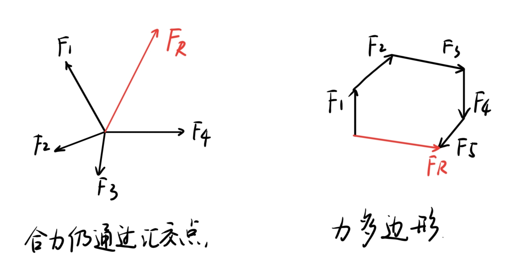
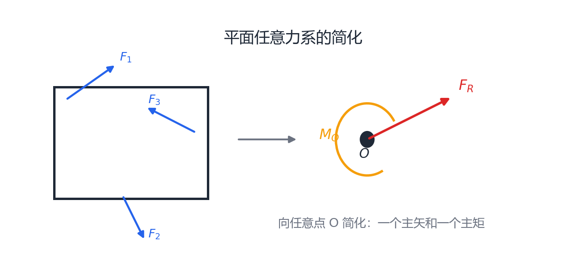
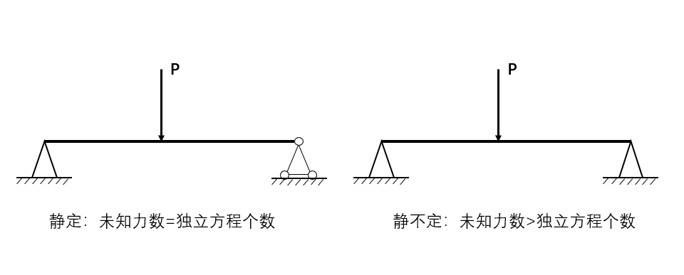

# 第 2 章 平面力系

## 2.1 平面力系基本概念

平面力系是指各力作用线都位于同一平面内的力系。按作用线关系可分为：

- 平面汇交力系：各力作用线汇交于一点，常用几何法或解析法合成。
- 平面力偶系：由若干力偶组成，合成时将各力偶矩代数相加。
- 平面任意力系：各力既不全汇交也不全平行，通常先向一点简化，再列平衡方程。

平面力系平衡的本质是：合力为零，合力矩也为零。

$$
\boldsymbol{F}_R=\boldsymbol{0},\qquad M_O=0
$$

## 2.2 平面汇交力系的合成与平衡

平面汇交力系中，各力作用线汇交于一点，合力也通过该汇交点。

{ .fig-medium }

几何法中，两个共点力可由平行四边形对角线求合力；多个共点力首尾相接构成力多边形，其起点到终点的矢量为合力。力系平衡时，力多边形自行封闭。

解析法：

$$
F_x=F\cos\alpha,\qquad F_y=F\sin\alpha
$$

$$
F_{Rx}=\sum F_x,\qquad F_{Ry}=\sum F_y
$$

这就是合力投影定理：合力在任一轴上的投影，等于各分力在同一轴上投影的代数和。一般情况下，力在某轴上的投影是标量；只有采用直角坐标系时，力沿坐标轴的分量大小才等于它在该轴上的投影。

$$
F_R=\sqrt{F_{Rx}^2+F_{Ry}^2},\qquad
\tan\alpha_R=\frac{F_{Ry}}{F_{Rx}}
$$

平面汇交力系平衡的解析条件为：

$$
\sum F_x=0,\qquad \sum F_y=0
$$

## 2.3 力矩与合力矩定理

力使物体绕某点转动的效应用力矩度量。力 $\boldsymbol{F}$ 对点 $O$ 的矩为：

$$
\boldsymbol{M}_O(\boldsymbol{F})=\boldsymbol{r}\times\boldsymbol{F}
$$

平面问题中，力矩的大小为力与力臂的乘积：

$$
M_O(F)=\pm Fd
$$

其中 $d$ 为点 $O$ 到力作用线的垂直距离。力的作用线通过矩心时，力矩为零；通常约定逆时针转动趋势为正，顺时针为负。

若力的作用点坐标为 $(x,y)$，力的坐标分量为 $F_x,F_y$，则：

$$
M_O(F)=xF_y-yF_x
$$

合力矩定理又称瓦里农定理：力系的合力对任一点的矩，等于各分力对该点力矩的代数和。

$$
M_O(F_R)=\sum_i M_O(F_i)
$$

## 2.4 平面力偶系的合成与平衡

力偶由两个大小相等、方向相反、作用线平行但不共线的力组成。力偶不能合成为一个力，只能使刚体产生转动效应。

力偶矩大小为：

$$
M=Fd
$$

其中 $d$ 为两力作用线间的垂直距离。力偶矩方向按转向确定，平面问题中常约定逆时针为正、顺时针为负。

力偶的性质：

- 力偶无合力，即 $\displaystyle \sum\boldsymbol{F}=0$，但对刚体仍有转动效应。
- 力偶矩与取矩点无关，对平面内任一点取矩的结果相同。
- 力偶可在其作用平面内任意移动，不改变对刚体的作用效应。
- 同一平面内力偶矩大小相等、转向相同的两个力偶彼此等效。

平面力偶系合成为一个合力偶：

$$
M_R=\sum M_i
$$

平面力偶系平衡条件为：

$$
\sum M_i=0
$$

## 2.5 力向一点平移

作用在刚体上某点 $A$ 的力 $\boldsymbol{F}$ 可平移到另一点 $O$，但必须附加一个力偶，附加力偶矩等于原力对新点 $O$ 的矩。

$$
M_O=\boldsymbol{r}_{OA}\times \boldsymbol{F}
$$

这就是平面任意力系向一点简化的基础。

## 2.6 平面任意力系的简化与平衡

平面任意力系向平面内任意一点 $O$ 简化后，得到一个主矢和一个主矩：

{ .fig-wide }

$$
\boldsymbol{F}_R=\sum\boldsymbol{F}_i
$$

$$
M_O=\sum M_O(\boldsymbol{F}_i)
$$

简化结果的判别：

| 主矢 $\boldsymbol{F}_R$ | 主矩 $M_O$ | 简化结果 |
|---|---|---|
| $\boldsymbol{F}_R\ne 0$ | 任意 | 可简化为一个合力。 |
| $\boldsymbol{F}_R=0$ | $M_O\ne 0$ | 可简化为一个合力偶。 |
| $\boldsymbol{F}_R=0$ | $M_O=0$ | 力系平衡。 |

平面任意力系平衡的基本条件：

$$
\sum F_x=0,\qquad \sum F_y=0,\qquad \sum M_O=0
$$

常用等价形式：

| 方程形式 | 平衡方程 | 适用条件 |
|---|---|---|
| 一矩式 | $\displaystyle \sum F_x=0,\quad \sum F_y=0,\quad \sum M_O=0$ | 通用形式。 |
| 二矩式 | $\displaystyle \sum F_x=0,\quad \sum M_A=0,\quad \sum M_B=0$ | $A,B$ 连线不能垂直于 $x$ 轴。 |
| 三矩式 | $\displaystyle \sum M_A=0,\quad \sum M_B=0,\quad \sum M_C=0$ | $A,B,C$ 三点不共线。 |

对平面平行力系，若各力均与 $y$ 轴平行，常用：

$$
\sum F_y=0,\qquad \sum M_O=0
$$

### 分布载荷的等效

分布载荷可等效为一个集中力。设梁上分布载荷集度为 $q(x)$，作用区间为 $[a,b]$，则等效合力的大小等于载荷图的面积：

$$
F_R=\int_a^b q(x)\,dx
$$

合力作用线的位置由合力矩定理确定：

$$
x_R=\frac{\displaystyle\int_a^b xq(x)\,dx}
{\displaystyle\int_a^b q(x)\,dx}
$$

即等效集中力通过载荷图的形心。常见情况：均布载荷 $q$ 作用于长度 $l$ 时，$F_R=ql$，作用于区段中点；三角形分布载荷的合力为 $F_R=q_{\max}l/2$，作用点距载荷较大端 $l/3$。

## 2.7 静定与静不定问题

静力学中，若仅依靠独立平衡方程即可求出全部未知约束力，则为静定问题；若未知量个数多于独立平衡方程数，则为静不定问题。

{ .fig-wide }

平面问题中，共线力系有 $1$ 个独立平衡方程，平面汇交力系和平面平行力系各有 $2$ 个，平面任意力系有 $3$ 个。

设未知力个数为 $n$，独立平衡方程数为 $m$：$n=m$ 时问题静定；$n<m$ 时约束不足，结构可能成为机构；$n>m$ 时问题静不定，需要补充变形协调条件或材料关系。
