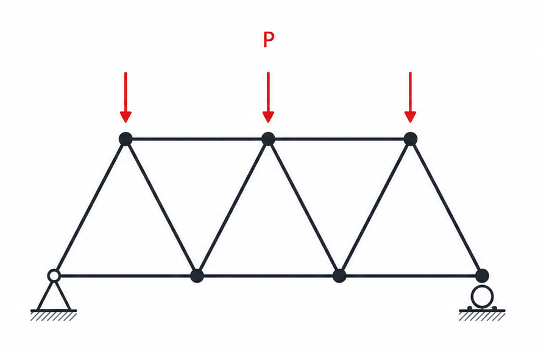
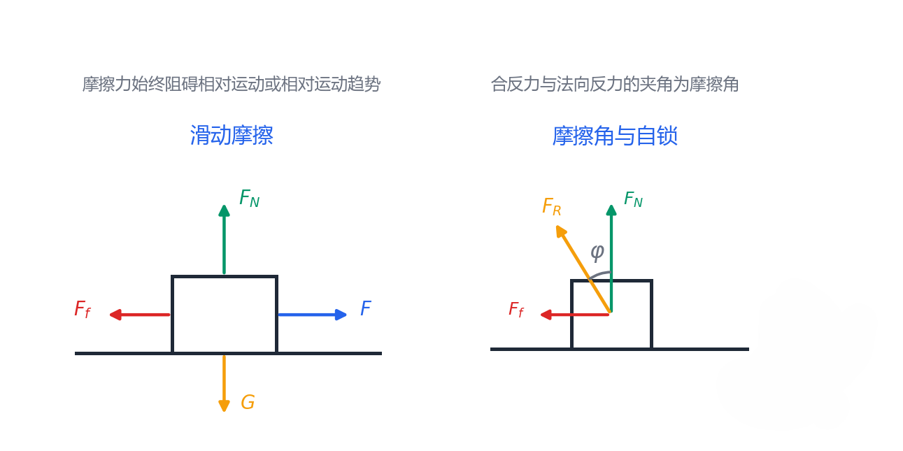
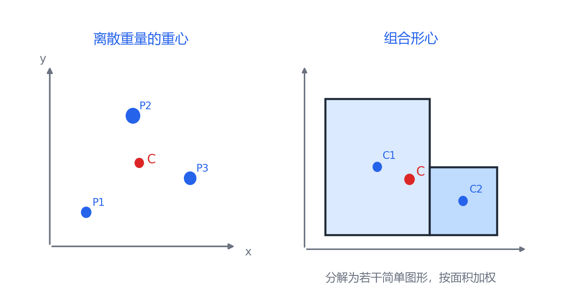

# 第 3 章 桁架、摩擦与重心

## 3.1 桁架的基本假设

桁架是由直杆在节点处连接而成的结构。工程力学中常采用理想桁架模型。

理想桁架基本假设：

- 各杆件在节点处用光滑铰链连接。
- 杆件均为直杆，各杆轴线通过节点中心。
- 荷载和支座反力均作用在节点上。
- 忽略杆件自重；若不能忽略，通常将其等效分配到节点。

满足这些假设时，桁架杆件只承受轴向力，即杆件为二力杆；杆内力只有拉力或压力，没有剪力和弯矩。

{ .fig-medium }

## 3.2 桁架内力计算方法

桁架内力常用两种方法：节点法和截面法。

| 方法 | 适用思路 | 方程 |
|---|---|---|
| 节点法 | 逐个取节点为研究对象，适合求较多杆件内力。 | 每个节点可列 $\displaystyle \sum F_x=0,\ \sum F_y=0$。 |
| 截面法 | 用截面切开桁架，取一部分为研究对象，适合直接求少数指定杆件内力。 | 可列 $\displaystyle \sum F_x=0,\ \sum F_y=0,\ \sum M=0$。 |

节点法要点：先求整体支座反力，再从未知杆力不超过两个的节点开始；杆力可先假设为拉力，若结果为负，则实际为压力。

截面法要点：截面一般切过不超过三根未知杆，取截开后的一侧为研究对象；对部分未知杆作用线的交点取矩，可直接消去这些未知量。

## 3.3 滑动摩擦

摩擦力总是阻碍接触面间的相对运动或相对运动趋势。滑动摩擦分为静滑动摩擦和动滑动摩擦。

{ .fig-wide }

静滑动摩擦：

$$
0\le F_f\le F_{f\max}
$$

$$
F_{f\max}=f_sF_N
$$

动滑动摩擦：

$$
F_f=fF_N
$$

其中 $f_s$ 为静摩擦系数，$f$ 为动摩擦系数，通常动摩擦系数小于静摩擦系数。

摩擦问题受力分析要点：

- 摩擦力方向与相对运动或相对运动趋势方向相反。
- 未达到临界状态时，静摩擦力由平衡方程确定，不一定等于 $f_sF_N$。
- 物体处于将滑未滑状态时，摩擦力达到最大静摩擦力。
- 发生相对滑动后，动摩擦力按 $F_f=fF_N$ 计算。

## 3.4 摩擦角与自锁

粗糙接触面处，法向反力 $F_N$ 与摩擦力 $F_f$ 的合力称为全反力或合反力。临界状态下，全反力与法线的夹角称为摩擦角。

$$
\tan\varphi_{\max}=\frac{F_{f\max}}{F_N}=f_s
$$

若主动力合力的作用线位于摩擦角范围内，物体不会发生滑动，这称为自锁。

$$
\psi\le \varphi_{\max}
$$

其中 $\psi$ 为主动力合力与接触面法线的夹角。

## 3.5 滚动摩阻

滚动摩阻通常由接触变形和接触压力分布偏移等因素引起。静止或尚未滚动时，滚动摩阻力偶矩随主动力矩变化：

$$
0\leq M_f\leq M_{f\max}
$$

达到临界滚动状态时：

$$
M_{f\max}=\delta F_N
$$

其中 $\delta$ 为滚动摩阻系数，量纲为长度。滚动摩阻力偶矩方向与轮子滚动趋势方向相反。

## 3.6 重心与形心

重心是物体重力合力的作用点；质心是质量分布的中心；形心是几何图形面积或体积分布的中心。若物体密度均匀且重力场均匀，重心、质心和形心可重合。

{ .fig-wide }

离散重力系统的重心坐标：

$$
x_c=\frac{\sum P_ix_i}{\sum P_i},\qquad
y_c=\frac{\sum P_iy_i}{\sum P_i},\qquad
z_c=\frac{\sum P_iz_i}{\sum P_i}
$$

连续体重心坐标：

$$
x_c=\frac{\int_V x\rho g\,dV}{\int_V \rho g\,dV},\qquad
y_c=\frac{\int_V y\rho g\,dV}{\int_V \rho g\,dV},\qquad
z_c=\frac{\int_V z\rho g\,dV}{\int_V \rho g\,dV}
$$

若物体密度均匀、重力加速度近似不变，则可化为体积形心：

$$
x_c=\frac{\int_V x\,dV}{\int_V dV},\qquad
y_c=\frac{\int_V y\,dV}{\int_V dV},\qquad
z_c=\frac{\int_V z\,dV}{\int_V dV}
$$

组合平面图形的形心坐标：

$$
x_c=\frac{\sum A_ix_i}{\sum A_i},\qquad
y_c=\frac{\sum A_iy_i}{\sum A_i}
$$

求重心或形心的常用方法：标准几何图形可直接查表；复杂截面可拆成若干简单图形使用组合法；孔洞或挖去部分采用负面积法；薄板的重心还可通过悬挂实验确定。
