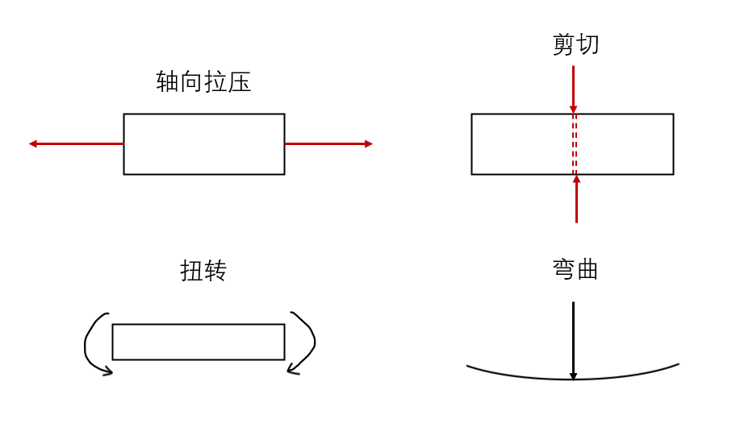
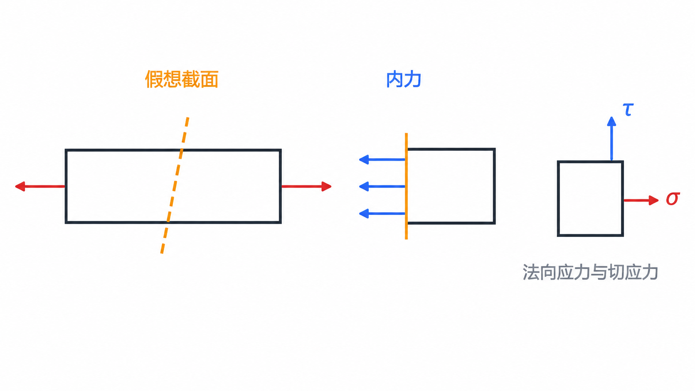

# 第 4 章 材料力学绪论

## 4.1 外力及其分类

外力是外界物体对构件的作用力，可按作用方式和时间变化分类。

{ .fig-medium }

表面力中，若作用面积很小，可近似为集中力；若分布在一定面积或长度上，则为分布力。

## 4.2 构件的承载能力

材料力学研究构件在外力作用下的强度、刚度和稳定性。

| 承载能力 | 含义 | 失效形式 |
|---|---|---|
| 强度 | 构件抵抗破坏的能力。 | 发生不可恢复塑性变形或断裂。 |
| 刚度 | 构件抵抗弹性变形的能力。 | 弹性变形过大，影响正常工作。 |
| 稳定性 | 构件保持原有平衡状态的能力。 | 平衡形式突然改变，如压杆屈曲。 |

失效是指构件丧失正常工作能力，不一定只表现为断裂；过大的弹性变形或失稳也属于失效。

## 4.3 变形固体的基本假设

材料力学中的变形固体通常采用以下基本假设：

{ .fig-medium }

## 4.4 杆件及其基本变形形式

工程构件按几何尺寸可粗略分为：杆件，一个方向尺寸远大于横截面尺寸，常记为 $L\gg s$；板壳，厚度远小于面内尺寸，常记为 $h\ll a$；块体，三个方向尺寸相差不大。

材料力学主要研究杆件。杆件的基本变形形式有四种：

{ .fig-medium }

- 轴向拉伸或压缩：外力沿杆轴线作用，横截面沿轴线方向移动。
- 剪切：外力使相邻截面发生相对错动。
- 扭转：外力偶作用在垂直于杆轴的平面内，横截面绕轴线相对转动。
- 弯曲：外力使杆件轴线由直线变为曲线。

实际构件可能同时发生多种基本变形，此时称为组合变形。

## 4.5 内力与截面法

内力是构件内部相邻部分之间的相互作用力。外力作用后，构件各部分相对位置发生改变，内部由此产生相互平衡的附加力。

内力计算常用截面法：

{ .fig-medium }

截面法可概括为“截、取、代、平衡”：

1. 截：在要求内力的位置作假想截面，将构件切开。
2. 取：取截面一侧为研究对象。
3. 代：用截面上的内力代替另一部分的作用。
4. 平衡：列静力平衡方程求内力。

## 4.6 应力

应力是内力在截面上某点处的集度，反映内力在局部区域的强弱。平均正应力可写为：

$$
\sigma=\frac{F_N}{A}
$$

应力按方向分为正应力 $\sigma$ 和切应力 $\tau$：正应力垂直于截面，以拉应力为正、压应力为负；切应力平行于截面，其方向按所取坐标和截面法向规定。

斜截面上的应力一般可分解为正应力和切应力。应力的单位为帕斯卡：

$$
1\ \mathrm{Pa}=1\ \mathrm{N/m^2}
$$

工程中常用 $\mathrm{MPa}$：

$$
1\ \mathrm{MPa}=10^6\ \mathrm{Pa}=1\ \mathrm{N/mm^2}
$$

## 4.7 位移、变形与应变

位移描述构件上点的位置变化；变形描述构件形状和尺寸的变化。

变形可分为线变形和角变形：前者表现为线段长度变化，后者表现为两线段之间的夹角变化。

应变用于度量构件一点附近的变形程度。

平均正应变：

$$
\varepsilon=\frac{\Delta l}{l}
$$

一点处沿 $x$ 方向的正应变可表示为：

$$
\varepsilon_x=\lim_{\Delta x\to 0}\frac{\Delta s}{\Delta x}
$$
