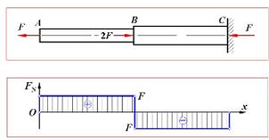
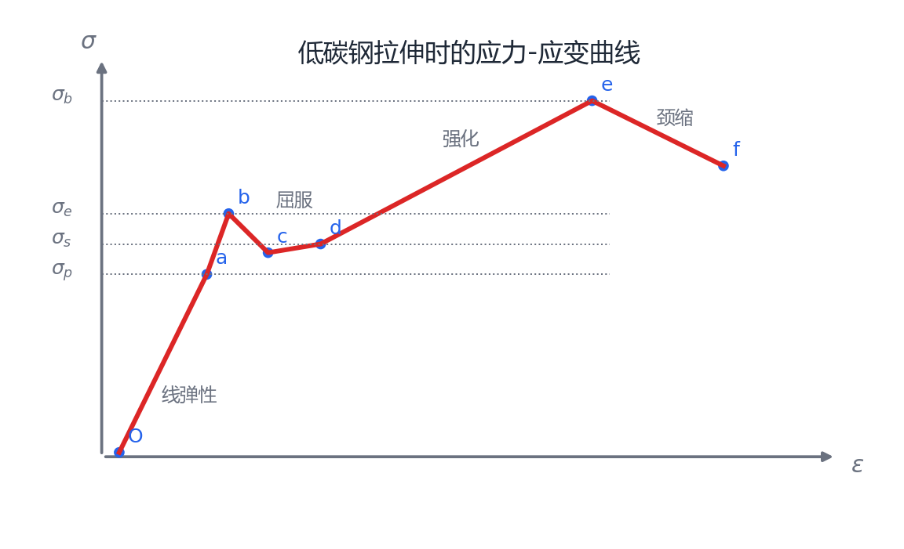
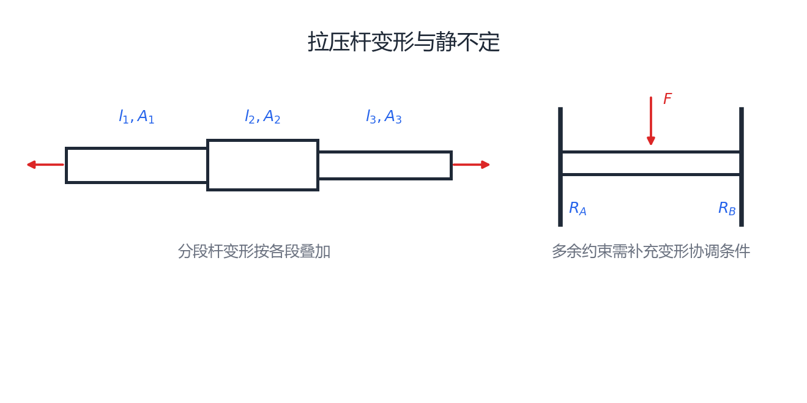

# 第 5 章 轴向拉压、应力集中与剪切挤压

## 5.1 轴向拉压的内力与轴力图

轴向拉压是指外力合力作用线与杆件轴线重合，杆件主要发生轴向伸长或缩短。轴向拉压杆的内力称为轴力，记为 $F_N$；通常约定拉力为正、压力为负。

求轴力用截面法：在所求截面处假想切开，取一侧为研究对象，列轴向平衡方程。轴力图用横坐标表示杆件轴线位置，用纵坐标表示截面轴力 $F_N$，反映轴力沿杆长的变化。

{ .fig-wide }

## 5.2 横截面正应力与圣维南原理

轴向拉压杆横截面上的平均正应力为：

$$
\sigma=\frac{F_N}{A}
$$

其中 $A$ 为横截面面积。远离加载端和截面突变处时，横截面上的正应力可近似认为均匀分布。

圣维南原理：力在杆端的具体分布方式只影响杆端附近的局部应力分布；远离加载端约 $1\sim2$ 个横向尺寸后，应力分布主要由力的合力决定。

## 5.3 斜截面上的应力

设横截面正应力为 $\sigma_0=F/A$，斜截面法线与杆轴夹角为 $\alpha$，则斜截面上的全应力为：

$$
p_\alpha=\sigma_0\cos\alpha
$$

斜截面正应力与切应力分别为：

$$
\sigma_\alpha=p_\alpha\cos\alpha=\sigma_0\cos^2\alpha
$$

$$
\tau_\alpha=p_\alpha\sin\alpha=\frac{\sigma_0}{2}\sin2\alpha
$$

最大正应力出现在 $\alpha=0^\circ$ 的横截面上，$\sigma_{\max}=\sigma_0$；最大切应力出现在 $\alpha=45^\circ$ 的斜截面上，$\tau_{\max}=\sigma_0/2$。正应力通常约定拉应力为正、压应力为负。

## 5.4 材料拉伸时的力学性能

低碳钢拉伸时的典型应力-应变曲线如下：

{ .fig-medium }

低碳钢拉伸曲线可分为：线弹性阶段 $Oa$，应力与应变成正比；弹性阶段，卸载后仍无残余变形；屈服阶段 $bc$，应力基本不变而应变明显增加；强化阶段 $ce$，材料抵抗变形能力提高；局部颈缩阶段 $ef$，试样局部截面急剧缩小并最终断裂。

常用强度指标：$\sigma_p$ 为比例极限，$\sigma_e$ 为弹性极限，$\sigma_s$ 为屈服极限，$\sigma_b$ 为强度极限。

在线弹性范围内满足胡克定律：

$$
\sigma=E\varepsilon
$$

其中 $E$ 为弹性模量，表示材料抵抗弹性变形的能力。

冷作硬化：试件加载至塑性阶段后卸载，再重新加载时，弹性极限提高，但塑性变形能力降低。

塑性指标包括断后伸长率 $\delta$ 和断面收缩率 $\psi$：

$$
\delta=\frac{l_1-l_0}{l_0}\times100\%,\qquad
\psi=\frac{A_0-A_1}{A_0}\times100\%
$$

常以 $\delta>5\%$ 判断为塑性材料，$\delta<5\%$ 判断为脆性材料。

## 5.5 材料压缩时的力学性能

低碳钢压缩时，屈服极限、弹性模量与拉伸时基本相同，但不会像拉伸那样发生颈缩断裂。

铸铁等脆性材料压缩强度明显高于拉伸强度，破坏常沿与轴线约 $45^\circ$ 的斜截面发生。温度升高时，材料弹性模量、屈服强度和抗拉强度一般有降低趋势。

## 5.6 许用应力与强度条件

构件设计时不直接使用极限应力，而是引入安全系数 $n$，得到许用应力：

$$
[\sigma]=\frac{\sigma_u}{n}
$$

塑性材料通常取屈服极限 $\sigma_s$ 作为极限应力，脆性材料通常取强度极限 $\sigma_b$ 作为极限应力。轴向拉压强度条件为：

$$
\sigma_{\max}=\frac{|F_N|}{A}\le[\sigma]
$$

这个条件可用于三类问题：已知载荷和截面时作强度校核；已知载荷和许用应力时设计截面；已知截面和许用应力时求许可载荷。

## 5.7 应力集中

应力集中是指孔洞、槽口、尖角、截面突变等几何不连续处局部应力显著增大的现象。

应力集中系数为：

$$
\alpha=\frac{\sigma_{\max}}{\sigma_n}
$$

带孔板按净截面计算名义应力时：

$$
\sigma_n=\frac{F}{(b-d)\delta}
$$

其中 $b$ 为板宽，$d$ 为孔径，$\delta$ 为板厚。工程中常通过圆角过渡、避免尖角、增大过渡半径、合理布置孔洞等方式减弱应力集中。

应力集中主要局限在孔洞、槽口和截面突变附近，离开局部区域后应力分布会逐渐趋于均匀。其影响与材料及载荷性质有关：塑性材料承受静载荷时，局部屈服可使应力重新分布，通常对应力集中不太敏感；脆性材料以及承受交变载荷的构件对应力集中较敏感，设计时应重点校核。

## 5.8 剪切与挤压

铆接、螺栓连接、销连接、键连接等连接件通常需要同时考虑剪切和挤压。

剪切名义应力与强度条件：

$$
\tau=\frac{F_s}{A_s},\qquad \frac{F_s}{A_s}\le[\tau]
$$

许用切应力由材料的极限切应力 $\tau_u$ 和安全因数 $n$ 确定：

$$
[\tau]=\frac{\tau_u}{n}
$$

工程计算中常采用以下经验关系：塑性材料 $[\tau]\approx(0.5\sim0.577)[\sigma]$，脆性材料 $[\tau]\approx(0.8\sim1.0)[\sigma]$。

挤压应力与强度条件：

$$
\sigma_{bs}=\frac{F_{bs}}{A_{bs}},\qquad
\frac{F_{bs}}{A_{bs}}\le[\sigma_{bs}]
$$

许用挤压应力通常根据材料和连接形式由许用正应力估算：塑性材料 $[\sigma_{bs}]\approx(1.5\sim2.5)[\sigma]$，脆性材料 $[\sigma_{bs}]\approx(0.9\sim1.5)[\sigma]$。这些系数属于工程经验范围，具体设计应按课程所给数据或相应规范取值。

单剪有一个剪切面，双剪有两个剪切面；接触面为半圆柱面时，挤压面积通常取其在挤压面上的投影面积。提高连接强度的常用方法是增加连接件数量或增大承载面积。

## 5.9 拉压杆变形

轴向拉压杆在线弹性范围内满足：

$$
\sigma=E\varepsilon,\qquad \sigma=\frac{F_N}{A},\qquad \varepsilon=\frac{\Delta l}{l}
$$

等截面直杆的轴向变形为：

$$
\Delta l=\frac{F_Nl}{EA}
$$

其中 $EA$ 称为拉压刚度。

{ .fig-wide }

变截面或变轴力杆：

$$
\Delta l=\int_0^l\frac{F_N(x)}{E A(x)}\,dx
$$

分段等截面杆：

$$
\Delta l=\sum_{i=1}^{n}\frac{F_{Ni}l_i}{E_iA_i}
$$

## 5.10 横向变形与泊松比

拉压杆受轴向变形时，横向尺寸也会变化。杆件拉伸时，纵向线应变为正，横向线应变为负；杆件压缩时相反。

泊松比定义为：

$$
\mu=-\frac{\varepsilon'}{\varepsilon}
$$

其中 $\varepsilon$ 为纵向线应变，$\varepsilon'$ 为横向线应变。在线弹性范围内：

$$
\varepsilon'=-\mu\varepsilon=-\frac{\mu\sigma}{E}
$$

均匀各向同性线弹性材料的泊松比通常满足 $0<\mu<0.5$。

## 5.11 轴向拉压应变能

轴向拉压杆中，外力所做功可转化为杆件的应变能。在线弹性范围内：

$$
V_\varepsilon=\frac12F\Delta l
$$

对等截面直杆：

$$
V_\varepsilon=\frac12F\cdot\frac{Fl}{EA}
=\frac{F^2l}{2EA}
$$

单位体积应变能：

$$
v_\varepsilon=\frac{V_\varepsilon}{Al}
=\frac12\sigma\varepsilon
=\frac{\sigma^2}{2E}
=\frac{E\varepsilon^2}{2}
$$

## 5.12 简单拉压静不定问题

静不定拉压问题中，未知力数量多于独立平衡方程数量，需要补充变形协调条件。基本思路是：先建立静力平衡方程，再建立变形协调方程，最后利用物理方程 $\Delta l=F_Nl/(EA)$ 联系力与变形并联立求解。

温度应力属于典型静不定问题。若杆件温度变化引起的自由伸缩被约束阻止，则会产生附加内力和应力。
