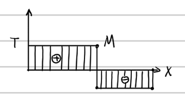
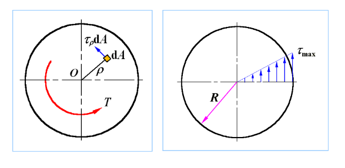

# 第 6 章 扭转

## 6.1 扭转的概念

扭转是指杆件受到作用面垂直于杆轴的外力偶作用，各横截面绕杆轴发生相对转动，杆轴仍近似保持为直线的变形形式。以扭转为主要变形的杆件称为轴。

扭转外力偶矩常由功率和转速换算：

$$
M_e=\frac{60000P}{2\pi n}=9549\frac{P}{n}\quad \mathrm{N\cdot m}
$$

其中 $P$ 的单位为 $\mathrm{kW}$，$n$ 的单位为 $\mathrm{r/min}$。

## 6.2 扭矩与扭矩图

截面上的内力偶矩称为扭矩，记为 $T$。求扭矩仍用截面法：在指定截面处假想切开，取一侧为研究对象，由力偶矩平衡求出截面扭矩。

{ .fig-wide }

扭矩正负号常用右手螺旋法则判断：若扭矩矢量方向与截面外法线方向一致，取正；方向相反，取负。扭矩图用横坐标表示轴线位置，用纵坐标表示扭矩 $T$。

## 6.3 薄壁圆筒扭转切应力

薄壁圆筒受扭时，圆筒上无正应力；沿圆周各点切应力大小相等，方向垂直于半径。

设平均半径为 $R_0$，壁厚为 $\delta$，切应力为 $\tau$，则：

$$
T=\int_0^{2\pi}R_0\cdot \tau\delta R_0\,d\theta
=2\pi R_0^2\delta\tau
$$

因此：

$$
\tau=\frac{T}{2\pi R_0^2\delta}
$$

该公式适用于薄壁圆筒。在线弹性范围内，当 $\delta\le R_0/10$ 时，近似误差不超过约 $4.53\%$。

## 6.4 切应力互等定理与剪切胡克定律

在微元相互垂直的两个截面上，垂直于两截面交线的切应力大小相等，并且同时指向或同时背离两截面的交线，这称为切应力互等定理：

$$
\tau_{xy}=\tau_{yx}
$$

成对切应力使微元发生角度改变，该角度变化用切应变 $\gamma$ 表示。

切应力 $\tau$ 与切应变 $\gamma$ 在线弹性范围内满足：

$$
\tau=G\gamma
$$

其中 $G$ 为切变模量。各向同性材料有：

$$
G=\frac{E}{2(1+\mu)}
$$

这里 $E$ 为弹性模量，$\mu$ 为泊松比。

## 6.5 圆轴扭转切应力

圆轴扭转时，横截面仍保持平面，横截面像刚性圆盘一样绕轴线转动。切应力沿半径线性分布，轴心处为零，外表面最大。

{.fig-medium}

圆轴扭转切应力公式：

$$
\tau_\rho=\frac{T\rho}{I_p}
$$

外表面最大切应力为：

$$
\tau_{\max}=\frac{TR}{I_p}=\frac{T}{W_p}
$$

其中 $I_p$ 为横截面对圆心的极惯性矩，$W_p=I_p/R$ 为抗扭截面系数。

实心圆截面：

$$
I_p=\frac{\pi D^4}{32},\qquad W_p=\frac{\pi D^3}{16}
$$

空心圆截面：

$$
I_p=\frac{\pi D^4}{32}(1-\alpha^4),\qquad
W_p=\frac{\pi D^3}{16}(1-\alpha^4),\qquad
\alpha=\frac{d}{D}
$$

## 6.6 圆轴扭转强度条件

圆轴扭转强度条件为：

$$
\tau_{\max}=\left(\frac{T}{W_p}\right)_{\max}\le[\tau]
$$

其中 $[\tau]$ 为许用切应力。塑性材料扭转破坏通常表现为沿横截面剪断；脆性材料扭转破坏常沿约 $45^\circ$ 螺旋面断裂。

强度设计常见任务：已知轴径和扭矩时校核强度；已知扭矩和许用应力时设计轴径；已知轴径和许用应力时求允许扭矩。

圆轴截面的合理设计应尽量增大抗扭截面系数 $W_p$。在横截面面积相同的条件下，空心圆轴将材料布置在离轴线较远的位置，通常比实心圆轴具有更大的 $W_p$，材料利用更充分；同时应避免轴径突然变化，并在变截面处采用圆角过渡，以减弱应力集中。

## 6.7 圆轴扭转变形与刚度

圆轴扭转角微分关系为：

$$
\frac{d\varphi}{dx}=\frac{T(x)}{G I_p}
$$

一般情况下：

$$
\varphi=\int_0^l\frac{T(x)}{G I_p}\,dx
$$

等直圆轴且扭矩不变时：

$$
\varphi=\frac{Tl}{GI_p}
$$

其中 $GI_p$ 称为抗扭刚度。单位长度扭转角为：

$$
\theta=\frac{d\varphi}{dx}=\frac{T}{GI_p}
$$

刚度条件为：

$$
\theta_{\max}=\left(\frac{T}{GI_p}\right)_{\max}\le[\theta]
$$

## 6.8 非圆截面杆扭转

非圆截面杆扭转时，横截面一般不再保持平面，会发生翘曲。因此非圆截面扭转不能直接套用圆轴扭转的平截面假设。

非圆截面扭转可分为自由扭转和约束扭转。自由扭转时，截面翘曲不受限制；约束扭转时，翘曲受到约束，会产生附加正应力。

矩形截面杆常用近似公式：

$$
\tau_{\max}=\frac{T}{W_p},\qquad
\varphi=\frac{Tl}{G I_p}
$$

其中：

$$
W_p=\alpha h b^2,\qquad I_p=\beta h b^3
$$

$\alpha,\beta$ 为与截面高宽比有关的系数。对于狭长矩形截面，可近似取：

$$
I_p=\frac13h\delta^3,\qquad W_p=\frac13h\delta^2
$$

矩形截面的切应力沿边界切向分布，四个角点处切应力为零；最大切应力出现在长边中点，短边中点还存在一个较小的极值。狭长矩形截面中，除短边附近外，沿长边方向的切应力近似均匀。
