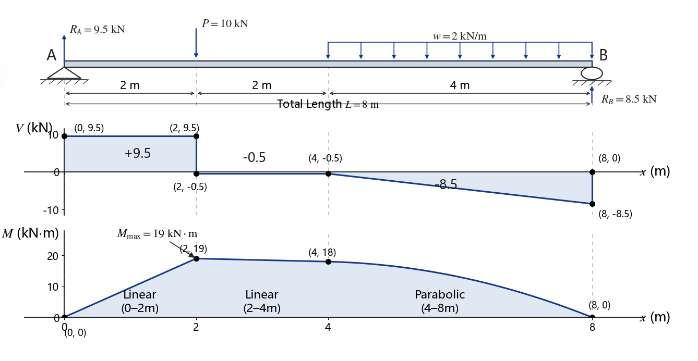
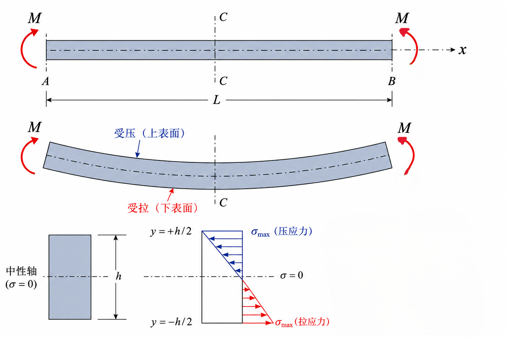

# 第 7 章 弯曲内力与弯曲应力

## 7.1 弯曲及其特征

弯曲是杆件在垂直于杆轴的外力或外力偶作用下，轴线由直线变为曲线的变形形式。若外力都作用在包含梁轴线的纵向平面内，则称为平面弯曲；若梁有纵向对称面，外力也位于该对称面内，则称为对称弯曲。

梁常简化为只保留轴线、荷载和支座的计算简图。常见支座包括固定铰支座、活动铰支座和固定端。按支承形式，常见梁可分为：

- 悬臂梁：一端固定，另一端自由。
- 简支梁：一端为固定铰支座，另一端为活动铰支座。
- 外伸梁：梁的一端或两端伸出支座之外。

若梁的全部支反力都能由静力平衡方程求出，称为静定梁；若未知支反力多于独立平衡方程，则称为超静定梁，还需补充变形协调条件。

## 7.2 弯曲内力

梁横截面上的弯曲内力主要包括剪力 $F_S$ 和弯矩 $M$。剪力是截面上分布内力在垂直梁轴方向的合力；弯矩是截面上分布内力对截面形心的合力矩。

{ .fig-wide }

符号规定常取：使隔离体有顺时针转动趋势的剪力为正；使梁段下侧受拉、上侧受压的弯矩为正。实际计算中只要前后一致即可。

用截面法求内力：在所求截面处假想切开，取一侧为研究对象，按平衡方程求 $F_S$ 和 $M$。剪力图和弯矩图分别表示 $F_S(x)$ 与 $M(x)$ 沿梁长的变化，用于确定危险截面。

## 7.3 荷载、剪力和弯矩的微分关系

设分布荷载集度为 $q(x)$，剪力为 $F_S(x)$，弯矩为 $M(x)$。在常用符号约定下有：

$$
\frac{dF_S}{dx}=q(x),\qquad
\frac{dM}{dx}=F_S(x)
$$

因此：

$$
\frac{d^2M}{dx^2}=q(x)
$$

这些关系用于快速绘制剪力图和弯矩图：无分布荷载段剪力为常数、弯矩为一次函数；均布荷载段剪力为一次函数、弯矩为二次函数；集中力使剪力图突变，集中力偶使弯矩图突变。由于 $dM/dx=F_S$，在剪力 $F_S=0$ 且发生变号的位置，弯矩通常取得极值。

## 7.4 纯弯曲正应力

纯弯曲指梁段横截面上只有弯矩而无剪力。纯弯曲时通常采用平面假设：变形前为平面的横截面，变形后仍保持平面，并绕某一中性轴转动。

{ .fig-wide }

中性层与横截面的交线称为中性轴。中性轴处正应力为零；距中性轴越远，正应力绝对值越大。

线应变与曲率半径关系：

$$
\varepsilon=\frac{y}{\rho}
$$

由胡克定律得：

$$
\sigma=E\varepsilon=E\frac{y}{\rho}
$$

由截面轴力为零可得中性轴通过截面形心。横向力矩为零还要求弯曲所绕的轴为截面的形心主惯性轴，即相应惯性积 $I_{yz}=0$；对具有纵向对称面、载荷又作用在该对称面内的对称弯曲，这一条件自然满足。由弯矩平衡可得：

$$
\frac{1}{\rho}=\frac{M}{EI_z}
$$

于是梁横截面上的弯曲正应力公式为：

$$
\sigma=\frac{My}{I_z}
$$

其中 $I_z$ 是横截面对中性轴 $z$ 的惯性矩，$y$ 是所求点到中性轴的距离。

## 7.5 弯曲正应力强度条件

截面边缘处 $|y|$ 最大，正应力绝对值最大：

$$
\sigma_{\max}=\frac{M_{\max}y_{\max}}{I_z}
=\frac{M_{\max}}{W_z}
$$

其中：

$$
W_z=\frac{I_z}{y_{\max}}
$$

称为抗弯截面系数。弯曲正应力强度条件为：

$$
\sigma_{\max}=\frac{M_{\max}}{W_z}\le[\sigma]
$$

常用截面参数：

$$
I_z=\frac{bh^3}{12},\qquad W_z=\frac{bh^2}{6}\quad\text{矩形截面}
$$

$$
I_z=\frac{\pi D^4}{64},\qquad W_z=\frac{\pi D^3}{32}\quad\text{实心圆截面}
$$

$$
I_z=\frac{\pi D^4}{64}(1-\alpha^4),\qquad
W_z=\frac{\pi D^3}{32}(1-\alpha^4)\quad\text{空心圆截面}
$$

组合截面惯性矩常用平行轴定理：

$$
I_z=I_{z0}+Aa^2
$$

## 7.6 弯曲切应力

梁横截面上同时存在剪力时，还会产生弯曲切应力。常用公式为：

$$
\tau=\frac{F_S S_z^*}{I_z b}
$$

其中 $S_z^*$ 为所求点以外部分面积对中性轴的静矩，$b$ 为该点处截面宽度。

矩形截面最大切应力出现在中性轴处：

$$
\tau_{\max}=\frac{3F_S}{2A}
$$

圆截面最大切应力也出现在中性轴处：

$$
\tau_{\max}=\frac{4F_S}{3A}
$$

工字形截面中，剪力主要由腹板承担；腹板内切应力沿高度变化较小，最大值位于中性轴处。设截面总高为 $H$、翼缘宽为 $B$、腹板厚为 $b$、两翼缘之间的腹板高度为 $h$，则腹板与翼缘交界处腹板一侧的切应力以及中性轴处最大切应力分别为：

$$
\tau_{\min}=\frac{F_S B(H^2-h^2)}{8I_zb}
$$

$$
\tau_{\max}=\frac{F_S[B(H^2-h^2)+bh^2]}{8I_zb}
$$

工程上常近似认为腹板内切应力均匀分布，并由腹板承担大部分剪力。细长梁的强度计算中，弯曲正应力往往起主要控制作用；但短粗梁、腹板较薄或剪力较大时，还需要校核切应力。

## 7.7 梁的合理强度设计

梁的合理强度设计主要围绕降低最大弯矩和提高截面抗弯能力展开。

降低 $M_{\max}$ 的方法：合理布置支座，合理安排荷载作用位置，把集中力改为均布载荷等。

提高 $W_z$ 的方法：合理选择截面形状，把材料尽量布置在远离中性轴的位置。例如工字形、箱形截面比实心矩形截面更能有效利用材料。

等强度梁的思想是使各截面最大正应力尽量接近许用应力：

$$
\sigma_{\max}(x)=\frac{M(x)}{W_z(x)}\approx[\sigma]
$$

实际设计还要同时满足约束、制造、连接和稳定等要求。
