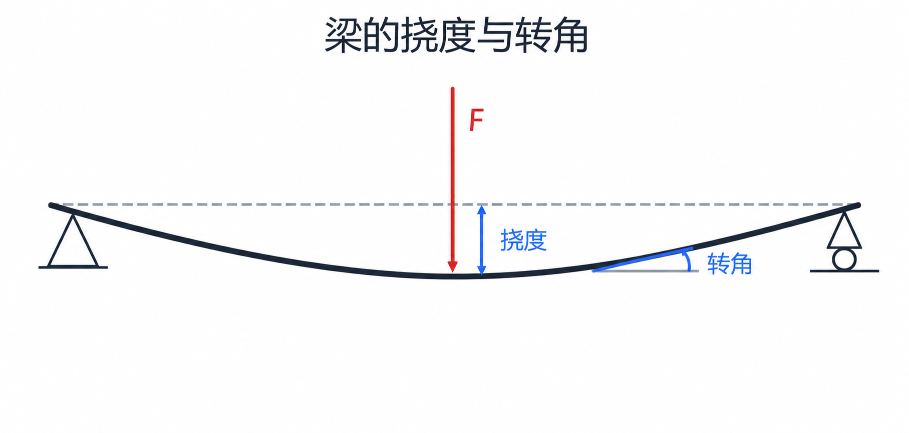
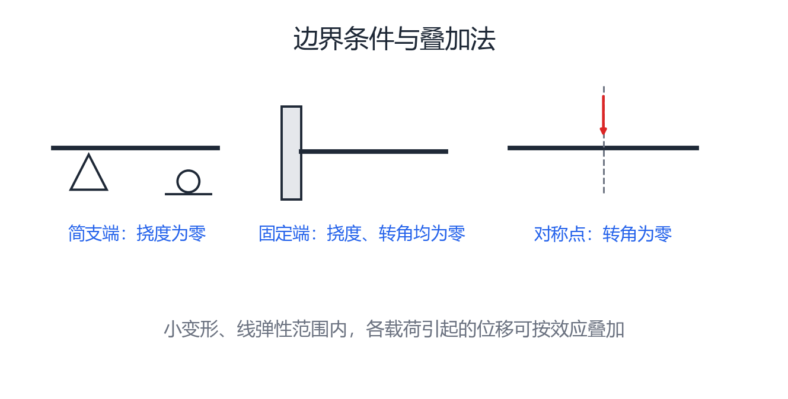
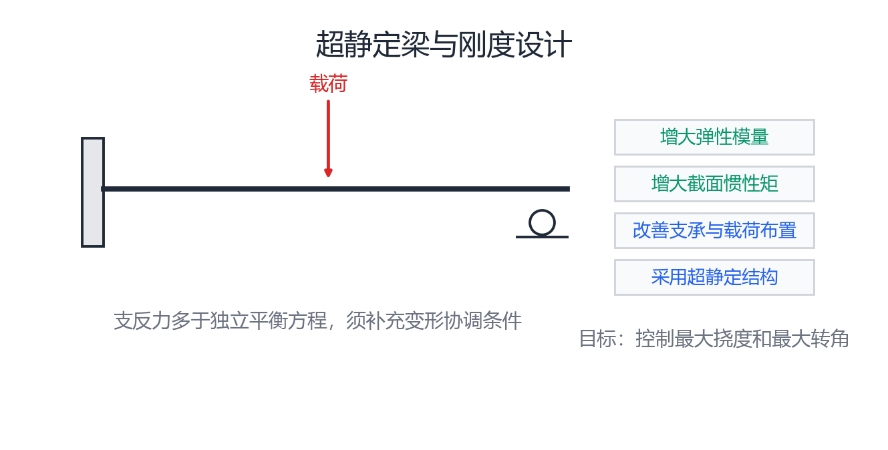

# 第 8 章 弯曲变形与超静定梁

## 8.1 挠度与转角

梁弯曲后的轴线称为挠曲线，其方程为 $w=w(x)$。横截面形心沿垂直于梁轴方向的位移称为挠度 $w$；横截面相对原位置转过的角度称为转角 $\theta$。

小变形时，挠曲线在任一点的切线斜率等于该截面的转角：

$$
\theta\approx\tan\theta=\frac{dw}{dx}=w'
$$

{ .fig-wide }

按本章符号约定，向上的挠度为正，逆时针转角为正。

## 8.2 挠曲线近似微分方程

梁的曲率与弯矩之间满足：

$$
\frac{1}{\rho(x)}=\frac{M(x)}{EI_z}
$$

平面曲线的曲率为 $\displaystyle \frac{1}{\rho}=\frac{\pm w''}{[1+(w')^2]^{3/2}}$。在小变形条件下，$|w'|\ll1$，按本章弯矩与挠度的符号约定可得挠曲线近似微分方程：

$$
EI_z w''=M(x)
$$

其中 $EI_z$ 称为梁的抗弯刚度。对上式逐次积分：

$$
\theta=w'=\frac{1}{EI_z}\int M(x)\,dx+C
$$

$$
w=\frac{1}{EI_z}\iint M(x)\,dx\,dx+Cx+D
$$

若梁分段受载，应对各段分别积分，并分别设置积分常数。

## 8.3 边界条件与连续条件

积分常数由支承条件和变形连续条件确定：

- 简支端：$w=0$；
- 固定端：$w=0$，$\theta=0$；
- 对称结构受对称载荷时，对称截面：$\theta=0$；
- 梁在光滑连接处，两侧的挠度和转角分别相等。

{ .fig-wide }

绘制挠曲线时，可先由弯矩符号判断各梁段的凹凸方向；$M=0$ 且弯矩变号处可能为拐点，再结合支座处的挠度、转角条件及各段连续性确定大致形状。无弯矩梁段的曲率为零，挠曲线为直线。

## 8.4 叠加法

在线弹性、小变形范围内，微分方程是线性的，多个载荷共同作用产生的挠度和转角，等于各载荷单独作用时相应变形的代数和：

$$
w=\sum_i w_i,\qquad \theta=\sum_i\theta_i
$$

应用时可将复杂载荷分解为若干简单载荷，查取或计算各自的挠度、转角后叠加；也可将结构分解成便于计算的基本形式，但各分量必须采用一致的正负号。

## 8.5 超静定梁

仅用静力平衡方程不能求出全部支反力的梁称为超静定梁。超静定次数等于多余约束数，也等于未知支反力数与独立平衡方程数之差。

{ .fig-wide }

求解超静定梁的一般步骤为：

1. 解除多余约束，以相应的未知力代替，得到相当系统；
2. 根据原约束处的位移要求，列出变形协调方程；
3. 由挠曲线方程或叠加法建立载荷、未知力与变形之间的物理关系；
4. 将物理关系代入协调方程，得到补充方程；
5. 联立补充方程与静力平衡方程，求出全部约束力和内力。

## 8.6 梁的刚度设计

梁除满足强度条件外，还应限制变形。常用刚度条件为：

$$
|w|_{\max}\le [w],\qquad |\theta|_{\max}\le [\theta]
$$

提高梁刚度的主要措施有：增大材料的弹性模量 $E$；合理选择截面形状并增大惯性矩 $I_z$；改善支承形式和载荷布置，以减小弯矩及其作用范围；在条件允许时采用超静定结构。
