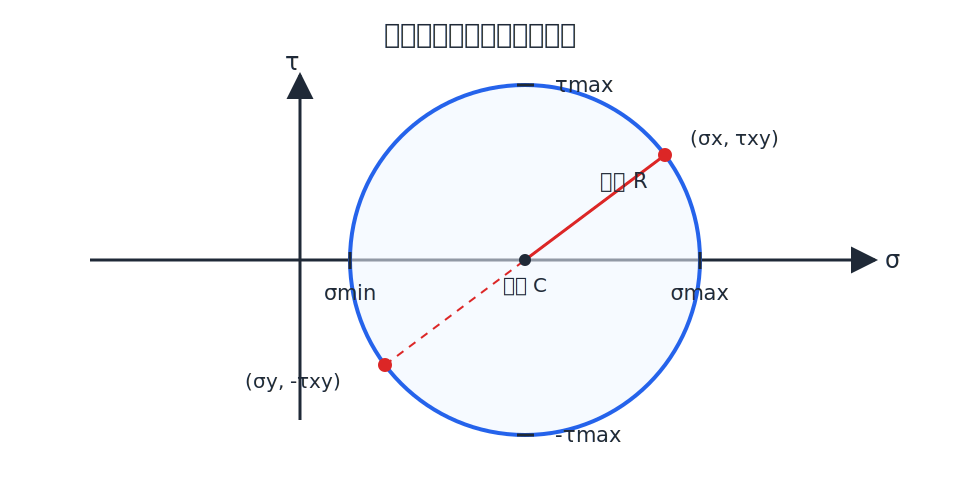

# 第 9 章 应力状态分析

## 9.1 一点的应力状态

过一点的不同截面上，应力的大小和方向一般不同。这些截面上全部应力的集合称为该点的应力状态。

切应力为零的截面称为主平面，主平面上的正应力称为主应力。三个主应力按代数值排列为：

$$
\sigma_1\geq\sigma_2\geq\sigma_3
$$

按非零主应力的个数，应力状态可分为单向、二向和三向应力状态。若微元只有一对相对表面上无应力，称为平面应力状态；各表面均有应力时为空间应力状态；只有切应力而无正应力时为纯剪切应力状态。

## 9.2 平面应力状态的解析法

设微元在 $x$、$y$ 面上的应力为 $\sigma_x$、$\sigma_y$ 和 $\tau_{xy}$，斜截面外法线与 $x$ 轴正向夹角为 $\alpha$。由斜截面微元平衡得：

$$
\sigma_\alpha=\frac{\sigma_x+\sigma_y}{2}
+\frac{\sigma_x-\sigma_y}{2}\cos2\alpha
-\tau_{xy}\sin2\alpha
$$

$$
\tau_\alpha=\frac{\sigma_x-\sigma_y}{2}\sin2\alpha
+\tau_{xy}\cos2\alpha
$$

正负号应按同一约定使用：正应力以拉应力为正；切应力按本章微元图示确定，并在解析法和应力圆中保持一致。斜截面角度 $\alpha$ 以截面外法线的转角为准。

令 $\tau_\alpha=0$，可确定主平面方位：

$$
\tan2\alpha_0=-\frac{2\tau_{xy}}{\sigma_x-\sigma_y}
$$

两个平面内主应力为：

$$
\sigma_{\max,\min}=\frac{\sigma_x+\sigma_y}{2}
\pm\sqrt{\left(\frac{\sigma_x-\sigma_y}{2}\right)^2+\tau_{xy}^2}
$$

最大切应力为：

$$
\tau_{\max}=\sqrt{\left(\frac{\sigma_x-\sigma_y}{2}\right)^2+\tau_{xy}^2}
=\frac{\sigma_{\max}-\sigma_{\min}}{2}
$$

最大切应力所在平面与主平面成 $45^\circ$，该平面上的正应力为 $\displaystyle (\sigma_x+\sigma_y)/2$。对于平面应力状态，垂直于应力平面的方向也是主方向，其主应力为零；确定 $\sigma_1,\sigma_2,\sigma_3$ 时必须将零一并排序。

## 9.3 应力圆

将应力变换公式整理可得：

$$
\left(\sigma_\alpha-\frac{\sigma_x+\sigma_y}{2}\right)^2+\tau_\alpha^2
=\left(\frac{\sigma_x-\sigma_y}{2}\right)^2+\tau_{xy}^2
$$

该圆称为莫尔应力圆。圆心和半径分别为：

$$
C\left(\frac{\sigma_x+\sigma_y}{2},0\right),\qquad
R=\sqrt{\left(\frac{\sigma_x-\sigma_y}{2}\right)^2+\tau_{xy}^2}
$$

{ .fig-wide }

应力圆与 $\sigma$ 轴的两个交点给出主应力，圆的最高点和最低点给出最大、最小切应力。微元中截面转过 $\alpha$ 时，应力圆上的对应半径转过 $2\alpha$；转向应根据所采用的切应力符号约定判断。

## 9.4 广义胡克定律

各向同性线弹性材料处于平面应力状态时：

$$
\varepsilon_x=\frac{1}{E}(\sigma_x-\mu\sigma_y),\qquad
\varepsilon_y=\frac{1}{E}(\sigma_y-\mu\sigma_x),\qquad
\gamma_{xy}=\frac{\tau_{xy}}{G}
$$

反写为应力与应变的关系：

$$
\sigma_x=\frac{E}{1-\mu^2}(\varepsilon_x+\mu\varepsilon_y),\qquad
\sigma_y=\frac{E}{1-\mu^2}(\varepsilon_y+\mu\varepsilon_x),\qquad
\tau_{xy}=G\gamma_{xy}
$$

空间应力状态下的广义胡克定律为：

$$
\varepsilon_x=\frac{1}{E}[\sigma_x-\mu(\sigma_y+\sigma_z)],\qquad
\varepsilon_y=\frac{1}{E}[\sigma_y-\mu(\sigma_x+\sigma_z)]
$$

$$
\varepsilon_z=\frac{1}{E}[\sigma_z-\mu(\sigma_x+\sigma_y)],\qquad
\gamma_{xy}=\frac{\tau_{xy}}{G},\quad
\gamma_{yz}=\frac{\tau_{yz}}{G},\quad
\gamma_{zx}=\frac{\tau_{zx}}{G}
$$

在主方向上切应力为零，主应变与主应力的关系为：

$$
\varepsilon_1=\frac{1}{E}[\sigma_1-\mu(\sigma_2+\sigma_3)],\quad
\varepsilon_2=\frac{1}{E}[\sigma_2-\mu(\sigma_1+\sigma_3)],\quad
\varepsilon_3=\frac{1}{E}[\sigma_3-\mu(\sigma_1+\sigma_2)]
$$

当 $\sigma_1\geq\sigma_2\geq\sigma_3$ 时，通常有 $\varepsilon_1\geq\varepsilon_2\geq\varepsilon_3$，最大主应变为：

$$
\varepsilon_{\max}=\varepsilon_1=\frac{1}{E}[\sigma_1-\mu(\sigma_2+\sigma_3)]
$$
