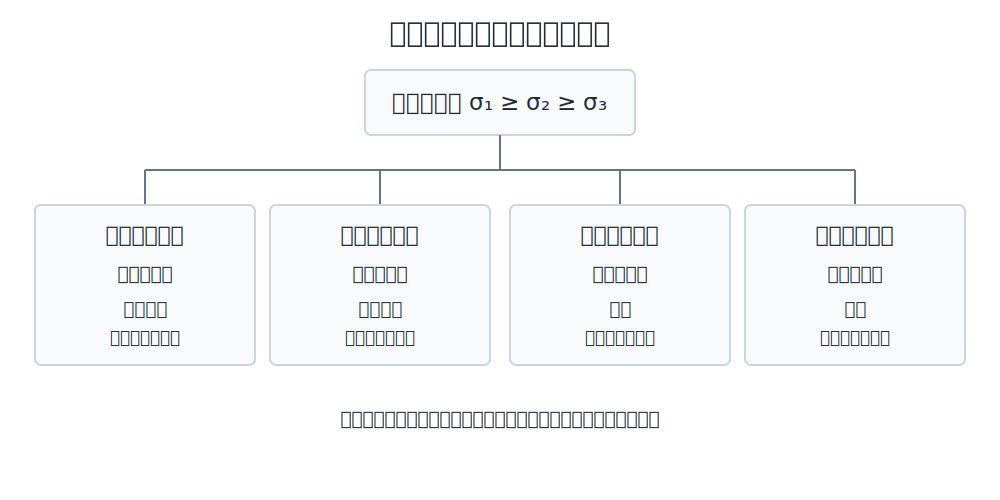

# 第 10 章 复杂应力状态强度问题

## 10.1 强度理论的基本思想

构件在复杂应力状态下的破坏形式主要有脆性断裂和塑性屈服。强度理论以单向拉伸试验为基础，提出导致材料破坏的共同力学因素，并用相当应力 $\sigma_r$ 将复杂应力状态与单向应力状态比较：

$$
\sigma_r\leq[\sigma]
$$

应用强度理论前，应先确定危险点的应力状态并求出主应力 $\sigma_1\geq\sigma_2\geq\sigma_3$。

{ .fig-wide }

## 10.2 四种强度理论

### 第一强度理论

最大拉应力理论认为，最大拉应力达到单向拉伸的极限值时，材料发生断裂。相当应力与强度条件为：

$$
\sigma_{r1}=\sigma_1,\qquad \sigma_1\leq[\sigma]
$$

该理论主要用于拉应力占主导的脆性断裂问题。

### 第二强度理论

最大拉应变理论认为，最大线应变达到单向拉伸的极限值时，材料发生断裂。由广义胡克定律：

$$
\varepsilon_1=\frac{1}{E}[\sigma_1-\mu(\sigma_2+\sigma_3)]
$$

相当应力与强度条件为：

$$
\sigma_{r2}=\sigma_1-\mu(\sigma_2+\sigma_3)\leq[\sigma]
$$

该理论也主要用于脆性材料。

### 第三强度理论

最大切应力理论认为，最大切应力达到单向拉伸屈服时的最大切应力，材料即发生屈服。由于 $\displaystyle \tau_{\max}=(\sigma_1-\sigma_3)/2$，故：

$$
\sigma_{r3}=\sigma_1-\sigma_3\leq[\sigma]
$$

该理论又称特雷斯卡理论，常用于塑性材料，形式简单但偏于安全。

### 第四强度理论

畸变能密度理论认为，形状改变比能达到单向拉伸屈服时的极限值，材料即发生屈服。相当应力为：

$$
\sigma_{r4}=\frac{1}{\sqrt{2}}
\sqrt{(\sigma_1-\sigma_2)^2+(\sigma_2-\sigma_3)^2+(\sigma_3-\sigma_1)^2}
$$

强度条件为：

$$
\sigma_{r4}\leq[\sigma]
$$

该理论又称米塞斯理论，常用于塑性材料。通常脆性材料采用第一、第二强度理论，塑性材料采用第三、第四强度理论；实际选择还应结合材料性质、应力状态和具体失效形式。

## 10.3 组合变形的强度计算

组合变形是杆件同时存在两种或两种以上基本变形。强度计算的一般步骤为：先分析外力并判断基本变形；再分别求各基本变形的内力，确定危险截面和危险点；最后叠加危险点的应力，按应力状态选择强度理论。

### 拉伸（压缩）与弯曲组合

轴力与弯矩均产生正应力，同一点的正应力可直接代数叠加：

$$
\sigma=\frac{F_N}{A}+\frac{My}{I_z}
$$

危险点通常位于弯矩最大的截面边缘，其最大正应力为：

$$
\sigma_{\max}=\frac{F_N}{A}+\frac{M_{\max}}{W_z}
$$

计算时应根据轴力和弯矩引起的拉压方向确定正负号。

### 弯曲与扭转组合

危险点同时承受弯曲正应力 $\sigma_M$ 和扭转切应力 $\tau_T$，属于平面应力状态。第三、第四强度理论分别给出：

$$
\sigma_{r3}=\sqrt{\sigma_M^2+4\tau_T^2}\leq[\sigma]
$$

$$
\sigma_{r4}=\sqrt{\sigma_M^2+3\tau_T^2}\leq[\sigma]
$$

对实心或空心圆截面，$W_p=2W$，因此 $\sigma_M=M/W$、$\tau_T=T/(2W)$，上式可写为：

$$
\sigma_{r3}=\frac{\sqrt{M^2+T^2}}{W}\leq[\sigma]
$$

$$
\sigma_{r4}=\frac{\sqrt{M^2+0.75T^2}}{W}\leq[\sigma]
$$

### 拉伸（压缩）、弯曲与扭转组合

轴力与弯矩产生的正应力先代数叠加：

$$
\sigma=\sigma_N+\sigma_M
$$

再与扭转切应力组合，第三、第四强度理论分别为：

$$
\sigma_{r3}=\sqrt{(\sigma_N+\sigma_M)^2+4\tau_T^2}\leq[\sigma]
$$

$$
\sigma_{r4}=\sqrt{(\sigma_N+\sigma_M)^2+3\tau_T^2}\leq[\sigma]
$$

## 10.4 薄壁圆筒的强度计算

设平均直径为 $D$、壁厚为 $\delta$ 的封闭薄壁圆筒承受内压 $p$，且 $\delta\ll D$。薄壁近似下内径、外径与平均直径的差别可以忽略；同时忽略远小于环向应力和轴向应力的径向应力，圆筒壁可视为二向应力状态。

由纵向截面平衡得环向应力：

$$
\sigma_t=\frac{pD}{2\delta}
$$

由横截面平衡得轴向应力：

$$
\sigma_x=\frac{pD}{4\delta}
$$

因此主应力为 $\sigma_1=\sigma_t$、$\sigma_2=\sigma_x$、$\sigma_3=0$。对脆性材料，第一、第二强度理论分别给出：

$$
\sigma_{r1}=\frac{pD}{2\delta}\leq[\sigma]
$$

$$
\sigma_{r2}=\frac{pD}{4\delta}(2-\mu)\leq[\sigma]
$$

对塑性材料，第三、第四强度理论分别给出：

$$
\sigma_{r3}=\frac{pD}{2\delta}\leq[\sigma]
$$

$$
\sigma_{r4}=\frac{\sqrt{3}\,pD}{4\delta}\leq[\sigma]
$$
