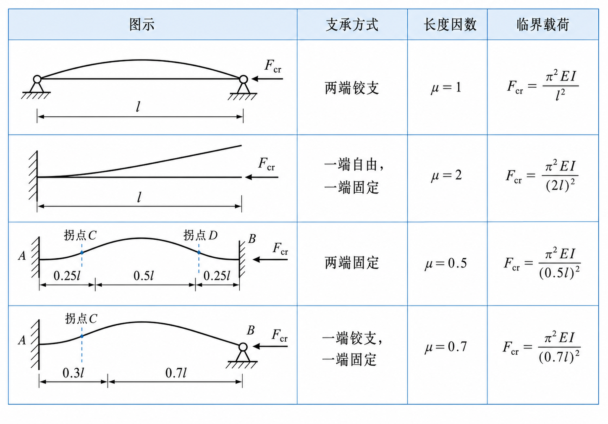

# 第 11 章 压杆稳定

## 11.1 压杆失稳与临界载荷

细长直杆承受轴向压力时，在压力较小的情况下保持直线平衡；压力达到某一数值后，直线平衡变得不稳定，杆件会突然发生显著侧向弯曲，这种现象称为失稳或屈曲。使压杆恰好处于直线平衡临界状态的轴向压力称为临界载荷 $F_{\mathrm{cr}}$。

压杆失稳前的正应力可能远低于材料的强度极限，因此压杆除满足强度条件外，还必须进行稳定性校核。

## 11.2 细长压杆的欧拉公式

两端铰支的理想细长压杆，其临界载荷为：

$$
F_{\mathrm{cr}}=\frac{\pi^2EI_{\min}}{l^2}
$$

压杆总是优先绕截面惯性矩最小的轴弯曲。对于不同端部约束，引入长度系数 $\mu$，以 $\mu l$ 表示有效长度，欧拉公式统一写为：

$$
F_{\mathrm{cr}}=\frac{\pi^2EI_{\min}}{(\mu l)^2}
$$

{ .fig-medium }

## 11.3 临界应力与柔度

定义截面的惯性半径和压杆的柔度：

$$
i=\sqrt{\frac{I_{\min}}{A}},\qquad \lambda=\frac{\mu l}{i}
$$

柔度综合反映杆长、约束和截面形状对稳定性的影响。由欧拉公式可得临界应力：

$$
\sigma_{\mathrm{cr}}=\frac{F_{\mathrm{cr}}}{A}=\frac{\pi^2E}{\lambda^2}
$$

欧拉公式以材料仍处于线弹性范围为前提。若比例极限为 $\sigma_p$，其适用条件为：

$$
\sigma_{\mathrm{cr}}\leq\sigma_p
\quad\Longleftrightarrow\quad
\lambda\geq\pi\sqrt{\frac{E}{\sigma_p}}=\lambda_p
$$

满足 $\lambda\geq\lambda_p$ 的压杆称为大柔度杆或细长杆，可用欧拉公式计算。

## 11.4 中、小柔度杆的临界应力

当 $\lambda<\lambda_p$ 时，欧拉公式不再适用，临界应力通常由经验公式确定。

中柔度杆满足 $\lambda_0<\lambda<\lambda_p$，常采用直线经验公式：

$$
\sigma_{\mathrm{cr}}=a-b\lambda
$$

小柔度杆满足 $0\leq\lambda\leq\lambda_0$，常采用抛物线经验公式：

$$
\sigma_{\mathrm{cr}}=a_1-b_1\lambda^2
$$

其中 $a,b,a_1,b_1$ 均为与材料有关的常数。实际计算时应先求柔度，再判断压杆类型并选用相应公式。

## 11.5 压杆稳定条件

考虑初弯曲、载荷偏心和材料不均匀等影响，引入稳定安全因数 $n_{\mathrm{st}}$。稳定条件可写为载荷形式：

$$
F\leq\frac{F_{\mathrm{cr}}}{n_{\mathrm{st}}}=[F_{\mathrm{st}}]
$$

或应力形式：

$$
\sigma=\frac{F}{A}\leq\frac{\sigma_{\mathrm{cr}}}{n_{\mathrm{st}}}=[\sigma_{\mathrm{st}}]
$$

工程设计中也常采用折减系数法，令 $[\sigma_{\mathrm{st}}]=\varphi[\sigma]$，其中 $0<\varphi<1$，且 $\varphi$ 与柔度和材料有关，则：

$$
\sigma\leq\varphi[\sigma]
$$

稳定计算的一般顺序为：确定计算长度 $\mu l$；求危险方向的 $I_{\min}$、$i$ 和 $\lambda$；选择临界应力公式；最后校核载荷或应力稳定条件。

## 11.6 压杆的合理设计

提高压杆稳定性的实质是提高临界载荷或临界应力，常用措施有：

- 合理选材：大柔度杆的临界载荷主要取决于弹性模量 $E$；中柔度杆可采用强度较高的材料；小柔度杆主要按强度要求选材。
- 合理设计截面：在面积基本不变时增大 $I_{\min}$ 和惯性半径 $i$，宜采用薄壁、空心截面，并使材料尽量远离形心轴。
- 保证各方向稳定性接近：使截面对两个主轴的惯性半径尽量接近，避免某一方向过早失稳。
- 减小计算长度：缩短杆长、改善端部约束，或设置中间支承和横向联系。
- 合理布置结构：保证压力尽量通过截面形心，减小初弯曲和偏心，并设置必要的稳定支撑。
