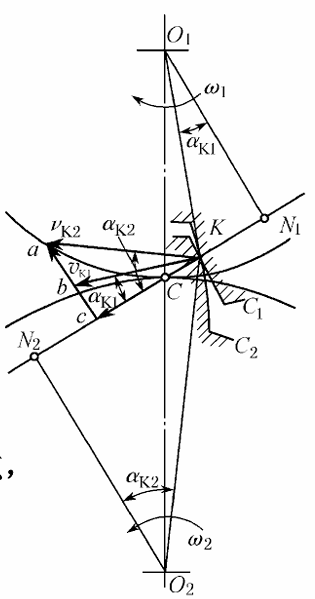
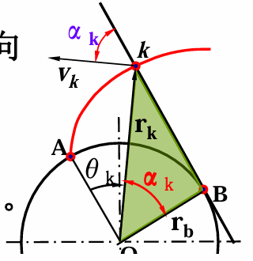
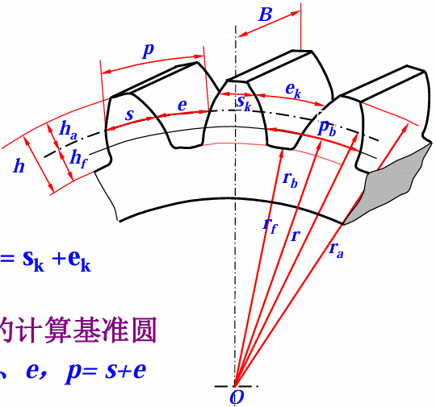
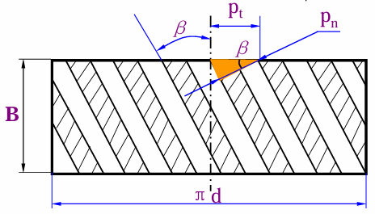
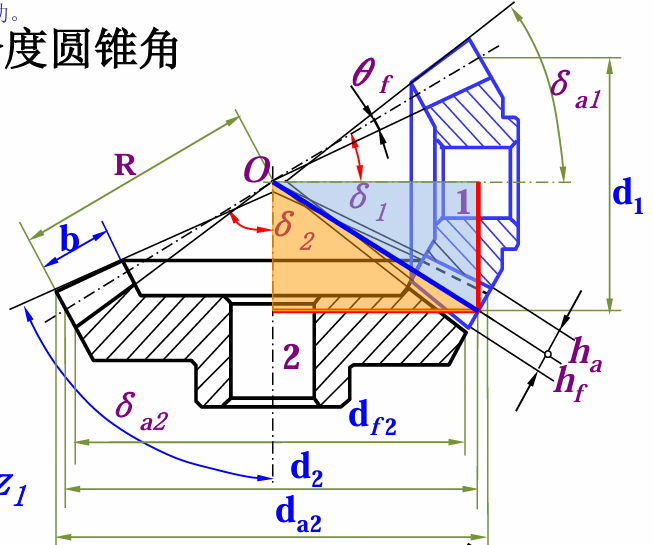
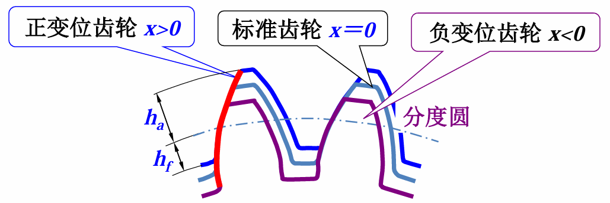

# 第 5 章 齿传动

## 5.1 概述

齿轮传动依靠轮齿之间的啮合传递运动和动力，属于啮合传动。

齿轮传动的优点：

- 传动比准确、平稳。
- 圆周速度范围大，高速时可达 $300\ \mathrm{m/s}$。
- 传动功率范围大。
- 效率高，使用寿命长，工作可靠。
- 可实现平行轴、相交轴和交错轴之间的传动。

齿轮传动的缺点是制造和安装精度要求高，加工成本较高。

按相对运动可分为：

- 平面齿轮传动：两轴线平行，如直齿圆柱齿轮、斜齿圆柱齿轮、人字齿轮等。
- 空间齿轮传动：两轴线不平行，如圆锥齿轮传动、交错轴斜齿轮传动等。

按齿廓曲线可分为渐开线齿轮、摆线齿轮、圆弧齿轮和抛物线齿轮等。按速度高低可分为高速、中速和低速齿轮传动。按封闭形式可分为开式齿轮传动和闭式齿轮传动。

## 5.2 齿廓啮合基本定律

{ align=right width="30%" }

一对齿轮实现定传动比传动时，两齿廓在接触点处的公法线必须与连心线交于定点。该定点称为节点，过节点作的圆称为节圆。

设两齿轮角速度分别为 $\omega_1$、$\omega_2$，节点为 $C$，两轮中心为 $O_1$、$O_2$，则传动比为：

$$
i_{12}=\frac{\omega_1}{\omega_2}
=\frac{O_2C}{O_1C}
$$

当 $O_1C$、$O_2C$ 保持不变时，传动比恒定。两节圆半径分别为 $r_1'$、$r_2'$，中心距为：

$$
a=r_1'+r_2'
$$

## 5.3 渐开线齿廓

### 渐开线的形成

{ align=right width="30%" }

一条直线沿基圆作纯滚动时，直线上任一点的轨迹称为该基圆的渐开线。该直线称为发生线，基圆半径记为 $r_b$。

渐开线上某点 $K$ 的压力角 $\alpha_k$ 为该点压力方向与速度方向之间的夹角。设 $K$ 点到圆心的半径为 $r_k$，则：

$$
r_b=r_k\cos\alpha_k
$$

离中心越远，压力角越大。

### 渐开线齿廓的啮合特性

渐开线齿廓具有以下特点：

- 渐开线齿廓满足齿廓啮合基本定律。
- 啮合线为两基圆的内公切线，齿廓间的压力方向不变。
- 瞬时传动比恒定，且中心距稍有变化时仍能保持原传动比不变。

对渐开线齿轮，有：

$$
i_{12}=\frac{\omega_1}{\omega_2}
=\frac{O_2C}{O_1C}
=\frac{r_{b2}}{r_{b1}}
$$

## 5.4 渐开线标准直齿圆柱齿轮

### 外齿轮的名称和符号

{ align=right width="35%" }

常用几何参数包括：

| 名称 | 符号 | 名称 | 符号 |
| --- | --- | --- | --- |
| 齿顶圆直径 | $d_a$ | 齿顶圆半径 | $r_a$ |
| 齿根圆直径 | $d_f$ | 齿根圆半径 | $r_f$ |
| 齿厚 | $s$ | 齿槽宽 | $e$ |
| 齿距 | $p=s+e$ | 基圆齿距 | $p_b$ |
| 分度圆直径 | $d$ | 齿宽 | $B$ |
| 齿顶高 | $h_a$ | 齿根高 | $h_f$ |
| 全齿高 | $h=h_a+h_f$ |  |  |

分度圆是规定的计算基准圆。标准齿轮在分度圆上满足：

$$
s=e=\frac{p}{2}
$$

### 基本参数

齿轮的三个基本参数为模数 $m$、齿数 $z$ 和压力角 $\alpha$。模数定义为：

$$
m=\frac{p}{\pi}
$$

分度圆直径为：

$$
d=mz
$$

分度圆压力角为标准压力角，通常取：

$$
\alpha=20^\circ
$$

标准直齿圆柱齿轮常用尺寸关系为：

$$
h_a=h_a^*m
$$

$$
h_f=(h_a^*+c^*)m
$$

$$
h=(2h_a^*+c^*)m
$$

其中正常齿制通常取 $h_a^*=1$，$c^*=0.25$；短齿制可取 $h_a^*=0.8$。齿根圆直径为：

$$
d_f=d-2h_f
$$

齿顶圆直径为：

$$
d_a=d+2h_a
$$

基圆直径为：

$$
d_b=d\cos\alpha
$$

标准中心距为：

$$
a=r_1+r_2=\frac{m(z_1+z_2)}{2}
$$

### 齿条和内齿轮

齿条可看作齿数 $z\to\infty$ 的齿轮。齿条的齿廓为直线，齿廓两侧互相平行；齿廓上各点压力角相同。齿条分度线上的齿距为：

$$
p=\pi m
$$

基节为：

$$
p_b=p\cos\alpha
$$

内齿轮的齿顶圆小于分度圆，齿根圆大于分度圆，其尺寸关系与外齿轮方向相反。

## 5.5 渐开线齿轮正确啮合和连续传动条件

### 正确啮合条件

一对渐开线直齿圆柱齿轮正确啮合时，两轮的基圆齿距必须相等：

$$
p_{b1}=p_{b2}
$$

因此应满足：

$$
m_1=m_2,\qquad \alpha_1=\alpha_2
$$

### 连续传动条件

实际啮合线段应不小于基圆齿距，通常用重合度表示连续传动能力：

$$
\varepsilon=\frac{B_1B_2}{p_b}
$$

连续传动要求：

$$
\varepsilon>1
$$

工程上常要求重合度满足许用条件：

$$
\varepsilon\ge[\varepsilon]
$$

## 5.6 渐开线齿轮加工及精度

### 加工方法

齿轮加工方法可分为成形法和范成法。

成形法使用与齿槽形状相同或相近的刀具加工齿形，如盘形铣刀、指状铣刀等。其特点是设备简单，但加工不连续，生产率和精度较低。

范成法利用齿轮啮合原理加工齿形，如滚齿、插齿和剃齿等。范成法加工连续，效率高，精度较高，是常用齿轮加工方法。

### 根切现象

用范成法加工齿轮时，若齿数过少，刀具会切去齿根附近已经形成的渐开线齿廓，称为根切。根切会削弱齿根强度，并使重合度下降。

标准直齿圆柱齿轮不发生根切的最少齿数为：

$$
z_{\min}=17
$$

### 齿轮精度

齿轮误差会影响传动的准确性、平稳性和载荷分布。常见影响包括：

- 转角与理论值不一致，影响运动准确性。
- 瞬时传动比不恒定，产生速度波动、引起振动和噪声。
- 齿向误差导致轮齿载荷分布不均，使齿面磨损不均。

齿轮精度等级需综合考虑传动用途、使用条件、圆周速度和传递功率等因素。

## 5.7 齿轮的失效和材料

### 失效形式

齿轮常见失效形式包括：

- 轮齿折断。
- 齿面点蚀。
- 齿面胶合。
- 齿面磨损，包括跑合磨损和磨粒磨损。
- 齿面塑性变形。

闭式软齿面齿轮传动常以齿面点蚀为主要失效形式；开式齿轮传动常以齿面磨损和轮齿折断为主要失效形式。

### 材料和热处理

常用齿轮材料包括优质碳素钢、合金结构钢、铸钢和铸铁等。

常用热处理方法包括：

- 表面淬火
- 渗碳淬火
- 调质
- 正火
- 渗氮

表面淬火可分为高频淬火和火焰淬火。材料和热处理方法应根据载荷大小、速度、精度要求和失效形式选择。

## 5.8 直齿圆柱齿轮传动强度计算

### 受力分析和计算载荷

直齿圆柱齿轮啮合时，齿面法向力 $F_n$ 可分解为圆周力 $F_t$ 和径向力 $F_r$：

$$
F_t=\frac{2T_1}{d_1}
$$

$$
F_r=F_t\tan\alpha
$$

$$
F_n=\frac{F_t}{\cos\alpha}
$$

小齿轮转矩为：

$$
T_1=\frac{9550P}{n_1}\ \mathrm{N\cdot m}
=9.55\times10^6\frac{P}{n_1}\ \mathrm{N\cdot mm}
$$

实际计算时用计算载荷代替名义载荷，以考虑载荷集中、附加动载荷等影响：

$$
F_{n,\mathrm{ca}}=KF_n
$$

其中 $K$ 为载荷系数。

### 齿面接触疲劳强度

齿面接触强度按赫兹接触应力计算。接触应力与法向载荷、齿宽、节点处综合曲率半径和材料弹性参数有关。

节点处综合曲率半径满足：

$$
\frac{1}{\rho}=\frac{1}{\rho_1}+\frac{1}{\rho_2}
$$

对于标准直齿圆柱齿轮，有：

$$
\rho=\frac{d_1\sin\alpha}{2}\cdot\frac{u}{u+1}
$$

其中 $u=z_2/z_1=d_2/d_1$ 为齿数比。

常用接触疲劳强度校核式可写为：

$$
\sigma_H=Z_EZ_H\sqrt{\frac{u+1}{u}\cdot\frac{2KT_1}{bd_1^2}}\le[\sigma_H]
$$

式中 $Z_E$ 为弹性影响系数，$Z_H$ 为节点区域系数，$b$ 为齿宽。

按齿宽系数 $\varphi_d=b/d_1$ 可得小齿轮直径设计式：

$$
d_1\ge
\sqrt[3]{
\left(\frac{Z_EZ_H}{[\sigma_H]}\right)^2
\frac{u+1}{u}
\frac{2KT_1}{\varphi_d}
}
$$

对钢制标准齿轮，也可使用简化形式：

$$
\sigma_H=671\sqrt{\frac{u+1}{u}\cdot\frac{KT_1}{bd_1^2}}\le[\sigma_H]
$$

### 齿根弯曲疲劳强度

轮齿可近似看作悬臂梁，按齿根弯曲疲劳强度校核：

$$
\sigma_F=\frac{2KT_1}{bm^2z_1}Y_{FS}\le[\sigma_F]
$$

其中 $Y_{FS}$ 为齿形系数与应力修正系数的综合系数。

按齿根弯曲强度设计模数时，可写为：

$$
m\ge
\sqrt[3]{\frac{2KT_1}{\varphi_d z_1^2}\cdot
\frac{Y_{FS}}{[\sigma_F]}}
$$

若两齿轮材料或热处理不同，应分别计算：

$$
\frac{Y_{FS1}}{[\sigma_{F1}]},\qquad
\frac{Y_{FS2}}{[\sigma_{F2}]}
$$

并取较大者进行设计。

### 强度计算准则

对于软齿面闭式齿轮传动，通常按齿面接触疲劳强度设计，并按齿根弯曲疲劳强度校核。

对于硬齿面闭式齿轮传动，通常按齿根弯曲疲劳强度设计，并按齿面接触疲劳强度校核。

开式齿轮传动常按齿根弯曲疲劳强度设计，并适当增大模数以补偿磨损。

### 主要参数选择

小齿轮齿数常取：

$$
z_1=20\sim40
$$

硬齿面齿轮可取：

$$
z_1=17
$$

齿数比不宜过大。一般直齿圆柱齿轮传动取 $u\le7$，开式传动可取 $u\le12$。齿宽系数 $\varphi_d$ 增大时，齿宽增大，但载荷沿齿宽分布越不均匀。

## 5.9 斜齿圆柱齿轮传动

### 啮合特点

斜齿圆柱齿轮的齿线与轴线成螺旋角 $\beta$。啮合时接触线逐渐进入、逐渐退出，因此传动比直齿轮更平稳，冲击和噪声较小，并且重合度较大。

{ .fig-medium }

### 基本参数

螺旋角 $\beta$ 为分度圆柱上齿线方向与齿轮轴线方向之间的夹角。设 $p_z$ 为端面螺旋导程，则：

$$
\tan\beta=\frac{\pi d}{p_z}
$$

法面参数和端面参数关系为：

$$
p_n=p_t\cos\beta
$$

$$
m_n=m_t\cos\beta
$$

$$
\tan\alpha_n=\tan\alpha_t\cos\beta
$$

其中下标 $n$ 表示法面参数，下标 $t$ 表示端面参数。斜齿轮以法面模数 $m_n$ 和法面压力角 $\alpha_n$ 为标准参数。

分度圆直径为：

$$
d=zm_t=\frac{zm_n}{\cos\beta}
$$

中心距为：

$$
a=\frac{m_n(z_1+z_2)}{2\cos\beta}
$$

一对外啮合斜齿圆柱齿轮正确啮合时，应满足：

$$
m_{n1}=m_{n2},\qquad
\alpha_{n1}=\alpha_{n2},\qquad
\beta_1=-\beta_2
$$

### 重合度

斜齿轮重合度由端面重合度和轴向重合度组成：

$$
\varepsilon=\varepsilon_\alpha+\varepsilon_\beta
$$

轴向重合度为：

$$
\varepsilon_\beta=\frac{b\tan\beta}{p_{bt}}
$$

### 当量齿轮和当量齿数

斜齿轮可用当量直齿圆柱齿轮进行近似分析。当量齿轮的半径为：

$$
r_v=\frac{r}{\cos^2\beta}
$$

当量齿数为：

$$
z_v=\frac{z}{\cos^3\beta}
$$

斜齿轮不发生根切的最少齿数为：

$$
z_{\min}=z_{v\min}\cos^3\beta
$$

螺旋角通常取 $\beta=8^\circ\sim20^\circ$，人字齿轮可取 $\beta=25^\circ\sim40^\circ$。

斜齿轮的优点：

- 啮合性能好，传动平稳，噪声小。
- 重合度大，承载能力高。
- 最少齿数小于直齿轮，结构更紧凑。

其缺点是会产生轴向力。

### 受力分析

斜齿圆柱齿轮受力可分解为圆周力、径向力和轴向力：

$$
F_t=\frac{2T_1}{d_1}
$$

$$
F_a=F_t\tan\beta
$$

$$
F_r=\frac{F_t\tan\alpha_n}{\cos\beta}
$$

## 5.10 锥齿轮传动

锥齿轮常用于相交轴之间的传动。标准直齿锥齿轮通常以大端参数为标准值，分度圆锥角常记为 $\delta$，轴交角通常为：

{ align=right width="45%" }

$$
\Sigma=90^\circ
$$

直齿锥齿轮的当量齿数为：

$$
z_v=\frac{z}{\cos\delta}
$$

不发生根切时，通常要求：

$$
z_{v\min}=17
$$

因此：

$$
z\ge17\cos\delta
$$

当 $\Sigma=90^\circ$ 时：

$$
i_{12}=\frac{\omega_1}{\omega_2}
=\frac{z_2}{z_1}
=\frac{\sin\delta_2}{\sin\delta_1}
=\tan\delta_2=\cot\delta_1
$$

直齿锥齿轮受力可分解为圆周力、径向力和轴向力：

$$
F_t=\frac{2T_1}{d_{m1}}
$$

$$
F_r=F_t\tan\alpha\cos\delta
$$

$$
F_a=F_t\tan\alpha\sin\delta
$$

当 $\delta_1+\delta_2=90^\circ$ 时，常有：

$$
F_{t1}=F_{a2},\qquad F_{a1}=F_{t2}
$$

## 5.11 齿轮结构

齿轮结构形式与齿轮尺寸、制造方法和安装方式有关。常见结构包括：

- 齿轮轴
- 实心齿轮
- 腹板式齿轮
- 轮辐式齿轮

当齿轮直径较小且与轴做成一体更合适时，可采用齿轮轴。中等尺寸齿轮常采用实心式或腹板式结构；大尺寸齿轮常采用轮辐式结构以减轻质量。

## 5.13 变位齿轮

### 变位齿轮的概念

标准齿轮加工时，刀具中线与齿轮分度圆相切。若齿轮齿数小于最少齿数，则容易发生根切，不适合采用标准齿轮。

{ .fig-medium }

加工变位齿轮时，齿条刀具相对齿轮毛坯移动一定距离，该距离称为移距。设移距为 $xm$，其中 $x$ 为变位系数。

- 正变位齿轮：刀具远离齿轮中心，$x>0$。
- 标准齿轮：$x=0$。
- 负变位齿轮：刀具靠近齿轮中心，$x<0$。

为避免根切，正变位系数应满足：

$$
x\ge1-\frac{z}{z_{\min}}
$$

标准直齿圆柱齿轮通常有：

$$
z_{\min}=\frac{2}{\sin^2\alpha}
$$

### 齿厚和齿槽宽

变位后，分度圆齿厚和齿槽宽发生变化：

$$
s=\frac{\pi m}{2}+2xm\tan\alpha
$$

$$
e=\frac{\pi m}{2}-2xm\tan\alpha
$$

### 变位齿轮传动类型

变位齿轮传动可分为：

- 等变位齿轮传动：$x_1=-x_2\ne0$，且 $x_1+x_2=0$。
- 正传动：$x_1+x_2>0$，实际中心距 $a'>a$，啮合角大于分度圆压力角。
- 负传动：$x_1+x_2<0$，实际中心距 $a'<a$，啮合角小于分度圆压力角。

变位齿轮的优点：

- 可在齿数小于 $z_{\min}$ 时避免根切。
- 可改善小齿轮磨损情况。
- 可提高承载能力。

变位齿轮的缺点是互换性较差。
