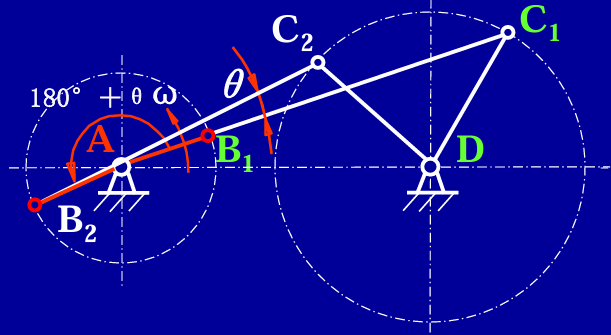
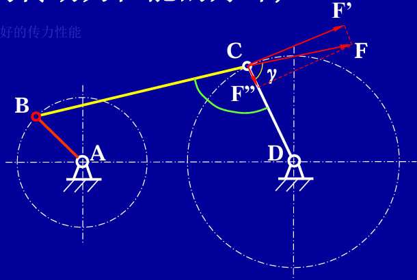
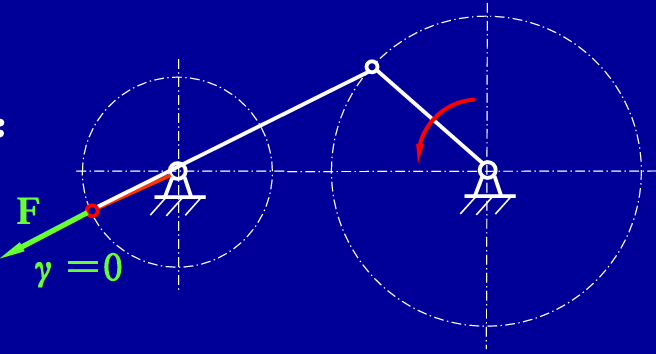
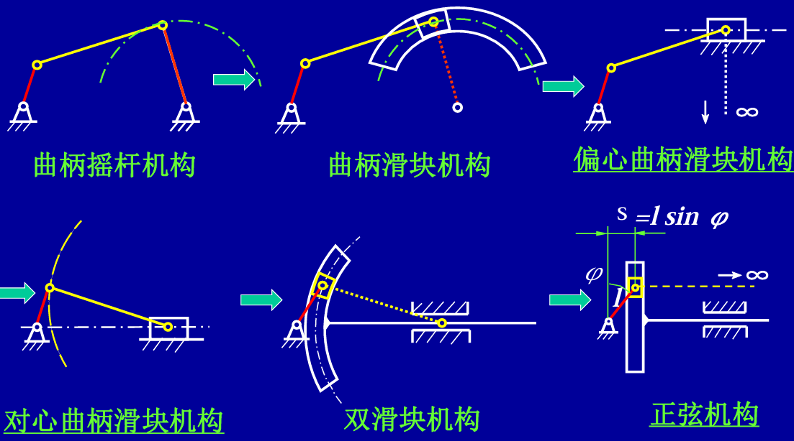
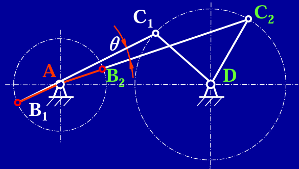
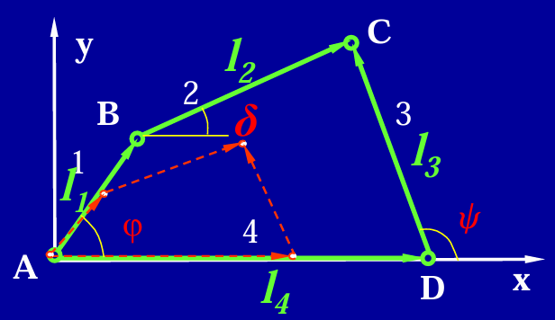

# 第 9 章 连杆传动

## 9.1 连杆传动的组成、应用及特点

连杆传动由若干构件通过低副组成，常见运动副包括转动副和移动副。

连杆传动的特点：

- 运动副为面接触，承载能力较大。
- 便于润滑，不易磨损。
- 构件形状较简单，容易制造和加工。
- 可通过改变杆长实现不同的运动规律。

连杆传动的缺点：

- 构件和运动副较多，累积误差较大，运动精度和效率较低。
- 产生动载荷，不适合高速运动。
- 设计复杂，难以实现精确的复杂轨迹。

连杆机构常用于实现往复运动、摆动运动、急回运动以及特定轨迹运动等。

## 9.2 铰链四杆机构的基本形式及其特性

铰链四杆机构由四个构件通过四个转动副组成，是平面连杆机构的基本形式。根据两连架杆能否作整周转动，可分为曲柄摇杆机构、双曲柄机构和双摇杆机构。

### 曲柄摇杆机构

曲柄摇杆机构中，一个连架杆为曲柄，能作整周转动；另一个连架杆为摇杆，只能作往复摆动。

{ .fig-small }

曲柄摇杆机构常用于将连续转动转化为往复摆动，也可将往复摆动转化为连续转动。

摇杆有两个极限位置，对应曲柄与连杆共线的两个位置。设摇杆摆角为 $\theta$，曲柄匀速转动时，摇杆往复摆动的平均速度不同，机构具有急回特性。

急回特性可用行程速比系数表示：

$$
K=\frac{v_2}{v_1}
=\frac{180^\circ+\theta}{180^\circ-\theta}
$$

其中 $\theta$ 为极位夹角。$K$ 越大，急回特性越明显。

机构传力性能常用压力角或传动角衡量。压力角为驱动力方向与速度方向之间的夹角；传动角 $\gamma$ 为压力角的余角。传动角越大，机构传力性能越好。

{ .fig-small }

当连杆与从动件共线时，机构可能处于死点位置。此时驱动力通过从动件转动中心，机构不能靠该力矩继续运动。实际机构可利用飞轮惯性或采用辅助机构越过死点。

{ .fig-small }

### 双曲柄机构

双曲柄机构中，两连架杆均为曲柄，均能作整周转动。主动曲柄等速转动时，从动曲柄通常作变速转动并完成一周回转。

平行四边形机构是双曲柄机构的一种特殊形式。其相对两杆长度相等且平行，两个曲柄转向相同，运动关系较简单。但该机构可能出现不确定位置，实际应用中常需采取约束或辅助措施。

### 双摇杆机构

双摇杆机构中，两连架杆均为摇杆，均只能作往复摆动。

双摇杆机构常用于需要两个构件作摆动运动的场合，如夹紧、摆动导向等机构。

## 9.3 铰链四杆机构的尺寸关系及其演化形式

### 曲柄存在条件

铰链四杆机构中，若最短杆与最长杆长度之和小于或等于其余两杆长度之和，则机构中可能存在曲柄：

$$
l_{\min}+l_{\max}\le l_a+l_b
$$

其中 $l_a$、$l_b$ 为其余两杆长度。

曲柄存在还与机架选择有关。若满足杆长条件：

- 以最短杆为机架，可得到双曲柄机构。
- 以最短杆相邻杆为机架，可得到曲柄摇杆机构。
- 以最短杆相对杆为机架，可得到双摇杆机构。

若不满足上述杆长条件，则无论取哪一杆为机架，均得到双摇杆机构。

### 机构演化形式

铰链四杆机构可通过改变运动副或选择不同构件为机架演化出多种机构。

{ .fig-medium }

常见演化方式包括：

- 将转动副转化为移动副，如曲柄滑块机构、偏心曲柄滑块机构和对心曲柄滑块机构。
- 取不同构件作为机架，得到不同形式的机构。
- 扩大回转副，形成结构等效但外形不同的机构。

常见演化机构包括：

- 曲柄摇块机构
- 曲柄滑块机构
- 偏心曲柄滑块机构
- 对心曲柄滑块机构
- 双滑块机构
- 正弦机构

## 9.4 平面四杆机构设计

平面四杆机构设计通常根据给定运动要求确定各杆长度、铰链位置或运动轨迹。

### 按预定连杆位置设计

已知连杆两位置时，可通过作图法确定固定铰链位置。若两位置间对应点的连线已知，则固定铰链通常位于对应点连线的垂直平分线上。

{.fig-small}

若已知摇杆两极限位置和机架距离，可利用几何关系确定曲柄和连杆长度。设两极限位置下活动铰链到固定铰链的距离分别为 $l_{AC1}$、$l_{AC2}$，则可取：

$$
l_1=\frac{l_{AC2}-l_{AC1}}{2}
$$

$$
l_2=\frac{l_{AC2}+l_{AC1}}{2}
$$

其中 $l_1$ 可作为曲柄长度，$l_2$ 可作为连杆长度。

若已知连杆三个位置，一般可唯一确定机构；若只给定两个位置，通常有多组可能解。

### 按给定行程速比系数设计

若要求机构具有指定急回特性，可根据行程速比系数 $K$ 求极位夹角：

$$
K=\frac{180^\circ+\theta}{180^\circ-\theta}
$$

即：

$$
\theta=180^\circ\frac{K-1}{K+1}
$$

再结合摇杆极限位置或滑块行程，按几何作图法确定曲柄和连杆长度。

常见设计对象包括曲柄摇杆机构和曲柄滑块机构。

### 按给定两连架杆对应位置设计

{.fig-small}

若要求两连架杆满足若干组对应角位移关系，可建立角度关系式：

$$
\cos\psi=p_1\cos\varphi+p_2\cos(\psi-\varphi)+p_3
$$

其中 $\varphi$、$\psi$ 为两连架杆对应转角，$p_1$、$p_2$、$p_3$ 为与机构尺寸有关的参数。根据给定的若干组对应位置，可求出这些参数，再确定机构尺寸。

### 按预定运动轨迹设计

若要求连杆上某点按给定轨迹运动，可采用作图法、解析法或试凑法进行机构综合。轨迹设计通常较复杂，可能存在多个近似解，应结合运动精度、传力性能和结构尺寸综合选择。
