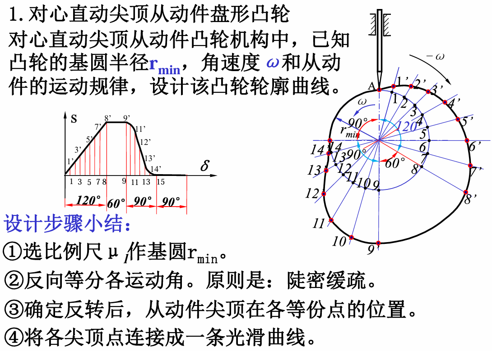
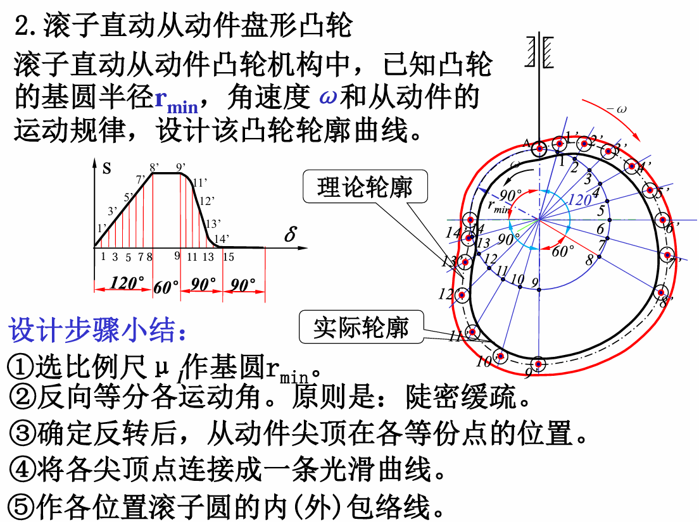
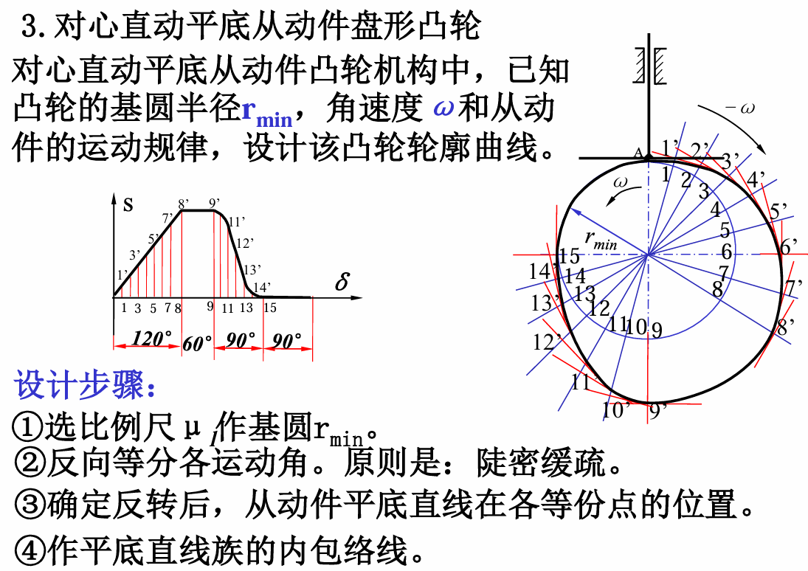
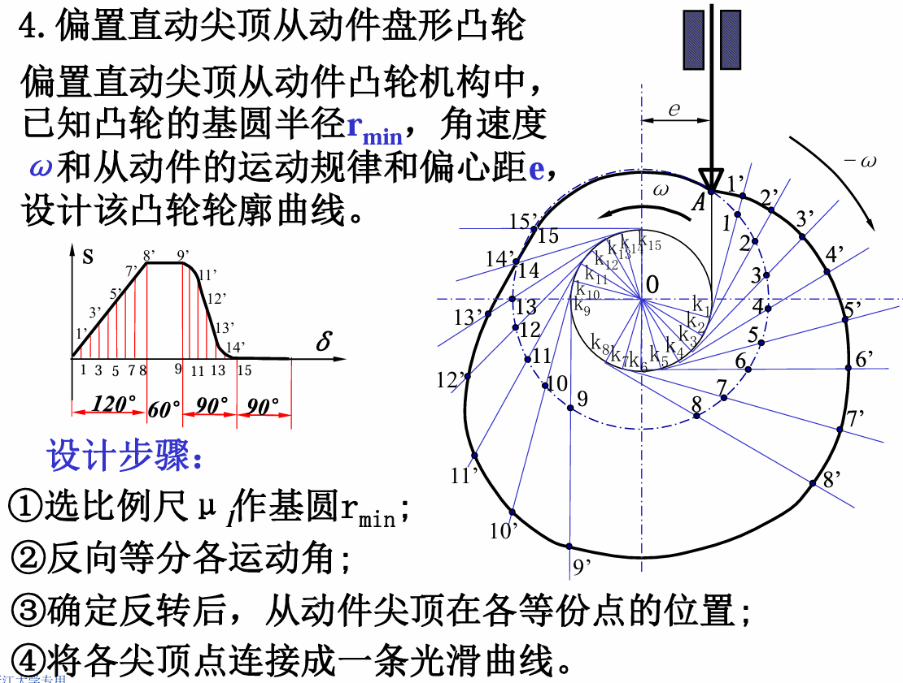
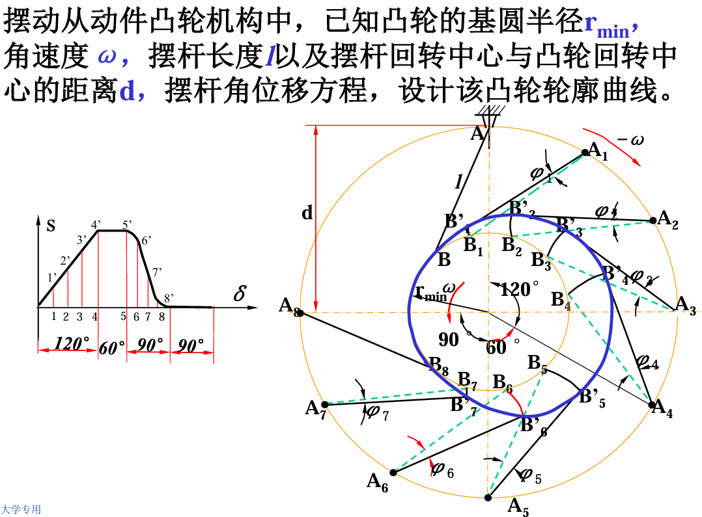
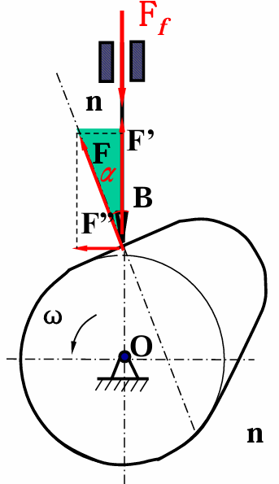
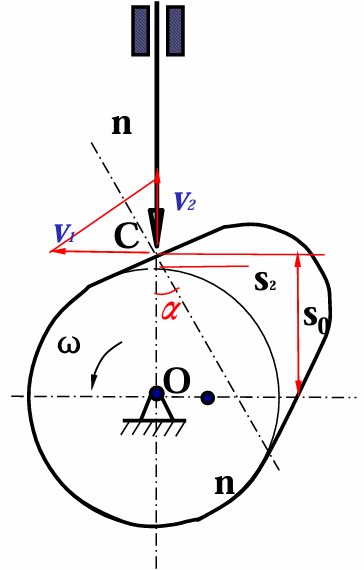

# 第 10 章 凸轮传动

## 10.1 组成、应用和类型

凸轮传动通常由凸轮、从动件和机架组成。凸轮作连续回转或移动时，通过其轮廓推动从动件作往复移动、摆动或其他预定运动。

凸轮传动适用于从动件运动规律要求较明确、运动循环重复的场合，如自动机械、内燃机配气机构和送料机构等。

凸轮机构可按不同方式分类：

- 按凸轮形状：盘形凸轮、移动凸轮、圆柱凸轮等。
- 按从动件端部形式：尖顶从动件、滚子从动件、平底从动件等。
- 按从动件运动形式：直动从动件和摆动从动件。

凸轮机构的优点是只要设计出合适的凸轮轮廓，就能使从动件实现预定运动规律；结构紧凑，动作可靠。缺点是凸轮与从动件之间多为高副接触，接触应力较大，易磨损，制造精度要求较高。

## 10.2 从动件常用运动规律

从动件运动规律描述从动件位移 $s$、速度 $v$、加速度 $a$ 随凸轮转角 $\delta$ 的变化关系。

若凸轮角速度为 $\omega$，从动件位移、速度、加速度可表示为多项式：

$$
\left\{ 
\begin{array}{l}
s=C_0+C_1\delta+C_2\delta^2+\cdots+C_n\delta \\
v=C_1\omega+2C_2\omega\delta+\cdots+nC_n\omega\delta^{n-1} \\
a=2C_2\omega^2+6C_3\omega^2\delta+\cdots+n(n-1)C_n\omega^2\delta^{n-2} 
\end{array}
\right.
$$

### 等速运动规律

等速运动规律中，从动件位移随凸轮转角线性变化，速度为常数。其位移线图为斜直线，速度线图为水平线。

等速运动在运动开始和终止瞬间速度发生突变，理论加速度趋于无穷大，会产生刚性冲击，因此只适用于低速、轻载或对运动平稳性要求不高的场合。

### 加速和减速运动规律

为了改善冲击，可采用加速和减速运动规律，使从动件在推程开始阶段逐渐加速，在推程结束阶段逐渐减速。

常见形式包括：

- 简谐运动规律：运动较平稳，但在某些位置仍可能产生柔性冲击。
- 摆线运动规律：加速度连续性较好，适用于高速凸轮机构。
- 多项式运动规律：可根据边界条件设计位移、速度和加速度曲线。

选择从动件运动规律时，应结合工作要求：

- 只要求实现一定位置，对运动规律无严格要求时，可选用便于凸轮制造的运动规律。
- 对从动件运动规律有特殊要求时，应按所需规律进行设计。
- 高速凸轮机构应具有良好的动力特性，避免刚性冲击和明显柔性冲击，可选用摆线运动或高次多项式运动规律。

## 10.3 用作图法设计凸轮轮廓曲线

### 基本原理

凸轮轮廓设计通常采用反转法。假想凸轮固定不动，而从动件连同机架以凸轮角速度的反方向绕凸轮轴线转动，同时从动件按给定运动规律相对机架运动。这样即可求出从动件尖端或滚子中心在反转运动中的一系列位置，并连接得到理论轮廓或实际轮廓。

对盘形凸轮，基圆是以凸轮回转中心为圆心、与理论轮廓相切的最小圆，其半径称为基圆半径 $r_{\min}$ 或 $r_0$。

### 直动从动件盘形凸轮

{ .fig-small }

{ .fig-small }

{ .fig-small }

{ .fig-small }

### 摆动从动件盘形凸轮

{ .fig-small }

## 10.5 基本尺寸确定

### 压力角和自锁

压力角 $\alpha$ 是从动件所受法向力方向与从动件速度方向之间的夹角。压力角越大，有效分力越小，侧向分力越大，机构传力性能越差。

忽略摩擦时，法向力 $F$ 可分解为有用分力 $F'$ 和有害分力 $F''$：

{ align=right width="25%" }

$$
F''=F'\tan\alpha
$$

若摩擦系数为 $f$，则摩擦力为：

$$
F_f=fF''
$$

当摩擦力大于有用分力时，机构可能发生自锁：

$$
F_f>F'
$$

由此可得自锁临界条件：

$$
\alpha>[\alpha]=\arctan\frac{1}{f}
$$

设计中应限制最大压力角，使其小于许用压力角。

### 基圆半径

基圆半径对凸轮机构尺寸和压力角有重要影响。基圆半径越大，压力角越小，传力性能越好，但机构尺寸也越大。

对直动从动件，若从动件速度为 $v_2$，凸轮角速度为 $\omega$，压力角为 $\alpha$，从动件相对基圆的位移为 $s_2$，则有：

{ align=right width="25%" }

$$
v_2=v_1\tan\alpha=s_0\omega\tan\alpha
$$

其中：

$$
s_0=r_0+s_2
$$

因此：

$$
r_0=\frac{v_2}{\omega\tan\alpha}-s_2
$$

基圆半径应根据许用压力角、结构尺寸和强度要求综合确定。常用经验式为：

$$
r_0\approx0.9d+(7\sim10)\ \mathrm{mm}
$$

其中 $d$ 为安装凸轮的轴径。

### 滚子半径

滚子半径会影响实际轮廓的形状。设理论轮廓曲率半径为 $\rho$，滚子半径为 $r_T$，实际轮廓曲率半径为 $\rho_a$。

对外凸轮廓，有：

$$
\rho_a=\rho-r_T
$$

若 $\rho_a>0$，实际轮廓正常；若 $\rho_a=0$，实际轮廓出现尖点；若 $\rho_a<0$，实际轮廓发生失真。

因此滚子半径应小于理论轮廓最小曲率半径。工程中常取：

$$
r_T<0.8\rho_{\min}
$$

并常按下式初选：

$$
r_T=(0.1\sim0.5)r_0
$$
