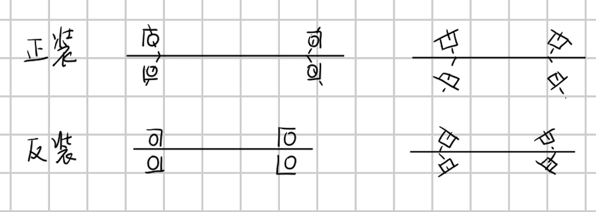
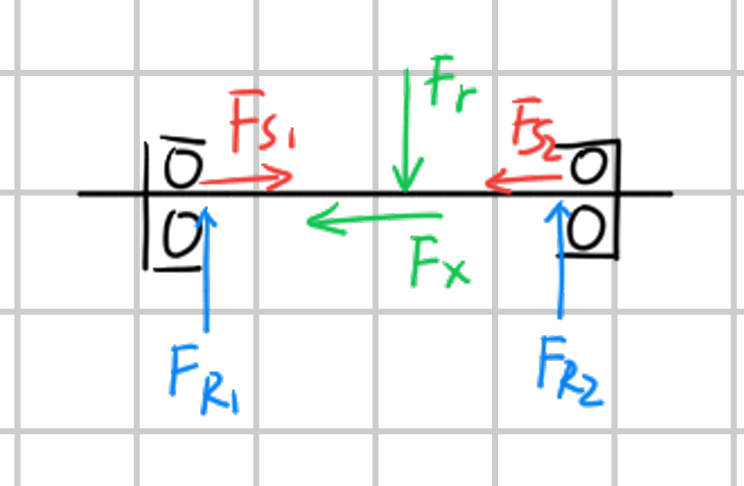

# 第 14 章 滚动轴承

## 14.1 基本类型和特点

滚动轴承通常由内圈、外圈、滚动体和保持架组成。工作时，滚动体在内外圈滚道之间滚动，从而支承轴并减小摩擦。

滚动轴承可按不同方式分类：

- 按承受载荷方向：向心轴承、推力轴承。
- 按滚动体形状：球轴承、滚子轴承。
- 按接触角：径向接触轴承、向心角接触轴承、推力角接触轴承。

常见类型包括深沟球轴承、角接触球轴承、圆锥滚子轴承、推力球轴承等。

主要类型及特点：

- 深沟球轴承：结构简单，应用广，可承受径向载荷和一定轴向载荷。
- 角接触球轴承：可同时承受径向载荷和轴向载荷，适合较高转速。
- 圆锥滚子轴承：承载能力较大，可承受径向载荷和单向轴向载荷。
- 推力轴承：主要承受轴向载荷。

### 滚动轴承的特点

滚动轴承摩擦阻力小，启动性能好，维护方便，标准化程度高。但其承受冲击载荷的能力相对较差，对安装精度和润滑条件有一定要求。

主要失效形式包括疲劳点蚀、永久变形、早期磨损、胶合、内外圈或保持架破裂等。

## 14.2 失效形式、寿命和承载能力

### 受力和失效形式

以向心轴承为例，在径向载荷作用下，载荷由若干滚动体共同承担。下半圈滚动体通常承受载荷，其中最大载荷近似为：

$$
F_{\max}=\frac{5F_r}{z}
$$

其中 $F_r$ 为径向载荷，$z$ 为参与承载的滚动体数。

滚动轴承的主要失效形式包括：

- 疲劳点蚀。
- 永久变形。
- 早期磨损。
- 胶合。
- 内圈、外圈或保持架破裂。

对正常工作、润滑良好的滚动轴承，疲劳点蚀是主要失效形式。

### 轴承寿命计算

滚动轴承寿命通常用基本额定寿命表示。基本额定寿命 $L_{10}$ 表示一组相同轴承在相同条件下运转时，可靠度为 $90\%$ 时达到的寿命。

寿命计算式为：

$$
L_{10}=\left(\frac{C}{P}\right)^\varepsilon 10^6
$$

其中 $C$ 为基本额定动载荷，$P$ 为当量动载荷，$\varepsilon$ 为寿命指数：

$$
\varepsilon=
\begin{cases}
3, & \text{球轴承}\\
10/3, & \text{滚子轴承}
\end{cases}
$$

按工作小时表示时：

$$
L_{10h}=
\frac{10^6}{60n}
\left(\frac{C}{P}\right)^\varepsilon
$$

其中 $n$ 为轴承转速，单位为 $\mathrm{r/min}$。

由寿命要求反求所需基本额定动载荷：

$$
C=P\sqrt[\varepsilon]{\frac{60nL_{10h}}{10^6}}
$$

式中 $P$ 为当量动载荷。考虑载荷性质、温度和可靠性时，需要对载荷或额定动载荷进行修正。

## 14.3 轴承的选择计算流程

滚动轴承选择时，应根据载荷大小和方向、转速、寿命要求、安装空间、调心要求及经济性综合确定轴承类型和尺寸。

一般步骤为：

1. 根据载荷方向和工作条件选择轴承类型。
2. 初选轴承型号。
3. 计算轴承所受径向载荷 $F_r$ 和轴向载荷 $F_a$。
4. 对角接触球轴承、圆锥滚子轴承等，应先确定内部轴向力和实际轴向载荷。
5. 计算当量动载荷 $P$。
6. 根据寿命要求计算所需基本额定动载荷 $C$。
7. 校核所选轴承的额定动载荷、极限转速和安装尺寸。

计算中常用符号：

- $F_r$：径向载荷。
- $F_a$：轴向载荷。
- $P$：当量动载荷。
- $n$：轴承转速，单位为 $\mathrm{r/min}$。
- $\varepsilon$：寿命指数，球轴承取 $3$，滚子轴承取 $10/3$。
- $f_T$：温度系数。
- $f_P$：载荷性质系数。

## 14.4 当量动载荷计算

滚动轴承同时承受径向载荷和轴向载荷时，应折算为当量动载荷：

$$
P=XF_r+YF_a
$$

其中 $X$ 为径向载荷系数，$Y$ 为轴向载荷系数。不同类型轴承的 $X$、$Y$ 取值与轴承类型、接触角以及 $F_a/F_r$ 有关。

若工作中有冲击载荷，可引入载荷性质系数：

$$
P=f_P(XF_r+YF_a)
$$

若考虑温度影响，基本额定动载荷可按温度系数修正。计算寿命时，应采用修正后的许用承载能力。

## 14.5 角接触轴承的轴向载荷

角接触球轴承和圆锥滚子轴承在承受径向载荷时，会产生内部轴向力。因此成对使用时，不能只把外部轴向载荷直接分给某一个轴承，而应同时考虑内部轴向力和外部轴向载荷。

常见安装方式包括正装和反装。正装时，两轴承压力线向内收敛；反装时，两轴承压力线向外发散。计算时应先根据安装方式判断内部轴向力方向。

{ .fig-medium }

内部轴向力常按下式估算：

$$
F_S=\frac{F_R}{2Y}
$$

对于圆锥滚子轴承，也常用：

$$
F_S=eF_R
$$

其中 $F_R$ 为轴承径向载荷，$Y$ 或 $e$ 为与轴承类型有关的系数。

设两轴承内部轴向力分别为 $F_{S1}$、$F_{S2}$，外部轴向载荷为 $F_X$。若 $F_X$ 的方向与 $F_{S2}$ 同向，则需要比较 $F_{S1}$ 与 $F_{S2}+F_X$：

- 若 $\displaystyle F_{S1}>F_{S2}+F_X$，则轴承 1 被压紧：

{ align=right width="30%" }

$$
F_{A1}=F_{S1},\qquad
F_{A2}=F_{S1}-F_X
$$

- 若 $\displaystyle F_{S1}\le F_{S2}+F_X$，则轴承 2 被压紧：

$$
F_{A1}=F_{S2}+F_X,\qquad
F_{A2}=F_{S2}
$$

实际做题时，先按载荷方向画出 $F_{S1}$、$F_{S2}$ 和 $F_X$，判断哪一端被压紧，再取该端轴承轴向载荷。最后将得到的 $F_A$ 代入当量动载荷公式计算 $P$。
