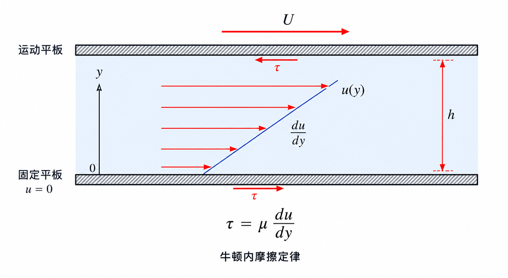
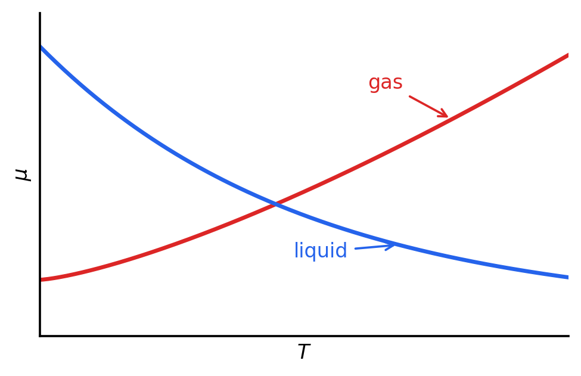
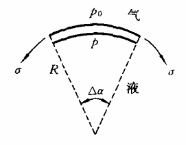
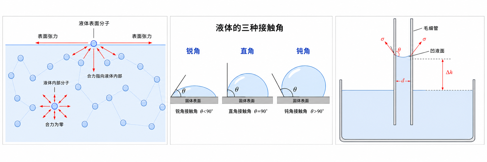

# 第 1 章 流体的性质

## 1.1 黏性与牛顿内摩擦定律

黏性是流体抵抗相邻流层相对运动的性质。只要相邻流层速度不同，就会出现速度梯度，并产生内摩擦切应力。

{ .fig-medium }

对于平板间的流动，若速度沿 $y$ 方向变化，则满足牛顿内摩擦定律的流体称为牛顿流体：

$$
\tau=\mu\frac{du}{dy}
$$

其中 $\tau$ 为切应力，$\dfrac{du}{dy}$ 为速度梯度，$\mu$ 为动力黏度，单位为 $\mathrm{Pa\cdot s}$。黏性使流体运动中出现内摩擦，是流动阻力和能量损失的重要来源。

常用黏性参数：

| 量 | 定义 | 单位 | 含义 |
| --- | --- | --- | --- |
| 动力黏度 | $\mu$ | $\mathrm{Pa\cdot s}$ | 衡量流体内摩擦强弱 |
| 运动黏度 | $\nu=\dfrac{\mu}{\rho}$ | $\mathrm{m^2/s}$ | 黏性与密度共同作用后的运动学参数 |

黏度受温度影响明显：气体黏性主要取决于分子热运动，温度升高时 $\mu$ 增大；液体黏性主要取决于分子间引力，温度升高时 $\mu$ 减小。

{ .fig-small }

## 1.2 雷诺数与流动状态

雷诺数用于判断层流和湍流，并表征惯性力与黏性力的相对大小：

$$
Re=\frac{\rho U L}{\mu}=\frac{UL}{\nu}
$$

其中 $U$ 为特征速度，$L$ 为特征长度。圆管流动中常用判据为：$Re<2300$ 时多为层流，$Re>2300$ 时多为湍流。层流阻力近似满足 $F\propto U$，湍流阻力通常随速度更快增长，近似可看作 $F\propto U^2$。

## 1.3 表面张力、毛细现象与接触角

{align=right width="25%"}

液体自由表面分子受力不平衡，表面层会表现出收缩趋势，这种沿表面切向作用的力称为表面张力。二维曲面表面张力可以表示为：

$$
p-p_0=\frac{\sigma}{R}
$$

对于三维曲面，主曲面半径分别为 $R_1$ 和 $R_2$，则有：

$$p-p_0=\sigma\left(\frac{1}{R_1}+\frac{1}{R_2}\right)$$

其中 $\sigma$ 为表面张力系数。该式被称为拉普拉斯表面张力公式。

细管插入液体后，液面可能上升或下降，这称为毛细现象。半径为 $R$ 的圆管中，毛细高度可写为：

$$
\Delta h=\frac{4\sigma\cos\theta}{\rho g d}
$$

其中 $\theta$ 为接触角。$\theta<90^\circ$ 表示润湿，液面上升；$\theta>90^\circ$ 表示非润湿，液面下降；$\theta=90^\circ$ 时毛细作用的竖直分量为零。

{ .fig-wide }

## 1.4 基本研究方法

流体力学常用三类研究方法：

| 方法 | 处理对象 | 典型用途 |
| --- | --- | --- |
| 控制体积分分析法 | 有限控制体 | 建立整体守恒方程，处理流量、动量、能量问题 |
| 微元体微分分析法 | 无穷小流体微元 | 建立局部微分方程，分析速度场、压强场 |
| 实验方法与量纲分析法 | 实验模型与无量纲参数 | 通过相似准则和实验数据研究复杂流动 |

积分分析重整体收支，微分分析重局部分布，量纲分析常用于把实验结果推广到工程尺度。
