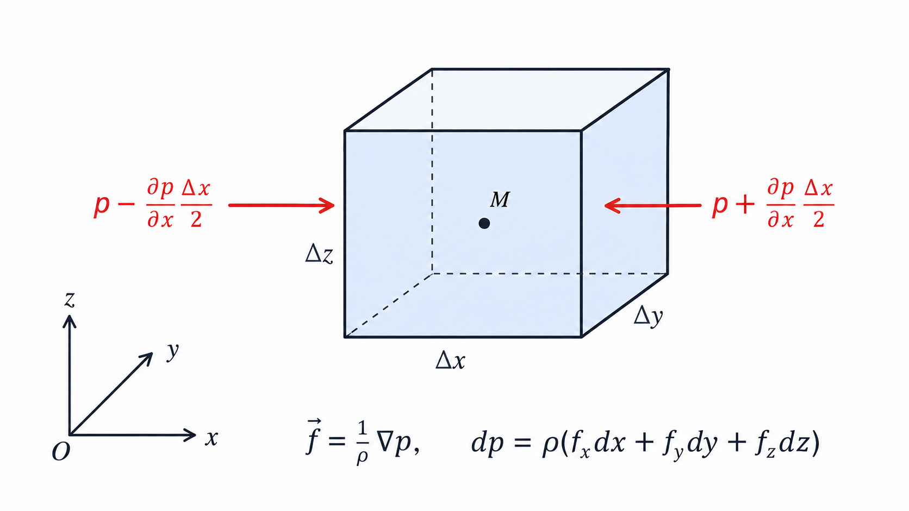
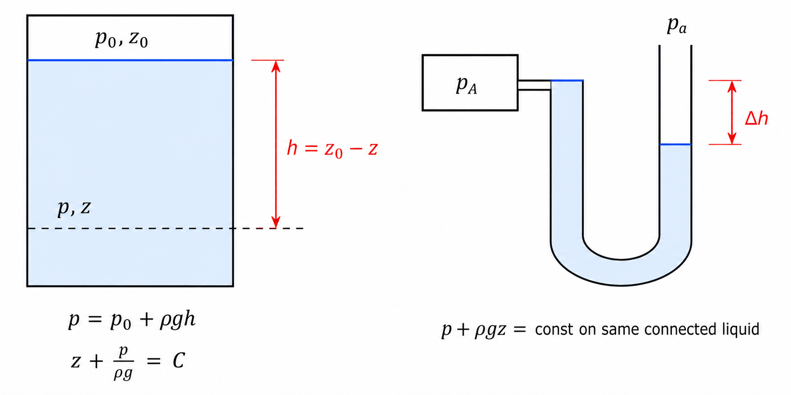
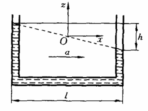
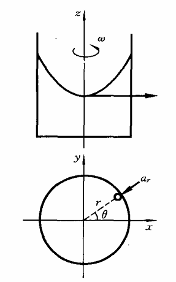
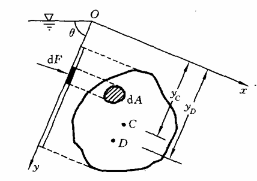
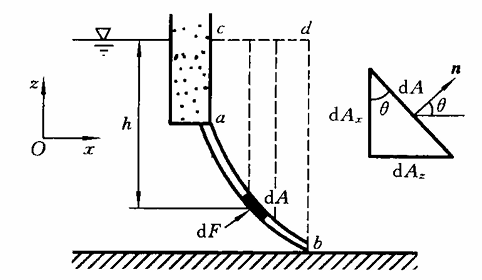

# 第 2 章 流体静力学

流体静力学研究流体处于静止或相对静止时的压强分布，以及静止液体对壁面的总压力。本章主要涉及压强分布、测压计、相对平衡、平面和曲面上的静水总压力。

## 2.1 流体平衡微分方程

取静止流体微元，表面力为压强，质量力为 $\rho\vec f\,dV$。平衡条件给出流体平衡微分方程：

$$
f_x=\frac{1}{\rho}\frac{\partial p}{\partial x},\qquad
f_y=\frac{1}{\rho}\frac{\partial p}{\partial y},\qquad
f_z=\frac{1}{\rho}\frac{\partial p}{\partial z}
$$

向量形式为 $\vec f=\dfrac{1}{\rho}\nabla p$，压强微分式为 $dp=\rho(f_xdx+f_ydy+f_zdz)$。等压面上 $dp=0$，即 $f_xdx+f_ydy+f_zdz=0$。

{ .fig-medium }

## 2.2 重力场中静止流体的压强分布

只受重力时 $f_x=f_y=0,\ f_z=-g$，于是：

$$
dp=-\rho g\,dz,\qquad p+\rho gz=C,\qquad z+\frac{p}{\rho g}=C
$$

设自由液面压强为 $p_0$、高度为 $z_0$，点 $z$ 处深度 $h=z_0-z$，则 $p=p_0+\rho g(z_0-z)=p_0+\rho gh$。静止连通液体中，同一水平面压强相等。

{ .fig-medium }

常用压强基准：

| 名称 | 含义 |
| --- | --- |
| 绝对压强 | 以绝对真空为零点 |
| 大气压强 | 标准大气压 $p_a=101325\ \mathrm{Pa}$ |
| 表压强 | 高于当地大气压的部分 |
| 真空度 | 低于当地大气压的部分 |

若从不可压缩 Navier-Stokes 方程 $\rho\vec a=-\nabla p+\rho\vec g+\mu\nabla^2\vec v$ 出发，静止时 $\vec a=0,\ \vec v=0$，也可得到 $\nabla p=\rho\vec g$。

### 大气压强分布

空气可近似看作理想气体，满足 $p=\rho RT$，其中对空气 $R=287\ \mathrm{J/(kg\cdot K)}$。笔记采用国际标准大气的分段温度：

| 高度范围 | 温度模型 | 压强分布 |
| --- | --- | --- |
| 对流层 $z\le 10000\ \mathrm{m}$ | $T=288-0.0065z$ | $p=p_a\left(1-\dfrac{z}{44308}\right)^{5.256}$ |
| 同温层 $z\ge 10000\ \mathrm{m}$ | $T=216.5\ \mathrm{K}$ | $p=0.223p_a\exp\left[-\dfrac{z-10000}{6336}\right]$ |

其中 $z=10000\ \mathrm{m}$ 处 $p_1=0.223p_a$。

## 2.3 相对静止液体的压强分布

相对静止指液体相对运动容器静止，但在惯性系中可能具有整体加速度。此时可把惯性力并入质量力，仍用平衡微分方程处理。

### 水平匀加速

{ align=right width="30%" }

容器沿 $x$ 方向以加速度 $a$ 运动，质量力为 $f_x=-a,\ f_y=0,\ f_z=-g$，于是 $dp=\rho(-a\,dx-g\,dz)$，积分得：

$$
p=-\rho(ax+gz)+C
$$

若 $x=0,z=0$ 处 $p=p_a$，则 $p=p_a-\rho(ax+gz)$。等压面满足 $ax+gz=C$，自由面也是等压面，因此 $z_0=-\dfrac{a}{g}x$，自由面与水平面的夹角满足 $\theta=\arctan\dfrac{a}{g}$。相对压强仍可写成 $p-p_a=\rho g(z_0-z)=\rho gh$。

### 等角速度旋转

{ align=right width="30%" }

容器绕竖直轴以角速度 $\omega$ 旋转，质量力为 $f_x=\omega^2x,\ f_y=\omega^2y,\ f_z=-g$。积分得：

$$
p=\rho\left(\frac{\omega^2r^2}{2}-gz\right)+C,\qquad r^2=x^2+y^2
$$

若自由面最低点取为坐标原点，则自由面方程为 $z_0=\dfrac{\omega^2r^2}{2g}$，压强相对大气压为 $p-p_a=\rho g(z_0-z)=\rho gh$。只要液体整体仍保持相对静止，静压强规律仍成立。

## 2.4 静止液体作用在固体壁面上的总压力

### 平面壁

设平面壁与自由液面成角 $\theta$，面积为 $A$，形心深度为 $h_c=y_c\sin\theta$。微元受力 $dF=\rho gy\sin\theta\,dA$，总压力为：

$$
F=\rho gy_c\sin\theta\,A=\rho gh_cA
$$

作用点称为压力中心。若 $x,y$ 轴在受压平面内，形心为 $C$，压力中心为 $D$，则：

$$
x_D=\frac{J_{xy}}{Ay_c},\qquad y_D=\frac{J_x}{Ay_c}
$$

用平行轴定理 $J_{xy}=J_{cxy}+x_cy_cA,\ J_x=J_{cx}+y_c^2A$，可得 $x_D-x_c=\dfrac{J_{cxy}}{Ay_c}$，$y_D-y_c=\dfrac{J_{cx}}{Ay_c}$。因此压力中心通常位于形心下方。

{ .fig-medium }

### 曲面壁

曲面受力常分解为水平分力和竖直分力。水平分力等于该曲面在垂直于分力方向投影面上的静水总压力，竖直分力等于压力体内液体重量：

$$
F_x=\rho gh_cA_x,\qquad F_z=\rho gV
$$

其中 $A_x$ 为曲面在 $x$ 方向垂直平面上的投影面积，$h_c$ 为投影面积形心深度，$V$ 为压力体体积。合力大小和方向为 $F=\sqrt{F_x^2+F_z^2}$，$\tan\alpha=\dfrac{F_z}{F_x}$。

{ .fig-medium }
