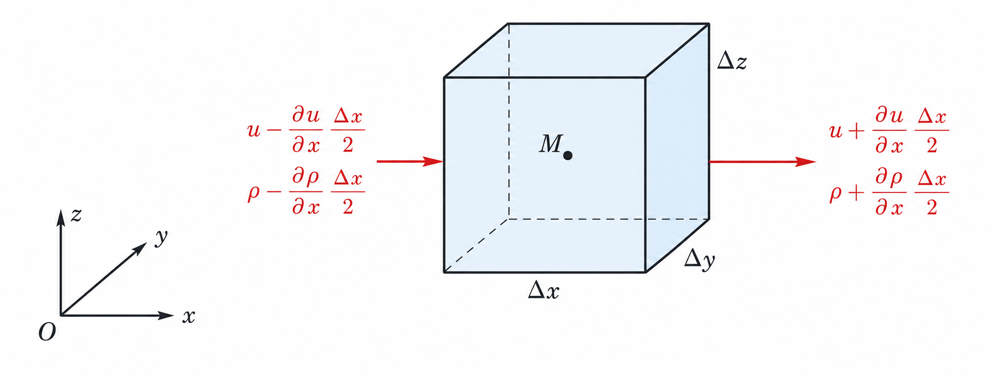
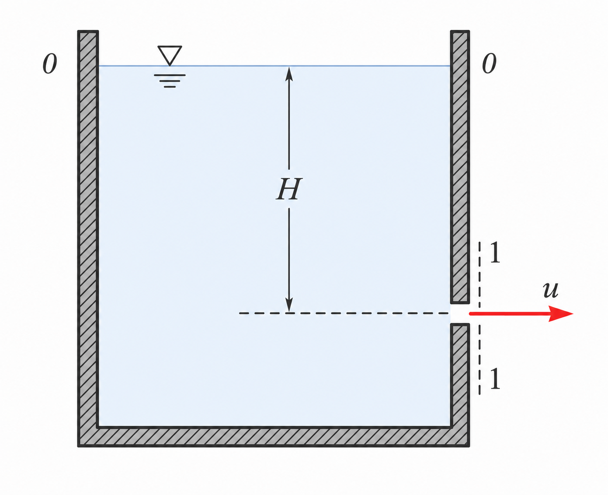
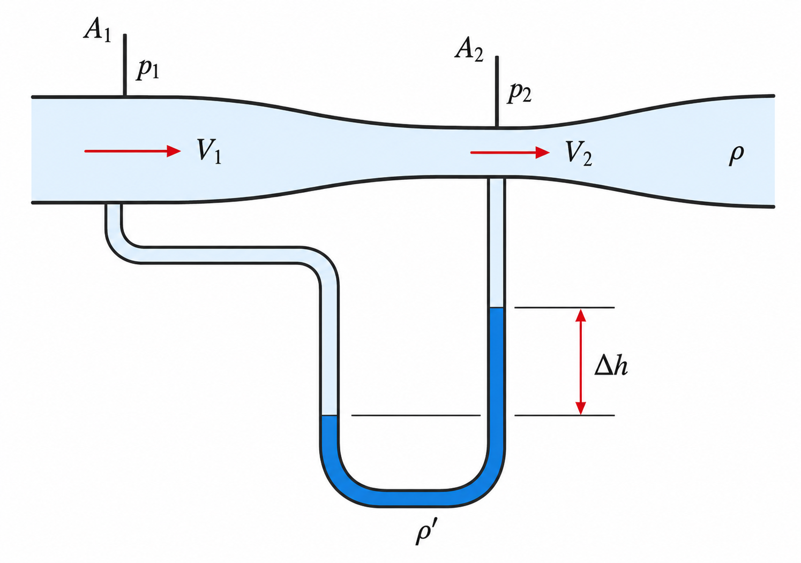
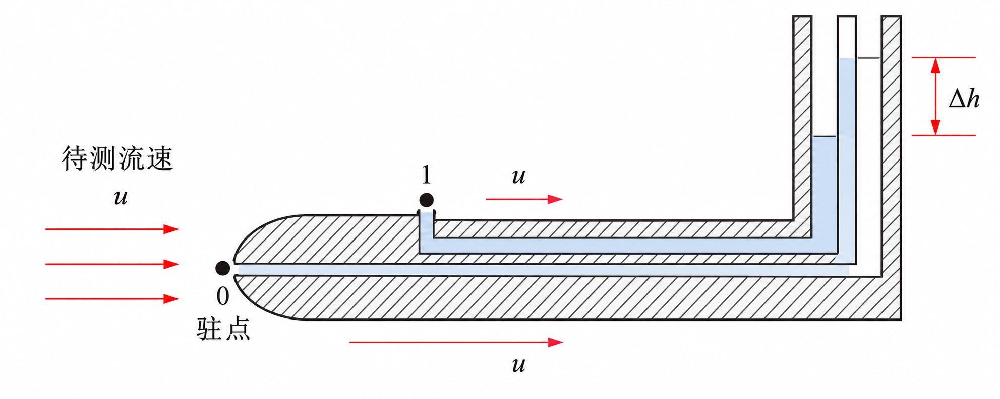

# 第 3 章 理想流体运动力学基础

本章以理想流体为对象，整理流体运动的描述方法、连续性方程、Euler 运动微分方程、Bernoulli 方程及其工程应用。常用控制方程包括质量守恒、动量守恒、能量守恒；若涉及气体，还需配合状态方程。

## 3.1 描述流体运动的两种方法

| 方法 | 描述对象 | 基本变量 | 特点 |
| --- | --- | --- | --- |
| 拉格朗日法 | 跟踪单个流体质点 | $x=x(\xi,\eta,\zeta,t)$ 等 | 质点一时间描述法 |
| 欧拉法 | 观察空间固定点 | $u,v,w,\rho,p$ 均为 $(x,y,z,t)$ 的函数 | 空间一时间描述法，工程中更常用 |

欧拉法中，速度场写为 $\vec v=u\vec i+v\vec j+w\vec k$。质点加速度是速度沿质点轨迹的全导数：

$$
\vec a=\frac{d\vec v}{dt}=\frac{\partial\vec v}{\partial t}+(\vec v\cdot\nabla)\vec v
$$

其中 $\dfrac{\partial\vec v}{\partial t}$ 为局部加速度，$(\vec v\cdot\nabla)\vec v$ 为对流加速度。即使定常流动中局部加速度为零，只要速度场空间分布不均匀，对流加速度仍可不为零。

流动分类：

| 分类 | 判据 |
| --- | --- |
| 定常流动 | 各物理量不随时间变化，如 $\partial u/\partial t=0$ |
| 非定常流动 | 物理量随时间变化 |
| 一维流动 | 主要沿一个坐标方向变化 |
| 二维流动 | 可近似为平面流动或轴对称流动 |
| 三维流动 | 三个方向速度分量和空间变化均需考虑 |

## 3.2 流线、流管与流量

流线是在某一瞬时处处与速度矢量相切的曲线，其微分方程为：

$$
\frac{dx}{u}=\frac{dy}{v}=\frac{dz}{w}
$$

迹线是同一流体质点随时间运动形成的轨迹；脉线是某固定点先后通过的流体质点在同一时刻连成的曲线。定常流动中，流线、迹线、脉线重合。

由流线围成的管状曲面称为流管，流管内的流体称为流束；若截面积无限小，称为微元流束。

流量定义：

| 量 | 定义 |
| --- | --- |
| 体积流量 | $Q=\displaystyle\int_A u_n\,dA$ |
| 质量流量 | $Q_m=\displaystyle\int_A \rho u_n\,dA$ |
| 截面平均速度 | $V=\dfrac{Q}{A}$ |

其中 $u_n$ 为速度在截面法线方向上的分量。

## 3.3 连续性方程

质量系统由特定流体质点组成，控制体是流场中人为选定的空间区域。连续性方程本质上是质量守恒。

微分形式为：

$$
\frac{\partial\rho}{\partial t}
+\frac{\partial(\rho u)}{\partial x}
+\frac{\partial(\rho v)}{\partial y}
+\frac{\partial(\rho w)}{\partial z}=0,
\qquad
\frac{\partial\rho}{\partial t}+\nabla\cdot(\rho\vec v)=0
$$

定常流动时 $\nabla\cdot(\rho\vec v)=0$；不可压缩流体 $\rho=\mathrm{const}$ 时：

$$
\frac{\partial u}{\partial x}+\frac{\partial v}{\partial y}+\frac{\partial w}{\partial z}=0
$$

圆柱坐标下的连续性方程为：

$$
\frac{\partial\rho}{\partial t}
+\frac{1}{r}\left[
\frac{\partial(\rho r u_r)}{\partial r}
+\frac{\partial(\rho u_\theta)}{\partial \theta}
+\frac{\partial(\rho r u_z)}{\partial z}
\right]=0
$$

对定常总流，流入质量流量等于流出质量流量。若截面平均速度、平均密度分别为 $V_1,V_2,\rho_1,\rho_2$，则：

$$
\rho_1V_1A_1=\rho_2V_2A_2,\qquad \rho=\mathrm{const}:\ V_1A_1=V_2A_2
$$

{ .fig-medium }

## 3.4 理想流体运动微分方程

对无黏理想流体微元应用动量定理，得到Euler 运动微分方程：

$$
\frac{du}{dt}=f_x-\frac{1}{\rho}\frac{\partial p}{\partial x},\qquad
\frac{dv}{dt}=f_y-\frac{1}{\rho}\frac{\partial p}{\partial y},\qquad
\frac{dw}{dt}=f_z-\frac{1}{\rho}\frac{\partial p}{\partial z}
$$

向量形式为：

$$
\frac{\partial\vec v}{\partial t}+(\vec v\cdot\nabla)\vec v
=\vec f-\frac{1}{\rho}\nabla p
$$

这里 $\vec f$ 为单位质量流体受到的质量力。第三章后续的 Bernoulli 方程可由 Euler 方程沿流线积分得到。

## 3.5 理想流体沿流线的 Bernoulli 方程

对定常、理想、不可压缩、只受重力作用的流动，沿同一流线有：

$$
z+\frac{p}{\rho g}+\frac{u^2}{2g}=C
$$

两点形式为：

$$
z_1+\frac{p_1}{\rho g}+\frac{u_1^2}{2g}
=z_2+\frac{p_2}{\rho g}+\frac{u_2^2}{2g}
$$

各项分别表示单位重量流体的位能、压能和动能，三者之和称为总水头。若流动无旋，Bernoulli 方程可推广到整个流场；否则通常只能沿同一流线使用。

## 3.6 弯曲流线方向的压强变化

沿弯曲流线法向取曲率半径 $r$，径向加速度为 $u^2/r$，可得：

$$
\frac{u^2}{r}=\frac{d}{dr}\left(gz+\frac{p}{\rho}\right)
$$

当流线曲率半径很大时，横向压强变化很小，可近似认为同一截面上 $z+\dfrac{p}{\rho g}=C$；急变流中曲率半径小，横向压强变化不能忽略。

## 3.7 总流的 Bernoulli 方程

实际应用常在缓变流截面上使用总流 Bernoulli 方程。设截面平均速度为 $V$，动能修正系数为 $\alpha$：

$$
\alpha=\frac{1}{A}\int_A\left(\frac{u}{V}\right)^3\,dA
$$

则总流 Bernoulli 方程为：

$$
z_1+\frac{p_1}{\rho g}+\alpha_1\frac{V_1^2}{2g}
=z_2+\frac{p_2}{\rho g}+\alpha_2\frac{V_2^2}{2g}
$$

其中缓变流截面上压强近似满足静压分布，常有 $z+\dfrac{p}{\rho g}=C$。工程计算中若速度分布接近均匀，可取 $\alpha\approx 1$。

## 3.8 Bernoulli 方程的应用

常见应用可归纳如下。

| 应用 | 主要结论 | 说明 |
| --- | --- | --- |
| 小孔定流 | $V=\sqrt{2gh}$ | 大容器自由液面速度忽略，孔口与外界同压 |
| 皮托管 | $u=\sqrt{2g\Delta h}$ | 测动压，由总压与静压差求速度 |
| 文丘里流量计 | $V_2=\sqrt{\dfrac{2(p_1-p_2)}{\rho(1-A_2^2/A_1^2)}}$ | 由收缩段压差和连续方程求流速 |

 

{.fig-small}

{.fig-small}

{.fig_small}

若压差由密度为 $\rho'$ 的测压液读数 $\Delta h$ 给出，且被测流体密度为 $\rho$，则常用 $p_1-p_2=(\rho'-\rho)g\Delta h$ 代入上式。

## 3.9 叶轮机械中的相对运动 Bernoulli 方程

在以角速度 $\omega$ 旋转的叶轮机械中，需在相对坐标系下加入离心势能项。相对运动 Bernoulli 方程为：

$$
z+\frac{p}{\rho g}+\frac{u^2}{2g}-\frac{\omega^2r^2}{2g}=C
$$

若定义内轮处总水头为 $H_1=\left(z+\dfrac{p}{\rho g}+\dfrac{u^2}{2g}\right)_{r=r_1}$，外轮处为 $H_2=\left(z+\dfrac{p}{\rho g}+\dfrac{u^2}{2g}\right)_{r=r_2}$，则：

$$
H_2=H_1+\frac{\omega^2(r_2^2-r_1^2)}{2g}
$$

