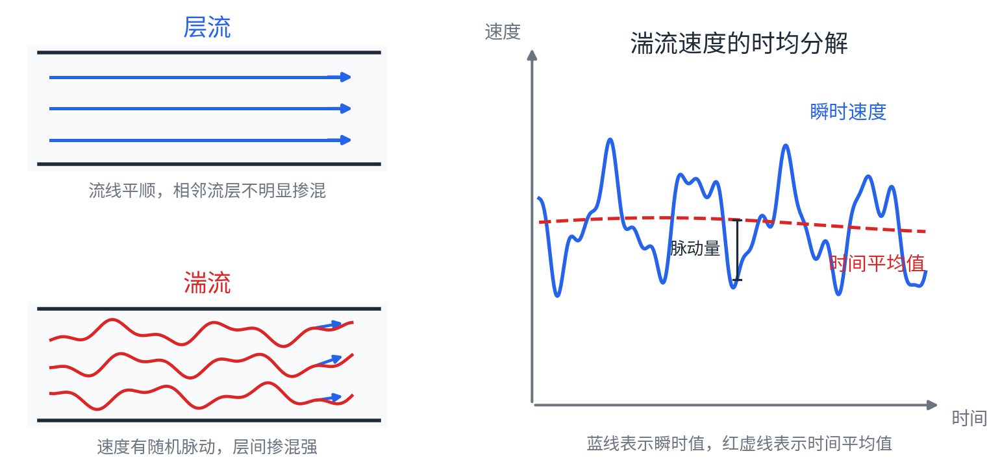
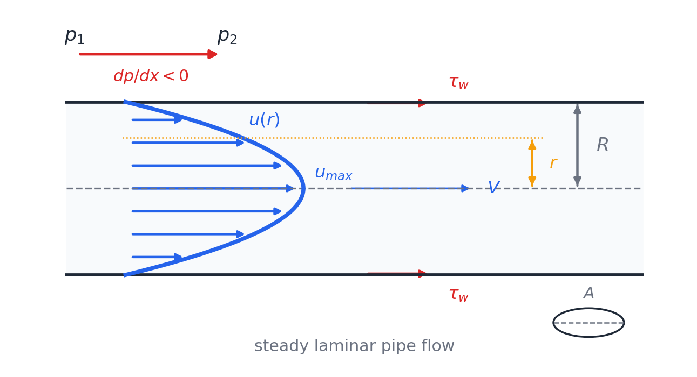
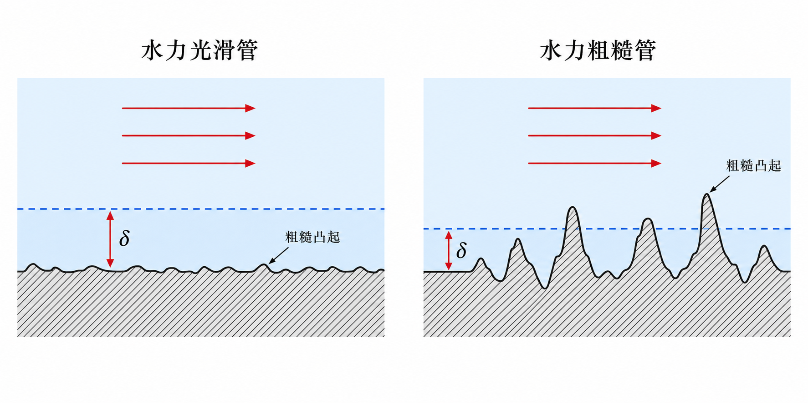
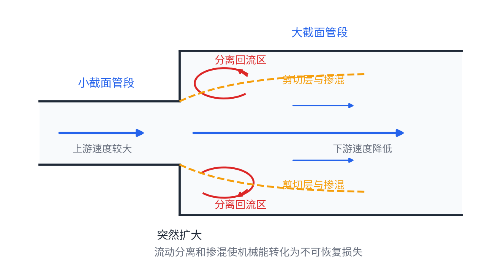

# 第 4 章 不可压缩黏性流体的一维流动

本章把黏性影响引入一维管流，重点是水头损失、层流与湍流、圆管层流、湍流阻力和局部损失。与第三章理想流体相比，这里 Bernoulli 方程右端需要加入损失项。

## 4.1 黏性流体运动的伯努利方程

不可压缩黏性流体从截面 1 流到截面 2 时，总水头不再守恒，而是减少为损失水头 $h_w$：

$$
z_1+\frac{p_1}{\rho g}+\frac{V_1^2}{2g}
=z_2+\frac{p_2}{\rho g}+\frac{V_2^2}{2g}+h_w
$$

损失通常分为沿程损失和局部损失：

$$
h_w=h_f+h_j,\qquad
h_f=\lambda\frac{l}{d}\frac{V^2}{2g},\qquad
h_j=\zeta\frac{V^2}{2g}
$$

其中 $\lambda$ 为沿程阻力系数，$\zeta$ 为局部阻力系数。

## 4.2 层流与湍流

圆管流动用雷诺数 $Re=\dfrac{\rho Vd}{\mu}$ 判断流态：$Re<2300$ 为层流，$Re>2300$ 为湍流。临界速度 $V_c$ 不是常数，随 $\mu,\rho,d$ 改变。

| 流态 | 运动特征 | 沿程损失随速度变化 |
| --- | --- | --- |
| 层流 | 流层有序滑移，脉动弱 | $h_f\propto V$ |
| 湍流 | 流体质点强烈掺混，速度和压强脉动 | $h_f\propto V^{1.75}\sim V^2$ |

湍流常用时均值和脉动值分解，例如 $u=\overline u+u'$，任意物理量 $f$ 的时均值为 $\overline f=\dfrac{1}{T}\displaystyle\int_{t-T/2}^{t+T/2}f\,dt$。脉动值的时均为零。

{ .fig-wide }

湍流中的总切应力由黏性切应力和 Reynolds 应力共同构成：

| 区域 | 切应力近似 |
| --- | --- |
| 层流 | $\tau=\mu\dfrac{du}{dy}$ |
| 湍流 | $\tau=\mu\dfrac{du}{dy}-\rho\overline{u'v'}$ |
| 湍流核心区 | $\mu\dfrac{du}{dy}\ll -\rho\overline{u'v'}$ |
| 黏性底层 | $\mu\dfrac{du}{dy}\gg -\rho\overline{u'v'}$ |

引入湍流黏度 $\mu_t$ 可写为 $-\rho\overline{u'v'}=\mu_t\dfrac{du}{dy}$。混合长理论给出 $-\rho\overline{u'v'}=\rho l^2\left|\dfrac{du}{dy}\right|\dfrac{du}{dy}$，因此 $\mu_t=\rho l^2\left|\dfrac{du}{dy}\right|$。

## 4.3 圆管定常层流流动

圆管层流中，速度只随半径 $r$ 变化。由 $\tau=-\mu\dfrac{du}{dr}$ 及边界条件 $r=R$ 时 $u=0$，可得 Poiseuille 速度分布：

$$
u=\frac{\Delta p}{4\mu l}(R^2-r^2)
$$

由此得到：

| 量 | 公式 |
| --- | --- |
| 最大速度 | $u_{\max}=\dfrac{R^2\Delta p}{4\mu l}$ |
| 流量 | $Q=\dfrac{\pi R^4\Delta p}{8\mu l}$ |
| 平均速度 | $V=\dfrac{Q}{A}=\dfrac{u_{\max}}{2}$ |
| 压降 | $\Delta p=\dfrac{8\mu lV}{R^2}=\dfrac{32\mu lV}{d^2}$ |
| 动能修正系数 | $\alpha=2$ |
| 沿程阻力系数 | $\lambda=\dfrac{64}{Re}$ |

{ .fig-medium }

层流圆管中，沿程损失也可写为 $h_f=\lambda\dfrac{l}{d}\dfrac{V^2}{2g}$，但此时 $\lambda=64/Re$，所以 $h_f$ 实际与 $V$ 成正比。

## 4.4 湍流近壁区与粗糙度

湍流近壁区常用摩擦速度 $u_*=\sqrt{\tau_w/\rho}$ 描述。按无量纲距离 $u_*\delta/\nu$ 可分为：黏性底层 $u_*\delta/\nu\le5$，过渡区 $5<u_*\delta/\nu<30$，湍流核心区 $u_*\delta/\nu\ge30$。笔记中给出的黏性底层厚度经验式为：

$$
\delta=\frac{34.2d}{Re^{7/8}}
$$

{ .fig-wide }

若管壁绝对粗糙度为 $\Delta$，则：

| 类型 | 判据 | 物理含义 |
| --- | --- | --- |
| 水力光滑管 | $\delta\gg\Delta$ | 粗糙突起被黏性底层淹没 |
| 水力粗糙管 | $\delta\ll\Delta$ | 粗糙突起伸入湍流核心区 |

## 4.5 湍流速度分布与阻力系数

水力光滑管的近壁速度分布：

| 区域 | 公式 |
| --- | --- |
| 黏性底层 | $\dfrac{u}{u_*}=\dfrac{u_*y}{\nu}$ |
| 湍流核心区 | $\dfrac{u}{u_*}=2.5\ln\dfrac{u_*y}{\nu}+5.5$ |
| 平均速度 | $\dfrac{V}{u_*}=2.5\ln\left(Re\dfrac{\sqrt{\lambda}}{2}\right)+1.75$ |

水力光滑管阻力系数常用：

$$
\frac{1}{\sqrt{\lambda}}=2\lg(Re\sqrt{\lambda})-0.8,\qquad
\lambda=\frac{0.3164}{Re^{1/4}}\quad(3\times10^3<Re<10^5)
$$

水力粗糙管中，速度分布和阻力系数主要与相对粗糙度有关：

| 量 | 公式 |
| --- | --- |
| 速度分布 | $\dfrac{u}{u_*}=2.5\ln\dfrac{y}{\Delta}+8.5$ |
| 平均速度 | $\dfrac{V}{u_*}=2.5\ln\dfrac{R}{\Delta}+4.75$ |
| 阻力系数 | $\dfrac{1}{\sqrt{\lambda}}=2\lg\dfrac{d}{2\Delta}+1.74$ |

阻力分区可按 Moody 图理解：

| 区域 | 范围 | $\lambda$ 的主要影响因素 |
| --- | --- | --- |
| 层流区 | $Re<2300$ | 只与 $Re$ 有关 |
| 层流到湍流过渡区 | $2300<Re<4000$ | 不稳定，工程上应避免 |
| 水力光滑管区 | $4000<Re<80\,d/\Delta$ | 只与 $Re$ 有关，$h_f\propto V^{1.75}$ |
| 光滑到粗糙过渡区 | $80\,d/\Delta<Re<4160(d/2\Delta)^{0.85}$ | 与 $Re$ 和 $\Delta/d$ 均有关 |
| 水力粗糙区 | $Re>4160(d/2\Delta)^{0.85}$ | 主要与 $\Delta/d$ 有关 |

## 4.6 局部损失：突然扩大

突然扩大处出现分离和掺混，机械能转化为不可恢复损失。对突然扩大管段，联立 Bernoulli 方程、动量方程和连续性方程，可得：

$$
h_j=\frac{(V_1-V_2)^2}{2g}
=\left(1-\frac{A_1}{A_2}\right)^2\frac{V_1^2}{2g}
=\left(\frac{A_2}{A_1}-1\right)^2\frac{V_2^2}{2g}
$$

因此以 $V_1$ 为基准时 $\zeta_1=\left(1-\dfrac{A_1}{A_2}\right)^2$，以 $V_2$ 为基准时 $\zeta_2=\left(\dfrac{A_2}{A_1}-1\right)^2$。

{ .fig-medium }

有压管水力计算通常就是把连续性方程、黏性 Bernoulli 方程、沿程损失和局部损失系数合并使用，未知量可能是流量、管径、压差或所需水头。
