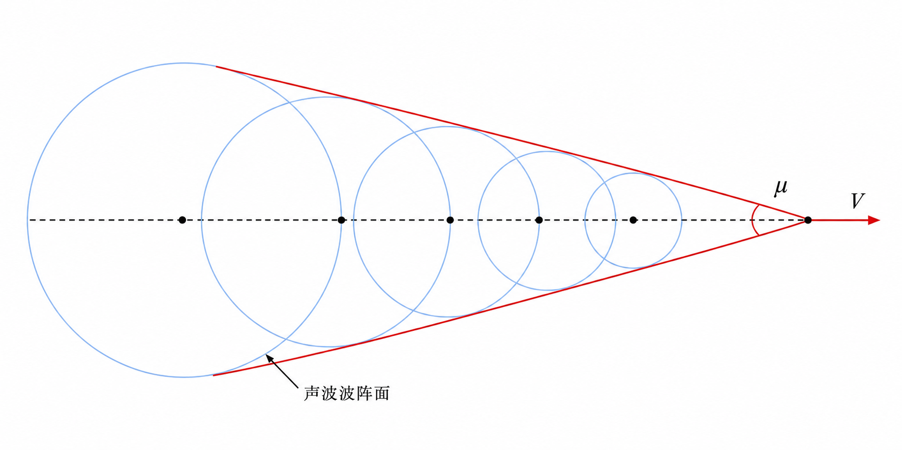
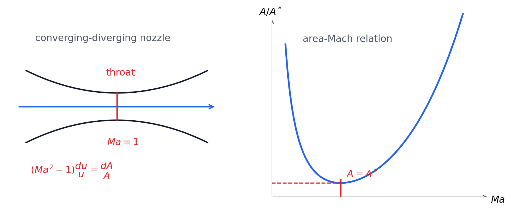

# 第 5 章 可压缩流体的一维流动

可压缩流动中密度随压强和温度明显变化，速度、压强、密度、温度之间必须同时满足连续性方程、运动方程、能量方程和状态方程。本章主要讨论一维、绝热、无摩擦的气体流动。

## 5.1 基本方程

理想气体状态方程为 $p=\rho RT$。一维管流中，连续性方程的微分形式为：

$$
\frac{d\rho}{\rho}+\frac{du}{u}+\frac{dA}{A}=0
$$

忽略摩擦、无重力影响时，一维运动方程为 $u\,du=-\dfrac{1}{\rho}dp$。热力学常数关系为：

| 量 | 关系 |
| --- | --- |
| 内能 | $e=C_vT$ |
| 焓 | $h=C_pT$ |
| 比热比 | $\gamma=\dfrac{C_p}{C_v}$ |
| 气体常数 | $R=C_p-C_v=(\gamma-1)C_v$ |
| 定容比热 | $C_v=\dfrac{R}{\gamma-1}$ |
| 定压比热 | $C_p=\dfrac{\gamma R}{\gamma-1}$ |

热力学第一定律可写为 $\delta q=de+p\,d(1/\rho)$，且 $h=e+p/\rho$。对绝热流动，$\delta q=0$，得到能量方程：

$$
\frac{u^2}{2}+h=C,\qquad
\frac{u^2}{2}+C_pT=C,\qquad
\frac{u^2}{2}+\frac{\gamma}{\gamma-1}\frac{p}{\rho}=C
$$

若过程可逆绝热，即等熵流动，则：

$$
\frac{p}{\rho^\gamma}=C
$$

常用等熵关系：

| 比值 | 公式 |
| --- | --- |
| 压强-密度 | $\dfrac{p_1}{p_2}=\left(\dfrac{\rho_1}{\rho_2}\right)^\gamma$ |
| 密度-温度 | $\dfrac{\rho_1}{\rho_2}=\left(\dfrac{T_1}{T_2}\right)^{1/(\gamma-1)}$ |
| 压强-温度 | $\dfrac{p_1}{p_2}=\left(\dfrac{T_1}{T_2}\right)^{\gamma/(\gamma-1)}$ |

## 5.2 声速与 Mach 数

声波是微弱压缩波。声速定义为微弱扰动在介质中的传播速度：

$$
c=\sqrt{\frac{dp}{d\rho}}
$$

等熵条件下 $p/\rho^\gamma=C$，因此 $c=\sqrt{\gamma p/\rho}=\sqrt{\gamma RT}$。Mach 数定义为：

$$
Ma=\frac{u}{c}
$$

当 $Ma<1$ 时为亚声速，压力扰动可向上游传播；当 $Ma>1$ 时为超声速，扰动被限制在 Mach 锥内，Mach 角满足 $\sin\theta=\dfrac{1}{Ma}$。

{ .fig-medium }

由运动方程和声速定义可得，流速增大时压强降低；该关系是喷管加速与截面变化规律的基础。

## 5.3 一维等熵流动基本关系

滞止状态是把流体等熵减速到 $u=0$ 后的状态，记为 $T_0,p_0,\rho_0$。由 $\dfrac{u^2}{2}+C_pT=C_pT_0$ 得：

| 滞止比 | 公式 |
| --- | --- |
| 温度比 | $\dfrac{T_0}{T}=1+\dfrac{\gamma-1}{2}Ma^2$ |
| 密度比 | $\dfrac{\rho_0}{\rho}=\left(1+\dfrac{\gamma-1}{2}Ma^2\right)^{1/(\gamma-1)}$ |
| 压强比 | $\dfrac{p_0}{p}=\left(1+\dfrac{\gamma-1}{2}Ma^2\right)^{\gamma/(\gamma-1)}$ |

临界状态是 $Ma=1$ 的状态，临界参数记为 $T^*,p^*,\rho^*,c^*$：

| 临界比 | 公式 |
| --- | --- |
| 温度比 | $\dfrac{T^*}{T_0}=\dfrac{2}{\gamma+1}$ |
| 压强比 | $\dfrac{p^*}{p_0}=\left(\dfrac{2}{\gamma+1}\right)^{\gamma/(\gamma-1)}$ |
| 密度比 | $\dfrac{\rho^*}{\rho_0}=\left(\dfrac{2}{\gamma+1}\right)^{1/(\gamma-1)}$ |

若气体膨胀到 $T\to0$，可得到最大速度状态。令最大速度为 $u_{\max}$，则：

| 参数 | 公式 |
| --- | --- |
| 最大速度 | $\dfrac{u_{\max}^2}{2}=\dfrac{\gamma R}{\gamma-1}T_0$ |
| 温度比 | $\dfrac{T}{T_0}=1-\left(\dfrac{u}{u_{\max}}\right)^2$ |
| 密度比 | $\dfrac{\rho}{\rho_0}=\left[1-\left(\dfrac{u}{u_{\max}}\right)^2\right]^{1/(\gamma-1)}$ |
| 压强比 | $\dfrac{p}{p_0}=\left[1-\left(\dfrac{u}{u_{\max}}\right)^2\right]^{\gamma/(\gamma-1)}$ |

## 5.4 变截面管中的等熵流动

对变截面等熵一维流动，连续性方程、运动方程和声速关系联立，可得面积-速度关系：

$$
(Ma^2-1)\frac{du}{u}=\frac{dA}{A}
$$

因此：

| 流动状态 | 截面增大 $dA>0$ | 截面减小 $dA<0$ |
| --- | --- | --- |
| 亚声速 $Ma<1$ | 减速 | 加速 |
| 超声速 $Ma>1$ | 加速 | 减速 |
| 声速 $Ma=1$ | 必须在 $dA=0$ 处 | 喉部截面积最小 |

{ .fig-wide }

面积-Mach 关系常写为：

$$
\frac{A}{A^*}
=\frac{1}{Ma}
\left[
\frac{2}{\gamma+1}
\left(1+\frac{\gamma-1}{2}Ma^2\right)
\right]^{\frac{\gamma+1}{2(\gamma-1)}}
$$

其中 $A^*$ 为临界截面积。$A/A^*$ 对同一个大于 1 的面积比通常对应一个亚声速解和一个超声速解。

## 5.5 喷管流动

收缩喷管中出口速度由能量方程给出：

$$
u_e=\sqrt{2C_p(T_0-T_e)}
=\sqrt{2C_pT_0\left[1-\left(\frac{p_e}{p_0}\right)^{(\gamma-1)/\gamma}\right]}
$$

质量流量为：

$$
Q_m=\rho_0A_e\left(\frac{p_e}{p_0}\right)^{1/\gamma}
\sqrt{2C_pT_0\left[1-\left(\frac{p_e}{p_0}\right)^{(\gamma-1)/\gamma}\right]}
$$

背压 $p_b$ 决定喷管工作状态：

| 背压条件 | 出口状态 |
| --- | --- |
| $p_b>p^*$ | 未达到临界，$p_e=p_b$，出口亚声速 |
| $p_b\le p^*$ | 出口达到临界，$p_e=p^*$，$Ma_e=1$，质量流量达到最大 |

收缩喷管最多只能把流体加速到声速。若要获得稳定超声速流动，需要使用缩放喷管，使气流先在收缩段加速到喉部 $Ma=1$，再在扩张段继续加速为超声速。
