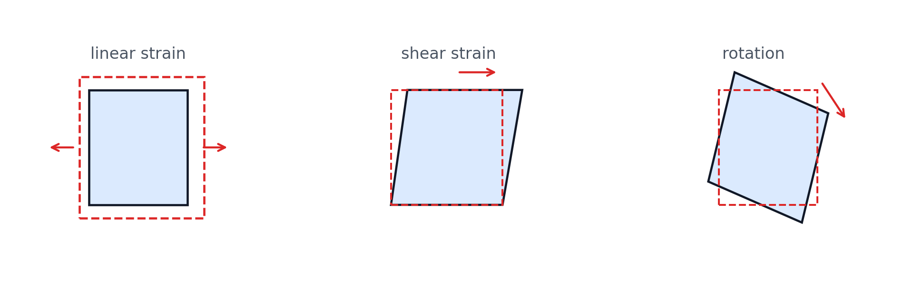
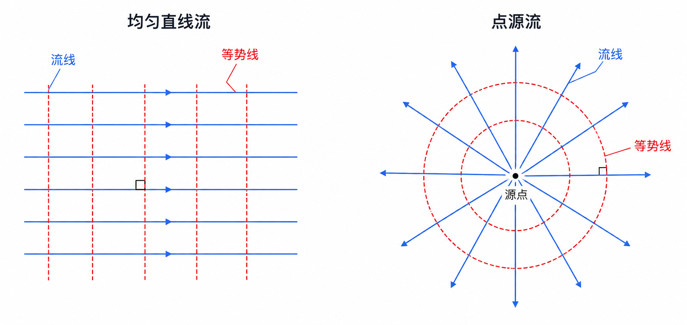
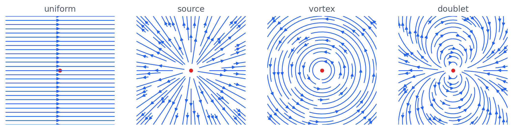
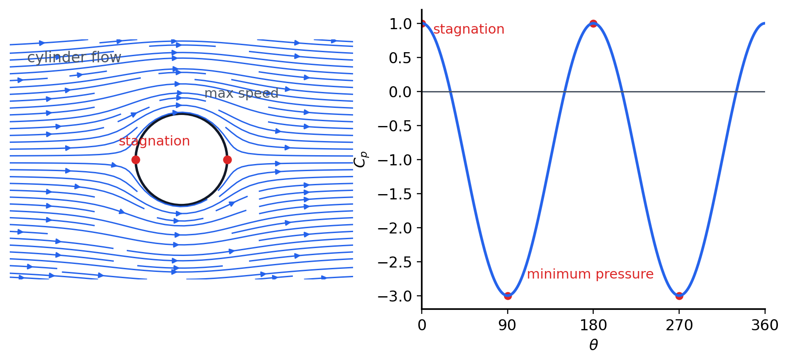

# 第 7 章 平面势流和涡流

## 7.1 流体微团运动分析

在点 $A(x,y,z)$ 附近取微团，点 $G(x+\delta x,y+\delta y,z+\delta z)$ 的速度可由 Taylor 展开得到：

$$
\begin{aligned}
u_G&=u+\frac{\partial u}{\partial x}\delta x+\frac{\partial u}{\partial y}\delta y+\frac{\partial u}{\partial z}\delta z,\\
v_G&=v+\frac{\partial v}{\partial x}\delta x+\frac{\partial v}{\partial y}\delta y+\frac{\partial v}{\partial z}\delta z,\\
w_G&=w+\frac{\partial w}{\partial x}\delta x+\frac{\partial w}{\partial y}\delta y+\frac{\partial w}{\partial z}\delta z.
\end{aligned}
$$

速度梯度可分解为平移、线变形、角变形和旋转。常用分量如下：

| 类型 | 分量 |
| --- | --- |
| 线变形率 | $\varepsilon_x=\dfrac{\partial u}{\partial x}$，$\varepsilon_y=\dfrac{\partial v}{\partial y}$，$\varepsilon_z=\dfrac{\partial w}{\partial z}$ |
| 角变形率 | $\gamma_x=\dfrac12\left(\dfrac{\partial w}{\partial y}+\dfrac{\partial v}{\partial z}\right)$，$\gamma_y=\dfrac12\left(\dfrac{\partial u}{\partial z}+\dfrac{\partial w}{\partial x}\right)$，$\gamma_z=\dfrac12\left(\dfrac{\partial v}{\partial x}+\dfrac{\partial u}{\partial y}\right)$ |
| 旋转角速度 | $\omega_x=\dfrac12\left(\dfrac{\partial w}{\partial y}-\dfrac{\partial v}{\partial z}\right)$，$\omega_y=\dfrac12\left(\dfrac{\partial u}{\partial z}-\dfrac{\partial w}{\partial x}\right)$，$\omega_z=\dfrac12\left(\dfrac{\partial v}{\partial x}-\dfrac{\partial u}{\partial y}\right)$ |

{ .fig-wide }

体积变形率为：

$$
\varepsilon=\varepsilon_x+\varepsilon_y+\varepsilon_z=\nabla\cdot\vec v
$$

对不可压流体，连续性方程给出 $\nabla\cdot\vec v=0$，因此微团体积变形率为零。

旋转角速度向量为：

$$
\vec\omega=\omega_x\vec i+\omega_y\vec j+\omega_z\vec k
=\frac12\nabla\times\vec v
$$

若 $\omega_x=\omega_y=\omega_z=0$，称为无旋流动；否则称为有旋流动。无旋条件等价于：

$$
\frac{\partial w}{\partial y}=\frac{\partial v}{\partial z},\qquad
\frac{\partial u}{\partial z}=\frac{\partial w}{\partial x},\qquad
\frac{\partial v}{\partial x}=\frac{\partial u}{\partial y}
$$

## 7.2 速度环量与涡强度

沿闭合曲线 $L$ 的速度环量为：

$$
\Gamma=\oint_L\vec v\cdot d\vec s
=\oint_L(u\,dx+v\,dy+w\,dz)
$$

涡量定义为 $\vec\Omega=\nabla\times\vec v=2\vec\omega$。穿过面积 $A$ 的涡强度为：

$$
I=\int_A\vec\Omega\cdot\vec n\,dA
=2\int_A\vec\omega\cdot\vec n\,dA
$$

由 Stokes 定理：

$$
\Gamma=\oint_L\vec v\cdot d\vec s
=\int_A(\nabla\times\vec v)\cdot\vec n\,dA
=I
$$

因此速度环量等于穿过该闭合曲线所围面积的涡强度。

涡线是在涡量场中处处与涡量矢量相切的曲线，其方程为：

$$
\frac{dx}{\omega_x}=\frac{dy}{\omega_y}=\frac{dz}{\omega_z}
$$

由涡线围成的管状曲面称为涡管，截面积趋于无穷小时称为涡束。

## 7.3 涡流运动的基本概念

Kelvin 定理：平面理想正压流体在有势质量力作用下发生运动时，若某时刻流体处处无旋，则以后仍保持无旋。

涡流产生的常见原因：流体具有黏性，或流体非正压，或质量力不是有势力。这些因素都可能破坏理想势流的无旋条件。

## 7.4 速度势函数与流函数

若流动无旋，则存在速度势函数 $\varphi$，使：

$$
d\varphi=u\,dx+v\,dy+w\,dz,\qquad
\vec v=\nabla\varphi
$$

在直角坐标下：

$$
\frac{\partial\varphi}{\partial x}=u,\qquad
\frac{\partial\varphi}{\partial y}=v,\qquad
\frac{\partial\varphi}{\partial z}=w
$$

在柱坐标下：

$$
v_r=\frac{\partial\varphi}{\partial r},\qquad
v_\theta=\frac{1}{r}\frac{\partial\varphi}{\partial\theta},\qquad
v_z=\frac{\partial\varphi}{\partial z}
$$

速度势函数的性质：

| 性质 | 内容 |
| --- | --- |
| 调和性 | 不可压无旋流动中 $\Delta\varphi=0$ |
| 等势面与流线 | 等势面与流线正交 |
| 沿线积分 | $\displaystyle\int_A^B\vec v\cdot d\vec r=\varphi_B-\varphi_A$ |
| 方向导数 | 速度在任意方向的分量等于速度势在该方向上的方向导数 |

{ .fig-wide }

对平面不可压流动，连续性方程为 $\dfrac{\partial u}{\partial x}+\dfrac{\partial v}{\partial y}=0$，因此可引入流函数 $\psi$：

$$
d\psi=-v\,dx+u\,dy,\qquad
\frac{\partial\psi}{\partial x}=-v,\qquad
\frac{\partial\psi}{\partial y}=u
$$

极坐标下：

$$
v_r=\frac{1}{r}\frac{\partial\psi}{\partial\theta},\qquad
v_\theta=-\frac{\partial\psi}{\partial r}
$$

流函数的性质：

| 性质 | 内容 |
| --- | --- |
| 调和性 | 平面不可压势流中 $\Delta\psi=0$ |
| 流线 | $\psi=\mathrm{const}$ 为流线 |
| 流量差 | 两条流线间单位宽度流量为 $\psi_B-\psi_A$ |

速度势函数和流函数同时存在时，都满足 Laplace 方程，并互为共轭函数：

$$
\frac{\partial\varphi}{\partial x}=\frac{\partial\psi}{\partial y},\qquad
\frac{\partial\varphi}{\partial y}=-\frac{\partial\psi}{\partial x}
$$

势线与流线正交，共同构成流网。

## 7.5 基本平面势流

常用基本势流如下。

{ .fig-wide }

| 流动 | 速度分布 | 速度势 $\varphi$ | 流函数 $\psi$ |
| --- | --- | --- | --- |
| 均匀直线流 | $u=u_0,\ v=0$ | $u_0x$ | $u_0y$ |
| 源/汇 | $v_r=\pm\dfrac{Q}{2\pi r},\ v_\theta=0$ | $\pm\dfrac{Q}{2\pi}\ln r$ | $\pm\dfrac{Q}{2\pi}\theta$ |
| 点涡 | $v_r=0,\ v_\theta=\dfrac{\Gamma}{2\pi r}$ | $\dfrac{\Gamma}{2\pi}\theta$ | $-\dfrac{\Gamma}{2\pi}\ln r$ |
| 偶极 | 极限满足 $Q\delta r=M$ | $\dfrac{M}{2\pi}\dfrac{x}{x^2+y^2}$ | $-\dfrac{M}{2\pi}\dfrac{y}{x^2+y^2}$ |

上表中源号取正表示源，取负表示汇；$Q$ 为源强，$\Gamma$ 为点涡环量，$M$ 为偶极强度。

## 7.6 平面势流的叠加：圆柱绕流

平面势流满足 Laplace 方程，因而可以线性叠加。均匀流与偶极叠加可构造圆柱绕流。设圆柱半径为 $R$，远处来流速度为 $v_\infty$，其流函数可写为：

$$
\psi=v_\infty\left(r-\frac{R^2}{r}\right)\sin\theta
$$

对应速度分量为：

$$
v_r=v_\infty\cos\theta\left(1-\frac{R^2}{r^2}\right),\qquad
v_\theta=-v_\infty\sin\theta\left(1+\frac{R^2}{r^2}\right)
$$

在远处 $r\to\infty$，有 $v_r=v_\infty\cos\theta,\ v_\theta=-v_\infty\sin\theta$；在柱面 $r=R$ 上，有 $v_r=0,\ v_\theta=-2v_\infty\sin\theta$，说明柱面本身是一条流线。

{ .fig-wide }

柱面上的特征点：

| 位置 | 结论 |
| --- | --- |
| $\theta=0^\circ,180^\circ$ | $v_\theta=0$，为驻点 |
| $\theta=90^\circ,270^\circ$ | $\vert v_\theta\lvert=2v_\infty$，速度最大 |

由无旋流动 Bernoulli 方程得到柱面压强分布：

$$
p-p_\infty=\frac{\rho v_\infty^2}{2}(1-4\sin^2\theta)
$$

压强系数为：

$$
C_p=\frac{p-p_\infty}{\frac12\rho v_\infty^2}=1-4\sin^2\theta
$$

势流圆柱绕流给出前后对称的压强分布，理想模型中合阻力为零；实际流动因黏性和分离会产生阻力。
