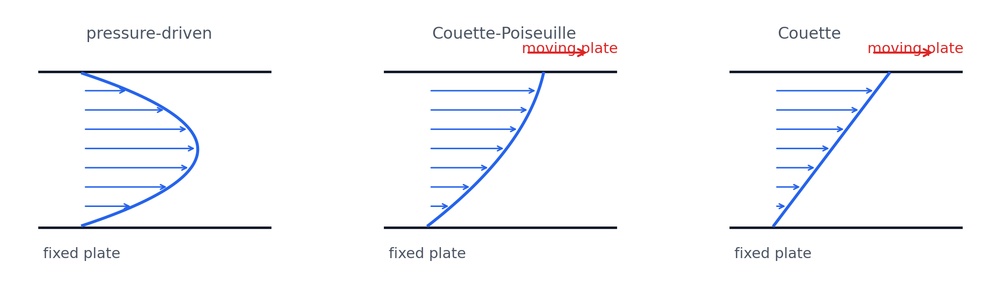
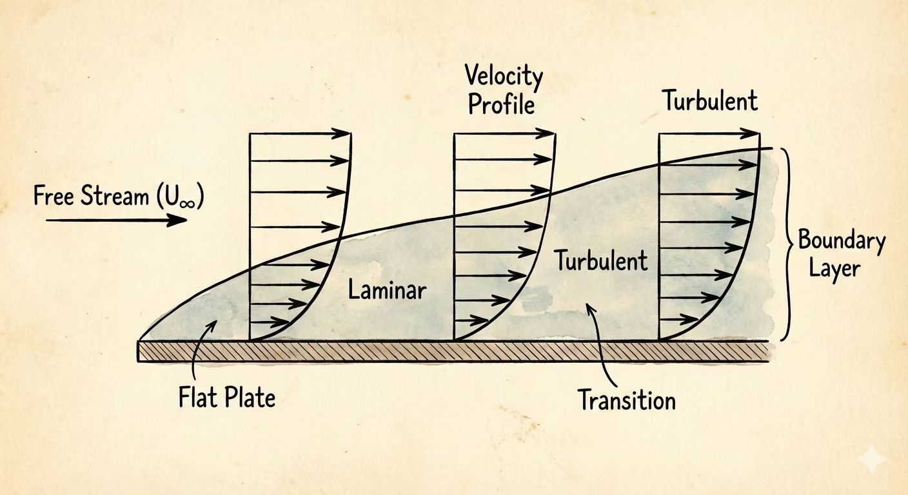
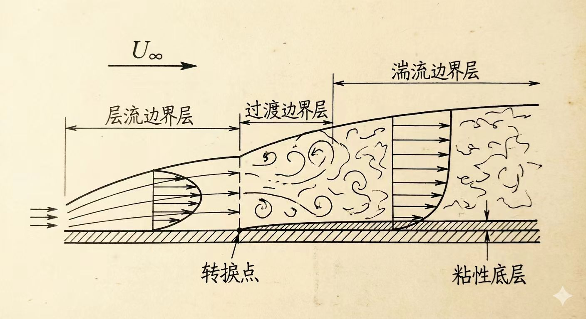

# 第 8 章 黏性不可压缩流体的运动

## 8.1 黏性流体中的应力

黏性流体中一点的应力状态不能只用压强描述，而应写成应力张量：

$$
\mathbf{P}=
\begin{bmatrix}
\sigma_{xx} & \tau_{xy} & \tau_{xz}\\
\tau_{yx} & \sigma_{yy} & \tau_{yz}\\
\tau_{zx} & \tau_{zy} & \sigma_{zz}
\end{bmatrix}
$$

切应力满足互等关系：

$$
\tau_{xy}=\tau_{yx},\qquad \tau_{yz}=\tau_{zy},\qquad \tau_{zx}=\tau_{xz}
$$

广义牛顿内摩擦定律把应力与速度梯度联系起来。对不可压缩流体，法向应力中的体积膨胀项消失：

| 应力分量 | 表达式 |
|---|---|
| 法向应力 | $\displaystyle \sigma_{xx}=-p+2\mu\frac{\partial u}{\partial x},\quad \sigma_{yy}=-p+2\mu\frac{\partial v}{\partial y},\quad \sigma_{zz}=-p+2\mu\frac{\partial w}{\partial z}$ |
| 切向应力 | $\displaystyle \tau_{xy}=\tau_{yx}=\mu\left(\frac{\partial u}{\partial y}+\frac{\partial v}{\partial x}\right)$ |
| 切向应力 | $\displaystyle \tau_{yz}=\tau_{zy}=\mu\left(\frac{\partial v}{\partial z}+\frac{\partial w}{\partial y}\right)$ |
| 切向应力 | $\displaystyle \tau_{zx}=\tau_{xz}=\mu\left(\frac{\partial w}{\partial x}+\frac{\partial u}{\partial z}\right)$ |

若考虑可压缩形式，法向应力还会出现 $\displaystyle \lambda\left(\frac{\partial u}{\partial x}+\frac{\partial v}{\partial y}+\frac{\partial w}{\partial z}\right)$ 这样的体积黏性项。

## 8.2 不可压缩黏性流体运动基本方程

不可压缩黏性流体的运动由连续方程和Navier-Stokes 方程共同描述：

$$
\frac{\partial u}{\partial x}+\frac{\partial v}{\partial y}+\frac{\partial w}{\partial z}=0
$$

$$
\frac{\partial \mathbf{v}}{\partial t}+(\mathbf{v}\cdot\nabla)\mathbf{v}
=\mathbf{f}-\frac{1}{\rho}\nabla p+\nu\nabla^2\mathbf{v}
$$

其中 $\mathbf{f}$ 为单位质量体积力，$\nu=\mu/\rho$ 为运动黏度。

| 情况 | 方程退化 |
|---|---|
| 理想流体 | $\displaystyle \frac{\partial \mathbf{v}}{\partial t}+(\mathbf{v}\cdot\nabla)\mathbf{v}=\mathbf{f}-\frac{1}{\rho}\nabla p$ |
| 流体静止或无加速度平衡 | $\displaystyle \mathbf{f}=\frac{1}{\rho}\nabla p$ |
| 定常平行流 | 可化为一维速度分布问题 |

## 8.3 平行平板间的黏性流动

设两无限大平板间距为 $h$，速度仅有 $x$ 方向分量 $u=u(y)$。定常、不可压缩、平行流满足：

$$
\frac{dp}{dx}=\mu\frac{d^2u}{dy^2}
$$

积分得一般解：

$$
u=\frac{1}{2\mu}\frac{dp}{dx}y^2+C_1y+C_2
$$

{ .fig-wide }

| 边界条件 | 速度分布 |
|---|---|
| 两板固定：$y=0,u=0;\ y=h,u=0$ | $\displaystyle u=\frac{1}{2\mu}\frac{dp}{dx}(y^2-yh)$ |
| 上板以 $U$ 运动且有压强梯度：$y=0,u=0;\ y=h,u=U$ | $\displaystyle u=\frac{U}{h}y+\frac{1}{2\mu}\frac{dp}{dx}(y^2-yh)$ |
| 上板以 $U$ 运动且无压强梯度 | $\displaystyle u=\frac{U}{h}y$ |

前两类体现压差驱动的泊肃叶流分量，第三类是由壁面运动驱动的库埃特流。

## 8.4 边界层基本概念及基本方程

黏性流体绕固体表面流动时，壁面附近速度从无滑移条件下的零速度迅速过渡到外部主流速度，这一薄层称为边界层。

{ .fig-medium }

边界层的主要特点：

| 特点 | 说明 |
|---|---|
| 很薄 | $\displaystyle \delta\ll L$ |
| 厚度变化 | $\delta=\delta(x)$，沿流向逐渐增厚 |
| 速度梯度大 | 壁面附近 $\displaystyle \frac{\partial u}{\partial y}$ 很大 |
| 法向压强近似不变 | $\displaystyle \frac{\partial p}{\partial y}=0$ |
| 黏性力不能忽略 | 边界层内黏性力与惯性力同量级 |

边界层外缘通常取 $u(y=\delta)=0.99U$。外缘不是一条严格流线，而是人为规定的速度达到主流的近似位置。

平板边界层的流态可用局部雷诺数判断：

$$
Re_x=\frac{Ux}{\nu},\qquad Re_{cr}=\frac{Ux_{cr}}{\nu}
$$

对光滑平板，常取 $\displaystyle Re_{cr}\approx 5\times10^5\sim 3\times10^6$。

{.fig-medium}

边界层内常用三个厚度描述速度亏损：

| 名称 | 定义 |
|---|---|
| 边界层厚度 | $u(\delta)=0.99U$ |
| 位移厚度 | $\displaystyle \delta^*=\int_0^\infty\left(1-\frac{u}{U}\right)dy$ |
| 动量厚度 | $\displaystyle \delta^{**}=\int_0^\infty\frac{u}{U}\left(1-\frac{u}{U}\right)dy$ |

二维边界层方程为：

$$
\frac{\partial u}{\partial x}+\frac{\partial v}{\partial y}=0
$$

$$
u\frac{\partial u}{\partial x}+v\frac{\partial u}{\partial y}
=-\frac{1}{\rho}\frac{\partial p}{\partial x}+\nu\frac{\partial^2u}{\partial y^2},\qquad
\frac{\partial p}{\partial y}=0
$$

边界条件：壁面 $y=0$ 处 $u=v=0$；边界层外缘 $u=U$，并与外部无黏流动压强分布相匹配。

## 8.5 平板层流边界层相似性解

对零压强梯度平板层流边界层，引入相似变量：

$$
\eta=y\sqrt{\frac{U}{2\nu x}},\qquad \frac{u}{U}=f'(\eta)
$$

可得到 Blasius 型常微分方程：

$$
f'f''+f'''=0
$$

由相似性解可得平板层流边界层的常用结果：

| 量 | 表达式 |
|---|---|
| 边界层厚度 | $\displaystyle \delta(x)=5.0\sqrt{\frac{\nu x}{U}}=\frac{5.0x}{\sqrt{Re_x}}$ |
| 位移厚度 | $\displaystyle \delta^*(x)=1.721\sqrt{\frac{\nu x}{U}}=\frac{1.721x}{\sqrt{Re_x}}$ |
| 动量厚度 | $\displaystyle \delta^{**}(x)=0.664\sqrt{\frac{\nu x}{U}}=\frac{0.664x}{\sqrt{Re_x}}$ |
| 壁面切应力 | $\displaystyle \tau_w=0.332\frac{\rho U^2}{\sqrt{Re_x}}$ |
| 单位宽度阻力 | $\displaystyle F_D=\int_0^l\tau_w\,dx=0.664\frac{\rho U^2l}{\sqrt{Re_l}}$ |
| 平均摩擦阻力系数 | $\displaystyle C_f=\frac{F_D}{\frac12\rho U^2l}=\frac{1.328}{\sqrt{Re_l}}$ |

## 8.6 边界层动量积分方程

边界层动量积分方程把壁面摩擦、外流速度变化和速度亏损厚度联系起来：

$$
\frac{d\delta^{**}}{dx}+\frac{\delta^{**}}{U}(2+H)\frac{dU}{dx}
=\frac{\tau_w}{\rho U^2},\qquad H=\frac{\delta^*}{\delta^{**}}
$$

对零压强梯度平板，$U$ 为常数，方程化为：

$$
\frac{d\delta^{**}}{dx}=\frac{\tau_w}{\rho U^2}
$$

## 8.7 湍流边界层与混合边界层

湍流边界层内速度分布更饱满，壁面附近速度梯度更大，因而壁面摩擦通常大于层流边界层。

常用的湍流边界层近似：

| 内容 | 表达式 |
|---|---|
| 七分之一次方律 | $\displaystyle \frac{u}{U}=\left(\frac{y}{\delta}\right)^{1/7}$ |
| 壁面摩擦关系 | $\displaystyle \frac{\tau_w}{\rho U^2}=0.0225\left(\frac{\nu}{U\delta}\right)^{1/4}$ |

实际平板边界层常先经历层流段，再在转捩后发展为湍流段，因此会出现混合边界层。计算时需要根据转捩位置分别处理层流段与湍流段。
