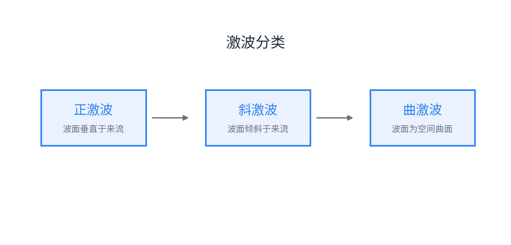
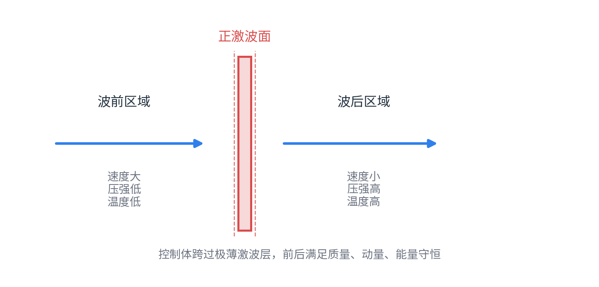

# 第 9 章 激波

激波是流动参数发生突跃变化的压缩波。激波前后，速度、压强、密度、温度等物理量在极薄区域内发生有限变化。

{ .fig-medium }

按波面形状与来流方向，激波可分为正激波、斜激波和曲激波。

## 9.1 正激波的形成

正激波可看作多个微弱压缩波不断追赶、叠加后形成的有限强度压缩间断面。由于压缩波后的声速与流速改变，后发出的压缩扰动可能追上前面的扰动，最终形成激波。

正激波的典型特征：

| 项目 | 结论 |
|---|---|
| 波面方向 | 波面垂直于来流方向 |
| 流动性质 | 激波前为超声速，激波后为亚声速 |
| 参数变化 | 波后压强、密度、温度升高，速度降低 |
| 热力学性质 | 绝热但不可逆，熵增，总压降低 |

{ .fig-wide }

## 9.2 正激波基本关系式

取跨越正激波的薄控制体，忽略激波厚度内的外功和热量交换，可写出四个基本关系：

| 方程 | 表达式 |
|---|---|
| 连续方程 | $\displaystyle \rho_1 v_1=\rho_2 v_2$ |
| 动量方程 | $\displaystyle p_1-p_2=\rho_2v_2^2-\rho_1v_1^2$ |
| 能量方程 | $\displaystyle h_1+\frac12v_1^2=h_2+\frac12v_2^2$ |
| 状态方程 | $\displaystyle \frac{p_1}{\rho_1T_1}=\frac{p_2}{\rho_2T_2}$ |

由基本方程可得普朗特激波关系：

$$
v_1v_2=c_*^2,\qquad \lambda_1\lambda_2=1
$$

因此正激波前后必有：波前超声速、波后亚声速；$v_1$ 越大，$v_2$ 越小。

## 9.3 Rankine-Hugoniot 公式

Rankine-Hugoniot 公式给出正激波前后压强、密度、温度的关系。以压强比为自变量：

$$
\frac{\rho_2}{\rho_1}
=\frac{(\gamma+1)\frac{p_2}{p_1}+(\gamma-1)}
{(\gamma+1)+(\gamma-1)\frac{p_2}{p_1}}
$$

$$
\frac{T_2}{T_1}
=\frac{\frac{\gamma+1}{\gamma-1}\frac{p_2}{p_1}+\left(\frac{p_2}{p_1}\right)^2}
{\frac{\gamma+1}{\gamma-1}\frac{p_2}{p_1}+1}
$$

也可反写为密度比形式：

$$
\frac{p_2}{p_1}
=\frac{(\gamma+1)\frac{\rho_2}{\rho_1}-(\gamma-1)}
{(\gamma+1)-(\gamma-1)\frac{\rho_2}{\rho_1}}
$$

当 $\displaystyle \frac{p_2}{p_1}\to\infty$ 时，

$$
\frac{\rho_2}{\rho_1}\to \frac{\gamma+1}{\gamma-1}
$$

空气取 $\gamma=1.4$ 时，极限压缩密度比为 $\displaystyle \frac{\gamma+1}{\gamma-1}=6$。所以激波是突跃压缩过程，但压缩有上限。

## 9.4 与上游马赫数的关系

正激波关系常写成上游马赫数 $Ma_1$ 的函数。

| 物理量 | 关系式 |
|---|---|
| 下游马赫数 | $\displaystyle Ma_2^2=\frac{2+(\gamma-1)Ma_1^2}{2\gamma Ma_1^2-(\gamma-1)}$ |
| 密度比 | $\displaystyle \frac{\rho_2}{\rho_1}=\frac{v_1}{v_2}=\lambda_1^2=\frac{(\gamma+1)Ma_1^2}{2+(\gamma-1)Ma_1^2}$ |
| 压强比 | $\displaystyle \frac{p_2}{p_1}=\frac{2\gamma}{\gamma+1}Ma_1^2-\frac{\gamma-1}{\gamma+1}$ |
| 驻点压强比 | $\displaystyle \frac{p_{01}}{p_{02}}=\left(\frac{2\gamma}{\gamma+1}Ma_1^2-\frac{\gamma-1}{\gamma+1}\right)^{\frac{1}{\gamma-1}}\left[\frac{2+(\gamma-1)Ma_1^2}{(\gamma+1)Ma_1^2}\right]^{\frac{\gamma}{\gamma-1}}$ |

由驻点压强比可判断激波的不可逆性：

$$
s_2-s_1=R\ln\frac{p_{01}}{p_{02}}
$$

当 $Ma_1>1$ 时，$\displaystyle \frac{p_{01}}{p_{02}}>1$，因此 $s_2>s_1$。激波压缩总是熵增过程。

临界有效截面积的变化为：

$$
\frac{A_2^*}{A_1^*}
=\frac{Ma_2}{Ma_1}
\left[
\frac{2+(\gamma-1)Ma_1^2}{2+(\gamma-1)Ma_2^2}
\right]^{\frac{\gamma+1}{2(\gamma-1)}}
$$

且有 $\displaystyle A_2^*>A_1^*$，说明正激波会造成总压损失和有效流通能力变化。

