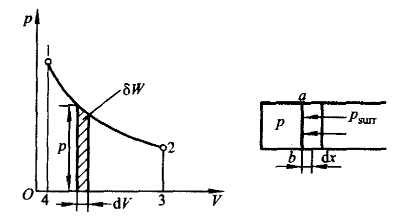
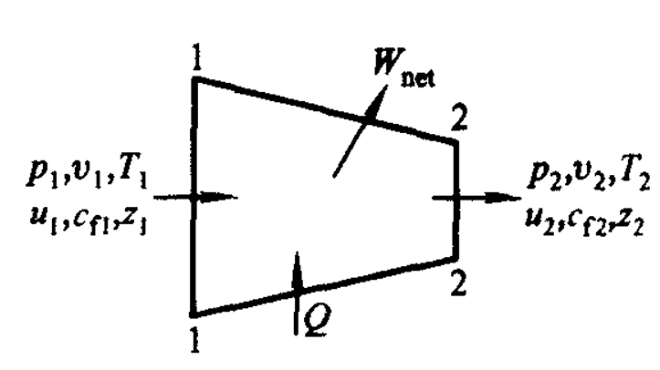

# 第 2 章 能量与热力学第一定律

## 2.1 热一律实质

能量守恒定律在热力学中的应用。第一类永动机不可能制造成功。

## 2.2 功

  

热力系与外界传递能量的方式只有功和传热两种。功量是过程量，对外做功为正。

$$
W=\int_1^2 \delta W=\int_1^2 pA\,dx=\int_1^2 p\,dV
$$

比功：

$$
w=\frac{W}{m}
$$

准静功：系统在准平衡过程中完成的功量。

$$
\delta w=\frac{1}{m}p\,dV=p\,dv,\qquad
w_{1-2}=\int_{v_1}^{v_2}p\,dv
$$

## 2.3 热

热力系与外界之间因温差而传递的能量称为热。比热量：

$$
q=\frac{Q}{m}
$$

$$
\delta Q=m c\,dT,\qquad Q_{1-2}=\int_{T_1}^{T_2}mc\,dT
$$

可逆过程中：

$$
Q=\int_1^2T\,dS
$$

符号约定：

$$
dS>0\Rightarrow \delta q>0,\qquad
dS<0\Rightarrow \delta q<0,\qquad
dS=0\Rightarrow \delta q=0
$$

## 2.4 循环的热一律表达式

$$
\oint \delta Q=\oint \delta W
$$

## 2.5 热一律推论：状态参数热力学能

$$
dU=\delta Q-\delta W
$$

热力学中考虑：

$$
U=U_k+U_p
$$

比热力学能：

$$
u=\frac{U}{m}
$$

外部储存能包括宏观动能和重力势能：

$$
E_k=\frac12 mc_f^2,\qquad E_p=mgz
$$

总储存能：

$$
E=U+E_k+E_p
$$

比储存能：

$$
e=u+\frac12 c_f^2+gz
$$

对闭口系统：

$$
de=\delta q-\delta w
$$

## 2.6 热力系与外界的物质交换

质量守恒：

$$
m_{in}-m_{out}=\Delta m_{c.v.}
$$

稳定流动时：

$$
\Delta m_{c.v.}=0,\qquad m_{in}=m_{out},\qquad
\left(\frac{\delta m}{\delta \tau}\right)_{in}=\left(\frac{\delta m}{\delta \tau}\right)_{out}
$$

流动功：

$$
W_f=p_2V_2-p_1V_1=\Delta(pV)
$$

比流动功：

$$
w_f=\Delta(pv),\qquad \delta w_f=d(pv)
$$

流动功与流动有关，取决于位置变化，是状态量；流动工质携带。

## 2.7 热一律表达式

基本表达式：

$$
Q=\Delta U+W,\qquad \delta Q=dU+\delta W
$$

单位质量形式：

$$
q=\Delta u+w,\qquad \delta q=du+\delta w
$$

  

稳定流动能量方程：

$$
Q=E_2-E_1+W_f+W_{net}
$$

令 $H=U+pV$，$h=u+pv$，有：

$$
Q=(H_2-H_1)+\frac12 m(c_{f2}^2-c_{f1}^2)+mg(z_2-z_1)+W_{net}
$$

常用形式：

$$
Q=\Delta H+\frac12m\Delta c_f^2+mg\Delta z+W_{net}
$$

忽略动能、位能变化：

$$
Q=\Delta H+W_t,\qquad q=\Delta h+w_t,\qquad \delta q=dh+\delta w_t
$$

## 2.8 能量方程式的应用

- 热力发动机：蒸汽轮机、燃气轮机、水轮机，

$$
W_{net}=H_1-H_2,\qquad w_{net}=h_1-h_2
$$

- 压气机、水泵：

$$
-W_{net}=H_2-H_1-Q,\qquad -w_{net}=h_2-h_1-q
$$

- 换热器：

$$
Q=\Delta H=H_2-H_1,\qquad q=h_2-h_1
$$

- 喷管：

$$
\frac12 mc_f^2=-\Delta H=H_1-H_2,\qquad \frac12c_f^2=h_1-h_2
$$

- 节流元件：

$$
H_1=H_2,\qquad h_1=h_2
$$
