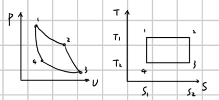
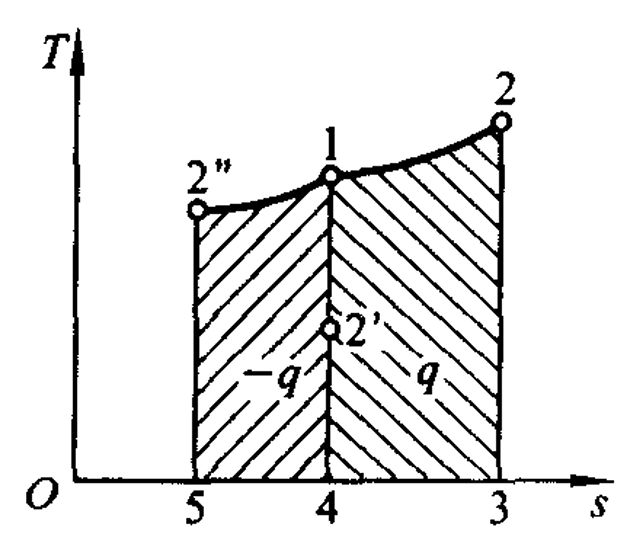

# 第 3 章 熵与热力学第二定律

## 3.1 概述

本章围绕热过程的方向性、可逆性、卡诺循环、熵、熵方程和有效能展开。

## 3.2 热过程的不可逆性

常见不可逆因素：

1. 功热转换、摩擦过程。
2. 不等温传热过程：热量自高温传向低温。
3. 无阻膨胀：常见自然过程，但逆过程无法实现。
4. 混合过程：可自发发生，分离需消耗外功。
5. 其他不可逆因素。

不可逆过程：不能使过程逆行且使过程中引起的变化在逆过程中完全消除。  
耗散效应：不可逆过程中使功转换为热的效应。

不可逆因素可分为外部不可逆因素和内部不可逆因素。

## 3.3 可逆过程

系统完成某一过程后，使该过程逆行，并使系统及外界回复原始状态，不遗留任何变化，则称为可逆过程。反之为不可逆过程。

## 3.4 热力学第二定律的表述

- 克劳修斯表述：不可能将热从低温物体传至高温物体而不引起其他变化。
- 开尔文表述：不可能从单一热源取热，并使之完全变为有用功而不产生其他影响。
- 普朗克表述：不可能制造一部机器，在循环中将一重物升高而同时使一热库冷却。

第二类永动机不可能实现。

## 3.5 卡诺定理

定理一：不可能制造出在两个温度不同的热源间工作的热机，而使其效率超过在同样热源间工作的可逆热机。  
定理二：在两个热源间工作的一切可逆热机具有相同的效率。

## 3.6 热力学温度标尺

任意工质的卡诺循环中：

$$
\frac{Q_1}{Q_2}=\frac{T_1}{T_2}
$$

## 3.7 卡诺循环

卡诺循环由两条定温过程和两条绝热过程组成：

1. $1\to2$：定温吸热，$Q_1=T_1(s_2-s_1)$。
2. $2\to3$：绝热膨胀，对外做功。
3. $3\to4$：定温放热，$Q_2=T_2(s_2-s_1)$。
4. $4\to1$：绝热压缩，对内做功。

热效率：

$$
\eta_c=\frac{W}{Q_1}=1-\frac{Q_2}{Q_1}=1-\frac{T_2}{T_1}
$$

结论：

1. 效率只与温度有关。
2. 尽量提高 $T_1$、降低 $T_2$。
3. $\eta_c<1$。
4. 若 $T_1=T_2$，$\eta=0$，说明利用比单一热源做功不可能。

制冷系数和供热系数：

$$
\varepsilon=\frac{Q_2}{W}=\frac{Q_2}{Q_1-Q_2}=\frac{T_2}{T_1-T_2}
$$

$$
\varepsilon'=\frac{Q_1}{W}=\frac{Q_1}{Q_1-Q_2}=\frac{T_1}{T_1-T_2}
$$

## 3.8 克劳修斯不等式

$$
\oint \frac{\delta Q}{T}\le 0
$$

方向性：

$$
\begin{cases}
= & \text{可逆循环}\\
< & \text{不可逆循环}
\end{cases}
$$

## 3.9 状态参数熵

熵的定义：

$$
dS=\frac{\delta Q_{rev}}{T}
$$

熵变：

$$
\Delta S=S_2-S_1=\int_1^2\frac{\delta Q_{rev}}{T}
$$

可逆过程中：

$$
\delta Q=T\,dS,\qquad Q_{1-2}=\int_1^2T\,dS
$$

示热图：

{ .fig-small}

## 3.10 熵增原理

任意过程中：

$$
dS\ge \frac{\delta Q}{T}
$$

其中等号对应可逆过程，大于号对应不可逆过程。

熵变由熵流和熵产组成：

$$
dS=dS_f+\delta S_g,\qquad \Delta S=\Delta S_f+S_g
$$

熵流：

$$
dS_f=\frac{\delta Q}{T}
$$

熵产：

$$
\delta S_g\ge0
$$

孤立系统：

$$
dS_{iso}\ge0
$$

熵增原理：在孤立系统内，一切实际过程都朝着熵增加方向进行；极限情况下熵不变。熵取极值时，比导数为零而二阶导数为负。

## 3.11 熵方程

热二律数学表达式：

$$
dS\ge\frac{\delta Q}{T},\qquad dS_{iso}\ge0
$$

闭口系：

$$
dS=dS_f+\delta S_g=\frac{\delta Q}{T}+\delta S_g
$$

开口系：

$$
dS_{c.v.}=\frac{\delta Q}{T}+d(ms)+\delta S_{g,c.v.}
$$

## 3.12 热力系的有效能

热量有效能：

$$
E_{x,Q}=W_{max}=\left(1-\frac{T_0}{T}\right)Q
$$

热量无效能：

$$
E_{n,Q}=Q-E_{x,Q}=\frac{T_0}{T}Q=T_0\,dS_f
$$

$$
Q=E_{x,Q}+E_{n,Q}
$$

闭口系工质有效能：

$$
\delta Q_{rev}=dU+\delta W_{max}=dU+p_0dV+\delta W_{u,max}
$$

$$
dS_{iso}=dS+dS_{surr}=0,\qquad dS_{surr}=\frac{\delta Q_{surr}}{T_0}=-\frac{\delta Q_{rev}}{T_0}
$$

$$
W_{u,max}=(U+p_0V-T_0S)-(U_0+p_0V_0-T_0S_0)
$$

可用能函数：

$$
\psi=(U+p_0V-T_0S)-(U_0+p_0V_0-T_0S_0),\qquad W_{u,max}=\psi_1-\psi_2
$$

开口系：

$$
W_{u,max}=(H-T_0S)-(H_0-T_0S_0)
$$

比用：

$$
e_x=(h-T_0s)-(h_0-T_0s_0)
$$

## 3.14 热力学第二定律的统计解释

从宏观上看，一切与热现象有关的宏观过程都是不可逆的；不受外界影响的孤立系统内部发生的过程，总是沿着由概率小的状态向概率大的状态方向进行。

$$
S=k_B\ln W
$$

其中 $k_B$ 为玻尔兹曼常数，$W$ 为热力学概率。
