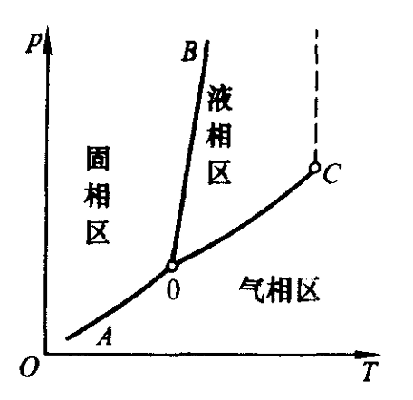
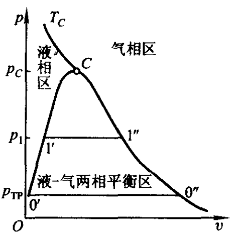
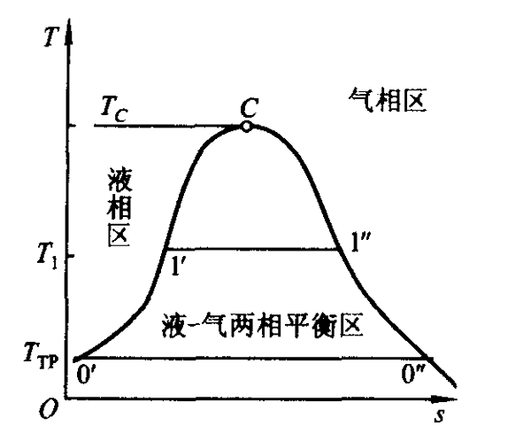
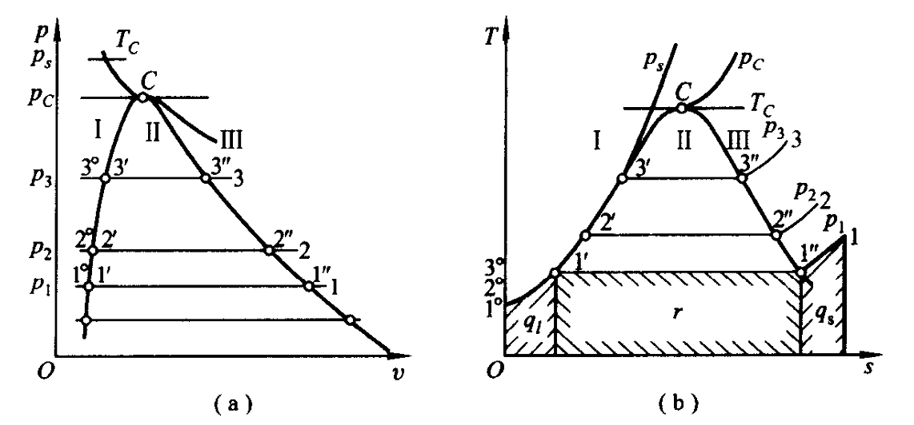

# 第 6 章 蒸气热力性质

## 6.1 单元工质的相图与相变

### p-T 相图

饱和线：$0-A$、$0-B$、$0-C$。  $0$ 为三相点，$C$ 为临界点。

在临界点上，饱和液和饱和气具有相同的 $T,p,v,u,h,s$。当 $p>p_c$ 时，液相和气相之间不存在明显界线。

### p-v相图

### T-s相图

汽化潜热：

$$
r=h''-h'=T_s(s''-s')
$$

其中 $h''$ 为饱和蒸气焓，$h'$ 为饱和液体焓。

## 6.2 单元复相系平衡条件

### 热力系平衡判据

1. 熵判据：

    $$(dS)_{iso}\ge0$$

    孤立系统中，平衡状态熵最大。

2. 亥姆霍兹自由能：

    $$F=U-TS,\qquad (dF)_{T,V}\le0$$

    适用于定温定容。

3. 吉布斯自由能：

    $$G=H-TS=U+pV-TS,\qquad (dG)_{T,p}\le0$$

    适用于定温定压。

### 化学势

$$
\mu=\left(\frac{\partial U}{\partial m}\right)_{S,V}
$$

### 相平衡条件

$$
T^\beta=T^\alpha,\qquad p^\beta=p^\alpha,\qquad \mu^\beta=\mu^\alpha
$$

### 吉布斯相律

$$
I=C-P+2
$$

### 克劳修斯-克拉珀龙方程

$$
\frac{\mathrm{d}p_s}{\mathrm{d}T_s}=\frac{r}{T_s(v^\beta-v^\alpha)}
$$

## 6.3 蒸气定压发生过程

1. 液体加热阶段

    未饱和液 $\rightarrow$ 饱和液 &emsp; 1° $\rightarrow$ 1'  &emsp; 吸热 $q_l = h' - h_0$

2. 气化阶段

    饱和液 $\rightarrow$ 饱和蒸气 &emsp; 1' $\rightarrow$ 1"  &emsp; 潜热 $r = h'' - h' = Ts(s''-s')$ 
    
    干度：湿蒸气中饱和蒸气占的质量成分 $x = \frac{m''}{m'+m''} = \frac{m''}{m}$

3. 过热阶段

    饱和蒸气 $\rightarrow$ 过热蒸气 &emsp; 1'' $\rightarrow$ 1 &emsp; 吸热 $q_s = h - h''$

    $\Delta t = t - t_s$ 称为过热度

## 6.4 蒸气热力性质表

1. 基准点的选定

    处于三相点的饱和水的热力学能及熵值为0

2. 饱和液及饱和蒸气热力性质表

    特点：两相共存，1个强度参数

    范围：三相点和临界点之间

    湿蒸气参数：
    
    $$\begin{aligned}
    &v_x = (1-x)v' + xv'' = v' + x(v''-v') \\
    &h_x = h' + x(h''-h') = h' + xr \\
    &s_x = s' + x(s''-s')
    \end{aligned}$$

3. 未饱和液及过热蒸汽热力性质表

    特点：单相状态，2个参数

    内插计算
