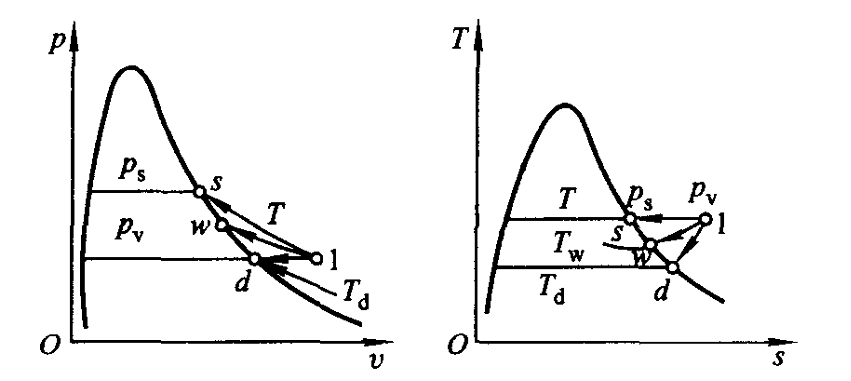

# 第 7 章 理想气体混合物与湿空气

## 7.1 混合物的成分、摩尔质量及气体常数

总质量、总物质的量：

$$
m=\sum_i m_i,\qquad n=\sum_i n_i
$$

质量分数：

$$
w_i=\frac{m_i}{m},\qquad \sum_i w_i=1
$$

摩尔分数：

$$
x_i=\frac{n_i}{n},\qquad \sum_i x_i=1
$$

混合物摩尔质量：

$$
M=\frac{m}{n}
=\frac{\sum_i m_i}{n}
=\frac{\sum_i n_iM_i}{n}
=\sum_i x_iM_i
$$

气体常数：

$$
R_g=\frac{R}{M}
=\frac{nR}{m}
=\frac{\sum_i n_iR}{m}
=\sum_i w_iR_{g,i}
$$

质量分数与摩尔分数换算：

$$
w_i=\frac{m_i}{m}
=\frac{n_iM_i}{nM}
=\frac{M_i}{M}x_i
$$

$$
x_i=\frac{n_i}{n}
=\frac{m_i/M_i}{m/M}
=\frac{R/M_i}{R/M}w_i
=\frac{R_{g,i}}{R_g}w_i
$$

## 7.2 分压、分体积定律

分压力定律：

$$
p_iV=n_iRT,\qquad p=\sum_i p_i,\qquad p_i=x_ip
$$

分体积定律：

$$
V_i=\frac{n_iRT}{p},\qquad V_i=x_iV,\qquad V=\sum_iV_i
$$

## 7.3 理想气体混合物的 $U,H,C,S$ 计算

$$
u(T)=\sum_i w_i u_i(T)
$$

$$
U_m(T)=\sum_i x_i U_{m,i}(T)
$$

$$
h(T)=\sum_i w_i\left[u_i(T)+R_{g,i}T\right]
$$

$$
c_v(T)=\sum_i w_i c_{v,i}(T),\qquad
c_p(T)=\sum_i w_i c_{p,i}(T)
$$

$$
s(T,p)=\sum_i w_i s_i(T,p_i)
$$

## 7.4 湿空气及其状态参数

1. 湿空气由干空气和水蒸气组成

    $$p=p_a+p_v$$

2. 绝对湿度：湿空气中所含水蒸气的量。

    $$\rho_v=\frac{1}{v_v}=\frac{p_v}{R_{g,v}T}$$

    定温下 $p_v$ 越高，$\rho_v$ 越大；$p_v$ 最大不能超过对应温度下的饱和压力 $p_s$。

3. 相对湿度

    $$\varphi=\frac{\rho _v}{\rho _s}=\frac{p_v}{p_s}$$

4. 含湿量

    $$d=\frac{m_v}{m_a}=0.622\frac{p_v}{p-p_v}=0.622\frac{\varphi p_s}{p-\varphi p_s}$$

5. 湿空气焓

    $$H = m_ah_a=m_vh_v &emsp;&emsp; h=h_a+dh_v$$

    $$h_a = c_{p,a}t &emsp; h_v=h_c+c_{p,v}t &emsp; h = c_{p,a}t+d(h_c+c_{p,v}t)$$

6. 从过热蒸气到饱和蒸气的路径

    

    ①定温加湿过程：$T$ 不变，$p_v$ 增大

    ②定压降温过程：$p_v$ 不变，$T$ 减小

## 7.5 干湿球温度计

湿球温度 $t_w \approx$ 绝热饱和温度

$\varphi$ 越大，$t-t_w$ 越小；$\varphi = 1$，$t=t_w$
