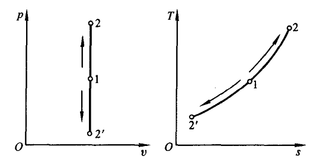
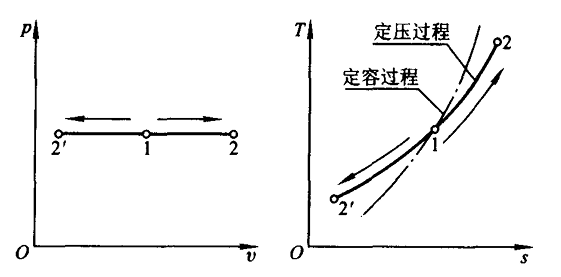
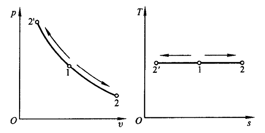
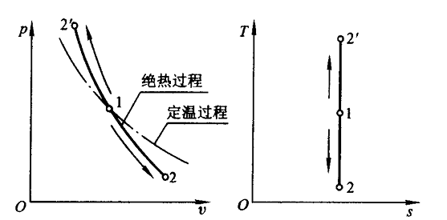

# 第 8 章 理想气体热力过程

## 8.1 概述

基本热力过程：定压、定温、定容、绝热

热力计算分析步骤：

1. 求状态方程 $p = f(v)$。求 $\Delta u, \Delta h, \Delta s$ 

    $$\Delta u = c_v(T_2 -T_1) &emsp; \Delta h=c_p(T_2-T_1)$$

    $$\Delta s=c_v\ln \frac{T_2}{T_1}+R_g\ln \frac{v_2}{v_1}=c_p\ln \frac{T_2}{T_1}-R_g\ln \frac{p_2}{p_1}$$

2. 在 $p-v$ 图，$T-s$ 图上表示热力过程

3. 计算功和热

    $$q=\int_{1}^{2}c\mathrm{d}T=\int_{1}^{2}T\mathrm{d}s$$

    $$q=\Delta u+w \qquad q=\Delta h+w_t$$

## 8.2 四种典型热力过程分析
### 定容过程

过程方程：$v=\text{const}$ 或 $\mathrm{d}v=0$

状态参数关系：

$$v_1=v_2 &emsp; \frac{p_2}{p_1}=\frac{T_2}{T_1} &emsp; \Delta u = c_v(T_2 -T_1) &emsp; \Delta h=c_p(T_2-T_1) &emsp; \Delta s=c_v\ln \frac{T_2}{T_1}$$

能量转换：

$$q=\Delta u=c_v(T_2-T_1) \qquad w=\int p\,\mathrm{d}v=0$$

在 $T-s$ 图上，斜率 $\displaystyle(\frac{\partial T}{\partial s})_v=\frac{T}{c_v}$，升温斜率变大

### 定压过程

过程方程：$p=\text{const}$ 或 $\mathrm{d}p=0$

状态参数关系：

$$p_1=p_2 \quad \frac{v_2}{v_1}=\frac{T_2}{T_1} \quad \Delta u=c_v(T_2-T_1) \quad \Delta h=c_p(T_2-T_1) \quad \Delta s=c_p\ln\frac{T_2}{T_1}$$

能量转换：

$$q=\Delta h=c_p(T_2-T_1) \qquad w=p(v_2-v_1)=R_g(T_2-T_1)$$

在 $T-s$ 图上，斜率 $\displaystyle(\frac{\partial T}{\partial s})_p=\frac{T}{c_p}$，定压线比定容线平缓

### 定温过程

过程方程：$T=\text{const}$ 或 $\mathrm{d}T=0$

状态参数关系：

$$T_1=T_2 \quad p_1v_1=p_2v_2 \quad \frac{p_2}{p_1}=\frac{v_1}{v_2} \quad \Delta u=0 \quad \Delta h=0 \quad \Delta s=R_g\ln\frac{v_2}{v_1}=R_g\ln\frac{p_1}{p_2}$$

能量转换：

$$q=w=\int_{v_1}^{v_2}p\,\mathrm{d}v=R_gT\ln\frac{v_2}{v_1}=R_gT\ln\frac{p_1}{p_2}$$

定温过程不能直接按 $\delta q=c_T\,\mathrm{d}T$ 计算热量

在 $p-v$ 图上，斜率 $\displaystyle(\frac{\partial p}{\partial v})_T=-\frac{p}{v}$

### 绝热过程

过程方程：可逆绝热过程 $\delta q=0$，$\mathrm{d}s=0$，且 $pv^\gamma=\text{const}$

比热比（绝热指数）：

$$
\gamma=\frac{c_p}{c_v}
$$

状态参数关系：

$$
\frac{p_2}{p_1}=\left(\frac{v_1}{v_2}\right)^\gamma \quad
\frac{T_2}{T_1}=\left(\frac{v_1}{v_2}\right)^{\gamma-1}
=\left(\frac{p_2}{p_1}\right)^{\frac{\gamma-1}{\gamma}} \quad
\Delta u=c_v(T_2-T_1) \quad \Delta h=c_p(T_2-T_1) \quad \Delta s=0
$$

能量转换：

$$
q=0 \qquad w=-\Delta u=c_v(T_1-T_2)=\frac{R_g(T_1-T_2)}{\gamma-1}=\frac{p_1v_1-p_2v_2}{\gamma-1}
$$

$$w_t=-\Delta h=c_p(T_1-T_2)$$

对于可逆绝热过程，$w_t = \gamma w_s$

在 $p-v$ 图上，绝热线斜率 $\displaystyle\left(\frac{\partial p}{\partial v}\right)_s=-\gamma\frac{p}{v}$，绝热线比定温线更陡

## 8.3 多变过程

过程方程：$pv^n=\text{const}$

①$n=0$，定压 &emsp; ②$n=1$，定温 &emsp; ③$n=\gamma$，绝热 ④$n=\pm \infty$，定容

状态关系：

$$
\frac{T_2}{T_1}=\left(\frac{v_1}{v_2}\right)^{n-1}
=\left(\frac{p_2}{p_1}\right)^{\frac{n-1}{n}}
$$

功量：

$$w=\frac{R_g(T_1-T_2)}{n-1}=\frac{p_1v_1-p_2v_2}{n-1} \qquad w_t=nw$$

多变比热：

$$
c_n=c_v\frac{n-\gamma}{n-1}
$$

热量：

$$
q=c_n(T_2-T_1)
$$
