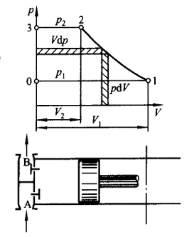
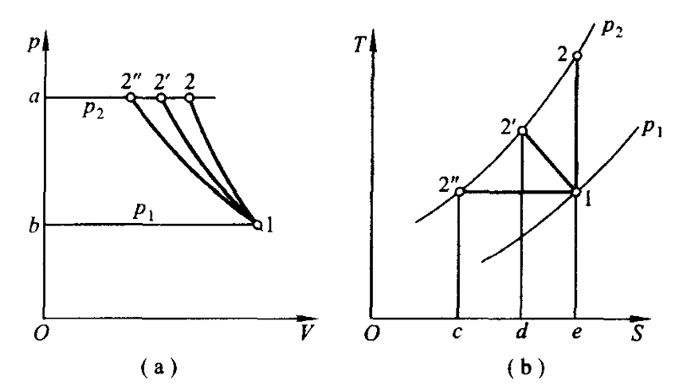
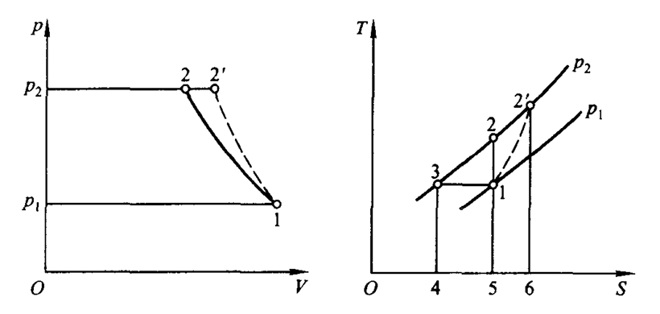
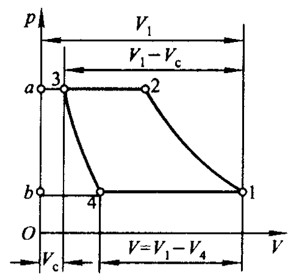
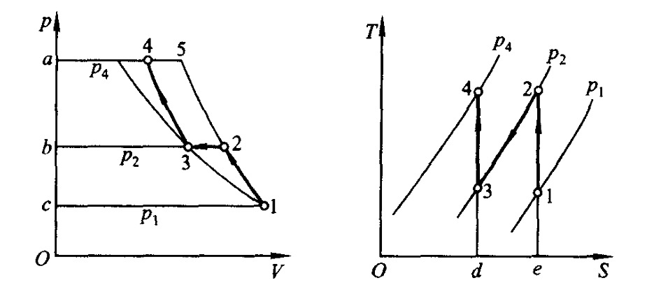

# 第 10 章 气体的压缩

## 10.1 压气机工作原理

1. 单级活塞式

    

    由吸气、压缩、排气过程组成。

    增压比：$\displaystyle\pi=\frac{p_2}{p_1}$

2. 叶轮式

    轴流式，离心式

## 10.2 压缩过程的热力分析

开系，能量方程：

$$Q=(H_2-H_1)+W_t=(H_2-H_1)+\frac{1}{2}m(c_{f2}^2-c_{f1}^2)+mg(z_2-z_1)+W_{net}$$

压缩过程可视为可逆过程

1. 压缩过程中气体的状态变化

    

    - 无理想冷却，绝热：$\displaystyle\frac{T_2}{T_1}=\left(\frac{p_2}{p_1}\right)^{\frac{\gamma -1}{\gamma}}$

    - 有理想冷却，等温：$T_{2''} = T_1$

    - 非理想冷却，多变：$\displaystyle\frac{T_{2'}}{T_1}=\left(\frac{p_{2'}}{p_1}\right)^{\frac{n -1}{n}}$

2. 耗功量及热交换

    - 绝热压缩：
    
    $$\displaystyle W_{t,s} = \frac{\gamma}{\gamma-1} p_1 V_1 \left[ 1 - \left( \frac{p_2}{p_1} \right)^{\frac{\gamma-1}{\gamma}} \right] = \text{面积 } 12ab1 \qquad Q_s = 0$$

    - 多变压缩：
    
    $$\displaystyle W_{t,n} = \frac{n}{n-1} p_1 V_1 \left[ 1 - \left( \frac{p_2}{p_1} \right)^{\frac{n-1}{n}} \right] = \text{面积 } 12'ab1 \qquad Q_n = m \frac{n-\gamma}{n-1} c_V (T_2 - T_1) = \text{面积 } 12'de1$$

    - 定温压缩：
    
    $$\displaystyle W_{t,T} = mR_g T \ln \frac{p_1}{p_2} = \text{面积 } 12''ab1 \qquad Q_T = mR_g T \ln \frac{p_1}{p_2} = \text{面积 } 12''ce1$$

    $$|W_{t,T}|<|W_{t,n}|<|W_{t,s}| \qquad T_{2''}<T_{2'}<T_2$$

3. 摩擦影响

    

    $$W_t'=H_1-H_{2'}=mc_p(T_1-T_{2'})=mc_pT_1\left(1-\frac{T_{2'}}{T_1}\right)=面积2'3462'$$

    $$W_t=mc_pT_1\left(1-\frac{T_2}{T_1}\right)=面积23452$$

    压气机热效率： $\displaystyle\eta _{c,s}=\frac{W_t}{W_{t'}}=\frac{T_2-T_1}{T_{2'}-T_1}$

## 10.3 单级活塞式余隙容积影响

压缩机存在余隙容积时，排气结束后余隙内高压气体会膨胀，减少有效吸气量。

容积效率：$\displaystyle\eta_v=\frac{v_1-v_4}{v_1-v_3}$

$$W_{t,n}=\frac{n}{n-1}p_1v_1\left[1-\left(\frac{p_2}{p_1}\right)^{\frac{n-1}{n}}\right]$$

增压比达到某一极限后，$\eta _v=0$

## 10.4 多级压缩与中间冷却

多级压缩并采用中间冷却可减少压缩耗功。两级压缩最佳中间压力：

$$
p_m=\sqrt{p_1p_2}
$$

若每级压比相同，总压比为 $\pi$、级数为 $z$：

$$
\pi_i=\pi^{1/z}
$$
