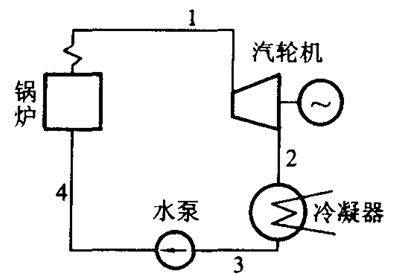
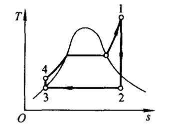
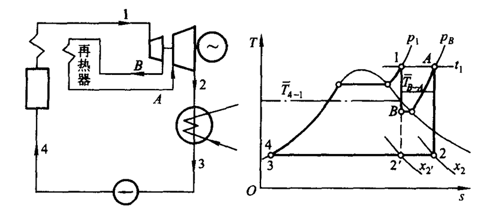
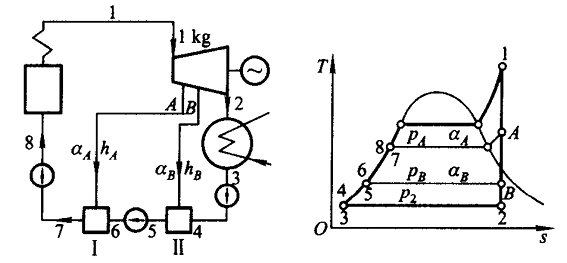

# 第 11 章 蒸汽动力循环

## 11.1 概述

动力循环的热力学第一定律表达式：$q=w$

循环热效率：$\displaystyle\eta_t=\frac{w}{q_1}=1-\frac{q_2}{q_1}$

卡诺循环效率：$\displaystyle\eta _t=1-\frac{T_2}{T_1}$

对一般动力循环，平均吸热温度 $\displaystyle\overline {T_1}=\frac{q_1}{\Delta s}$ &emsp; 平均放热温度 $\displaystyle\overline {T_2}=\frac{q_2}{\Delta s}$ &emsp; $\displaystyle\eta _t=1-\frac{q_2}{q_1}=1-\frac{\overline{T_2}}{\overline{T_1}}$

平均吸热温度越高、平均放热温度越低，循环热效率越高。

## 11.2 蒸气卡诺循环

在一定范围内，卡诺循环热效率最高。实际中，压缩难度太大；水的临界温度太低，热效率不高。

## 11.3 朗肯循环

基本设备：锅炉、汽轮机、冷凝器、水泵。

过程：

1 &rarr; 2： 汽轮机中可逆绝热膨胀 &emsp; $w_T=h_1-h_2$

2 &rarr; 3： 冷凝器定压放热 &emsp; $q_2=h_2-h_3$

3 &rarr; 4： 水泵中定熵压缩 &emsp; $w_p=h_3-h_4$

4 &rarr; 1： 锅炉中定压吸热 &emsp; $q_1=h_1-h_4$

朗肯循环热效率：

$$\eta_t=\frac{w_T-w_P}{q_1}=\frac{(h_1-h_2)-(h_4-h_3)}{h_1-h_4}\approx\frac{h_1-h_2}{h_1-h_4}$$

功比：

$$r_w=\frac{w}{w_T}=\frac{w_T-w_p}{w_T}=1-\frac{h_4-h_3}{h_1-h_2}$$

汽耗率：

$$d=\frac{3600}{w}$$

相对内效率（不可逆过程）：

$$\eta _T=\frac{h_1-h_{2'}}{h_1-h_2}$$

## 11.3 提高朗肯循环热效率的方法

1. 提高初温：有利于提高热效率，但受材料耐温限制。
2. 提高初压：一般可提高效率，但可能使汽轮机末级湿度增加。
3. 降低终温：提高汽轮机焓降，但受冷源条件限制。
4. 再热循环。
5. 回热循环。

## 11.4 再热循环

蒸汽在汽轮机部分膨胀后回锅炉再热，再进入后级汽轮机继续膨胀。

再热循环循环热效率不一定提升，需要 $p_B$ 选择合适。一般 $p_B=20\% \sim 30\% p_1$

$$\eta _t=\frac{w}{q_1}=\frac{(h_1-h_B)+(h_A-h_2)}{(h_1-h_4)+(h_A-h_B)}$$

## 11.5 回热循环

抽汽加热给水，提高进入锅炉的给水温度，从而提高平均吸热温度。回热循环常用给水回热加热器实现。

1. 分级抽气回热循环

    抽气系数 $\displaystyle\alpha _i=\frac{q_{m,i}}{q_m}$ &emsp; $q_m$ 为进气总量；$q_{m,i}$ 是第 $i$ 级抽气量

2. 抽气回热其他效果

    - 减少锅炉受热面积
    - 减少冷凝器换热面积
    - 增大高压段蒸汽流量，减少汽轮机低气压流量，结构更合理

3. 回热循环的计算

    $$\sum_i(q_{m,i}\,h_i)_{in}=\sum_j(q_{m,j}\,h_j)_{out} \qquad \sum_i(\alpha _i\,h_i)_{in}=\sum_j(\alpha _j\,h_j)_{out}$$

    $$\sum_i(q_{m,i})_{in}=\sum_j(q_{m,j})_{out} \qquad \sum_i(\alpha _i)_{in}=\sum_j(\alpha _j)_{out}$$
