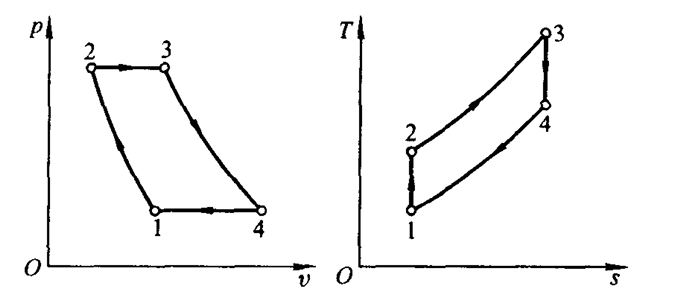
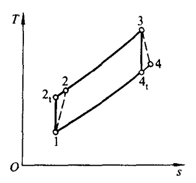
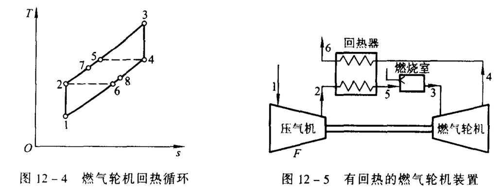
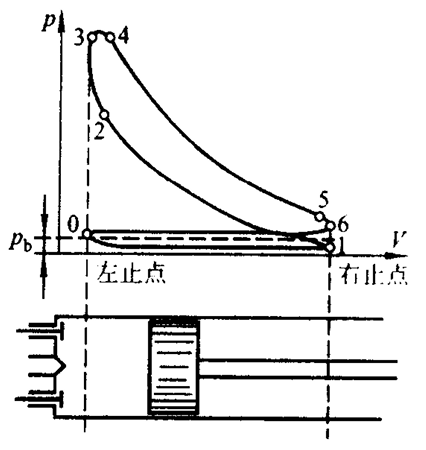
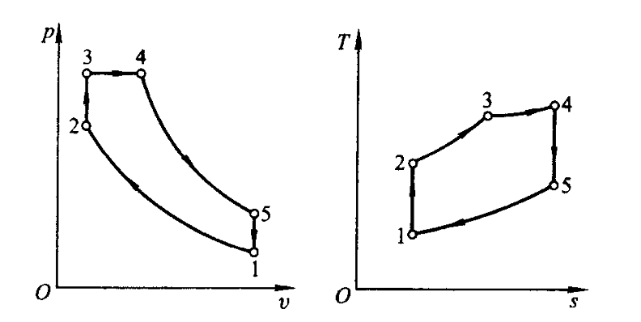
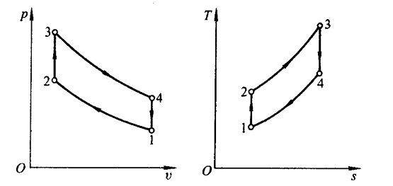
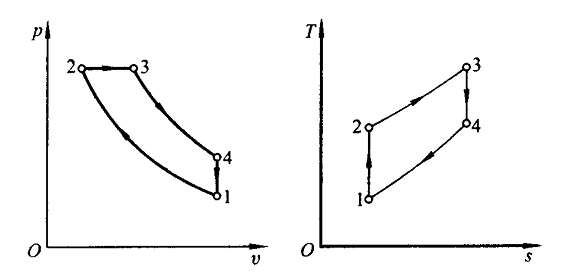
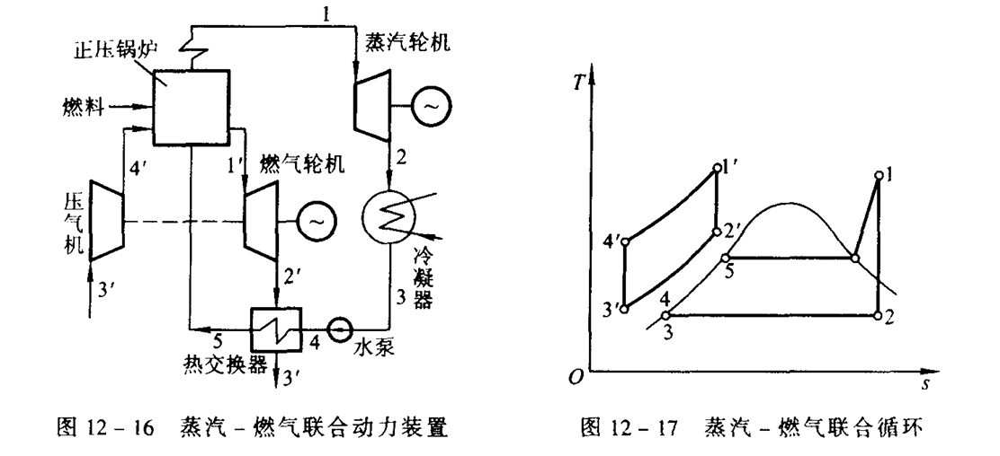

# 第 12 章 气体动力循环

## 12.1 定压加热理想循环

理想化假设：①工质进行封闭热力循环

&emsp;&emsp;&emsp;&emsp;&emsp;&emsp;②工质都在准平衡过程

&emsp;&emsp;&emsp;&emsp;&emsp;&emsp;③工质视为理想气体，比热容为定值

压比：$\displaystyle\pi=\frac{p_2}{p_1}$

循环热效率：$\displaystyle\eta_t=1-\frac{1}{\pi^{(\gamma-1)/\gamma}}$

## 12.2 考虑不可逆损失时燃气轮机定压加热循环

相对内效率：$\displaystyle\eta _T=\frac{h_3-h_4}{h_3-h_{4t}}=\frac{T_3-T_4}{T_3-T_{4t}}$

绝热效率：$\displaystyle\eta _{c,s}=\frac{h_{2t}-h_1}{h_2-h_1}=\frac{T_{2t}-T_1}{T_2-T_1}$

循环热效率：$\displaystyle\eta _t=\frac{\frac{\tau}{\pi ^{({\gamma -1}/{\gamma})}}\eta _T-\frac{1}{\eta _{c,s}}}{\frac{\tau -1}{\pi ^{({\gamma -1}/{\gamma})}-1}-\frac{1}{\eta _{c,s}}}$

## 12.3 具有回热的燃气轮机

理想回热：5，6 &emsp;&emsp; 实际回热：7，8

回热度：$\displaystyle\sigma = \frac{h_7-h_2}{h_5-h_2}=\frac{T_7-T_2}{T_5-T_2}$ &emsp;&emsp; 通常 $\sigma = 0.5\sim 0.7$

## 12.4 往复活塞式内燃机理想循环

1. 内燃机工作基本原理

    
    
    0-1：吸气冲程 &emsp; 1-2；压气冲程 &emsp; 2-3-4：燃烧 &emsp; 4-5：膨胀冲程 &emsp; 5-6-0：排气冲程

2. 三类理想循环

    (1) 混合加热理想循环

    

    混合加热循环由定容加热和定压加热共同组成。常见符号：

    - 压缩比：$\displaystyle\varepsilon=\frac{v_1}{v_2}$

    - 定容升压比：$\displaystyle\lambda=\frac{p_3}{p_2}$

    - 定压预胀比：$\displaystyle\rho=\frac{v_4}{v_3}$

    混合加热循环热效率：

    $$\eta_t=1-\frac{1}{\varepsilon^{\gamma-1}}\cdot\frac{\lambda\rho^\gamma-1}{(\lambda-1)+\gamma\lambda(\rho-1)}$$

    定容加热循环可视为 $\rho=1$ 的特例；定压加热循环可视为 $\lambda=1$ 的特例。

    (2) 定容加热理想循环（奥托循环）

    

    $$\eta _{t,v}=1-\frac{1}{\varepsilon ^{\gamma -1}}$$

    (3) 定压加热理想循环（狄赛尔循环）

    

    $$\eta _{t,p}=1-\frac{1}{\varepsilon ^{\gamma -1}}\frac{\rho ^\gamma -1}{\gamma (\rho -1)}$$

    (4)热力学比较

    ①当 $\varepsilon, q_1$ 相同时：$\eta _{t,v}>\eta _{t,mix}>\eta _{t,p}$

    ②当 $p_{max}, T_{max}$ 相同时：$\eta _{t,p}>\eta _{t,mix}>\eta _{t,v}$

    等 $\varepsilon$ 情况下，$\eta _{t,v}$ 较高；除此之外的情况下，$\varepsilon _p >\varepsilon _v$ 时，$\eta _{t,p}$ 较高。$\eta _t$ 介于二者之间。

## 12.5 蒸气——燃气联合循环

蒸汽循环功量：$w_v=(h_1-h_2)-(h_4-h_3)$

燃气循环功量：$\displaystyle w_g=m[(h_{1'}-h_{'})-(h_{4'}-h_{3'})] \qquad \qquad m=\frac{m_g}{m_v}=\frac{h_5-h_4}{h_{2'}-h_{3'}}$

循环热效率：$\displaystyle\eta _t=\frac{[(h_1-h_2)-(h_4-h_3)]+m[(h_{1'}-h_{2'})-(h_{4'}-h_{3'})]}{m(h_{1'}-h_{4'})+(h_1-h_5)}$
