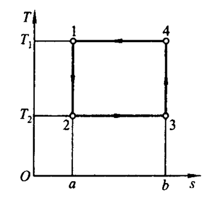
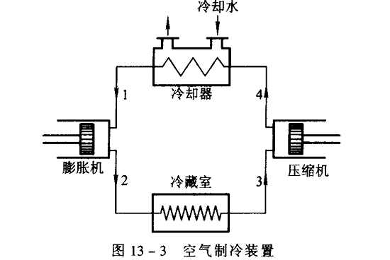
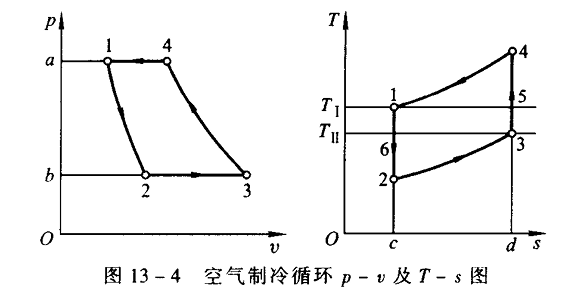
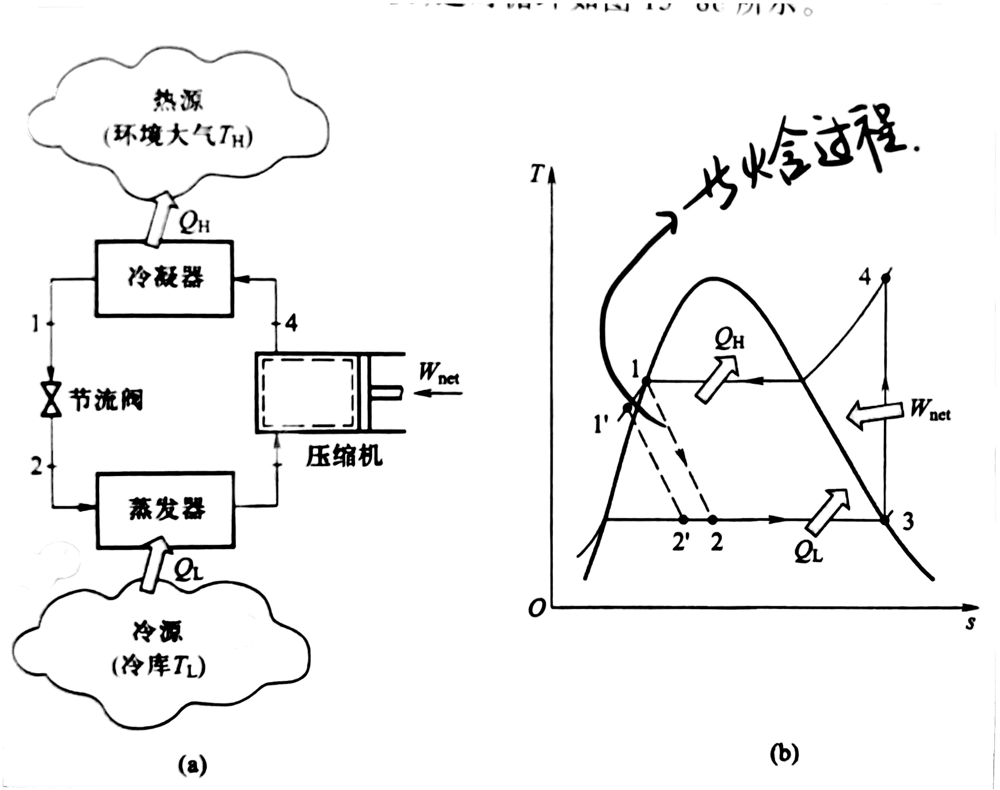

# 第 13 章 制冷循环

## 13.1 制冷循环与热泵

制冷循环和热泵都是逆向循环，原理相同，目的不同。循环从低温热源吸热，消耗外功，将热量排向高温热源。

吸热 $q_2$，放热 $q_1$，耗功 $w$ &emsp; $q_1=q_2+w$

制冷系数：$\displaystyle \varepsilon=\frac{q_0}{w}$ &emsp; 热泵供热系数：$\displaystyle\varepsilon'=\frac{q_k}{w}$ &emsp; 两者关系：$\varepsilon'=\varepsilon+1$

性能系数 $\displaystyle COP=\frac{得到的收益}{付出的代价}$

## 13.2 卡诺逆循环

1-2：定熵膨胀做功 &emsp; 2-3：定温吸热 &emsp; 3-4：耗功定熵压缩 &emsp; 4-1：定温放热

$$q_2=T_2(s_3-s_2) \qquad q_1=T_1(s_4-s_1)=T_1(s_3-s_2)$$ 

$$w=q_1-q_2=(T_1-T_2)(s_3-s_2) \qquad \varepsilon =\frac{T_2}{T_1-T_2}$$

## 13.3 空气制冷循环

$$\varepsilon = \frac{q_2}{w}=\frac{T_2}{T_1-T_2}=\frac{1}{\left(\displaystyle\frac{p_1}{p_2}\right)^{\frac{\gamma -1}{\gamma}}-1}$$

## 13.4 蒸气压缩式制冷循环

理想蒸气压缩制冷循环：

1. $1\to2$：节流降压，$h_1=h_2$。
2. $2\to3$：蒸发器定压吸热。
3. $3\to4$：压缩机绝热压缩。
4. $4\to1$：冷凝器定压放热。

单位质量制冷量：$q_2=h_3-h_2$

单位质量放热量：$q_1=h_4-h_1$

压缩机耗功：$w=h_4-h_3$

制冷系数：$\displaystyle\varepsilon=\frac{q_2}{w}=\frac{h_3-h_2}{h_4-h_3}$

热泵供热系数：$\displaystyle\varepsilon'=\frac{q_1}{w}=\frac{h_4-h_1}{h_4-h_3}$
