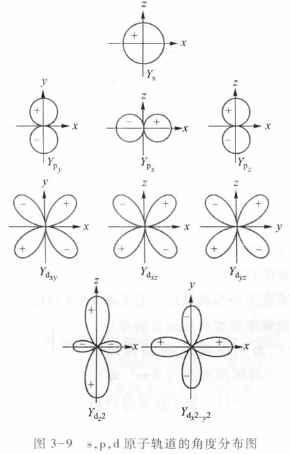
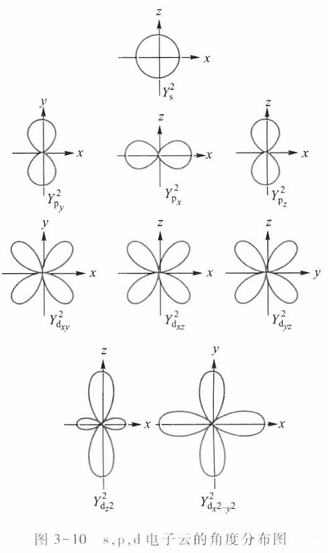
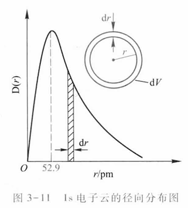
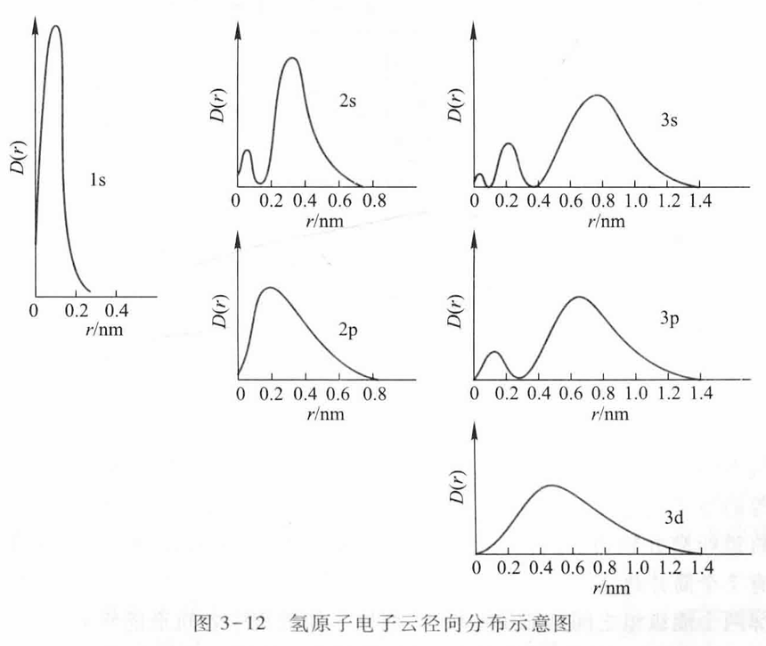
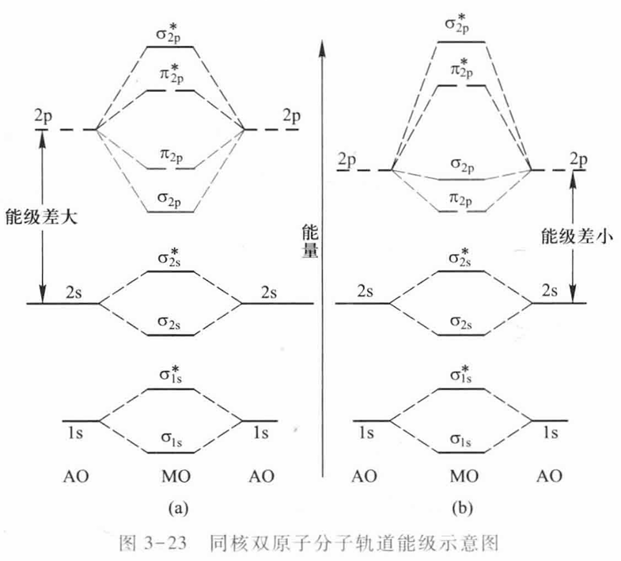
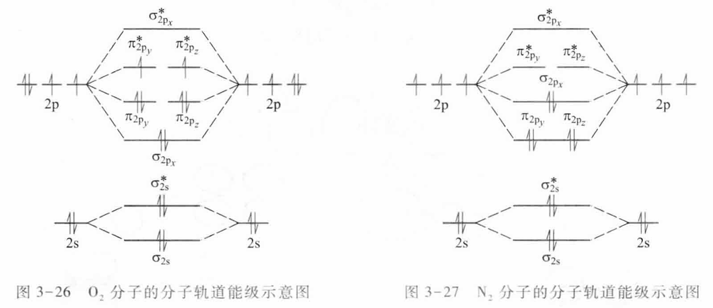

# 第 3 章 物质结构基础

## 3.1 氢原子核外电子运动状态

### 氢原子光谱与玻尔理论

氢原子光谱表现为线状光谱。经典理论只能解释连续光谱，不能解释原子线状光谱。

氢原子光谱满足 Rydberg 公式：

$$
\nu=R_H\left(\frac{1}{n_1^2}-\frac{1}{n_2^2}\right)
$$

其中：

$$
R_H=3.289\times10^{15}\ \mathrm{s^{-1}}
$$

玻尔理论引入定态电子能量。电子只能处于某些稳定能级，能级越高，电子离核越远；当电子在能级间跃迁时吸收或放出能量。

光子能量为：

$$
E=h\nu=\frac{hc}{\lambda}
$$

电子跃迁吸收或放出的能量为：

$$
\Delta E=E_2-E_1
$$

对应光频率为：

$$
\nu=\frac{E_2-E_1}{h}
$$

玻尔理论可以解释氢原子光谱，但不能完整解释多电子原子结构和光谱精细结构。

### 微观粒子的特性

微观粒子具有波粒二象性。电子既有粒子性，也有波动性，因此不能用经典轨道描述其运动状态。

量子力学用波函数描述电子运动状态：

$$
\psi=\psi(r,\theta,\varphi)
$$

$|\psi|^2$ 表示电子在空间某点附近出现的概率密度。

### 四个量子数

主量子数 $n$ 决定电子层和能量高低。对氢原子，电子能量只与 $n$ 有关。

角量子数 $l$ 决定电子云形状和原子轨道类型：

$$
l=0,1,2,\cdots,n-1
$$

磁量子数 $m$ 决定轨道在空间的取向：

$$
m=0,\pm1,\pm2,\cdots,\pm l
$$

自旋量子数 $s_i$ 描述电子自旋状态：

$$
s_i=\pm\frac{1}{2}
$$

$n,l,m$ 可以确定一个原子轨道；$n,l,m,s_i$ 可以确定一个电子的运动状态。

### 原子轨道与电子云

波函数可以分解为径向部分和角度部分：

$$
\psi_{n,l,m}(r,\theta,\varphi)=R_{n,l}(r)Y_{l,m}(\theta,\varphi)
$$

$R_{n,l}(r)$ 只与 $r$ 有关，称为径向波函数；$Y_{l,m}(\theta,\varphi)$ 只与角度有关，称为角度波函数。

常见图像包括原子轨道角度分布图、电子云角度分布图和电子云径向分布图。径向分布函数为：

$$
D(r)=|\psi|^2\cdot4\pi r^2=R(r)^2\cdot4\pi r^2
$$

$D(r)$ 表示电子在距核 $r$ 附近球壳内出现的概率密度。通常 $n$ 越大，电子云分布范围越大。

氢原子电子云径向分布示意图中有 $n-l$ 个峰值。

钻穿效应：外层电子穿过内层电子跑到原子核附近使其能量下降。同一主量子数下，穿透能力大致为：

$$
ns>np>nd>nf
$$

## 3.2 多电子原子结构

### 近似能级与简并轨道

能量相同的状态称为简并态，能量相同的轨道称为简并轨道。多电子原子的轨道能级可按近似能级图或 $(n+0.7l)$ 规则排序。

### 核外电子排布规则

核外电子排布遵循三条基本规则。

能量最低原理：系统能量越低越稳定，电子优先填入能量较低的轨道。

泡利不相容原理：同一原子中不存在四个量子数完全相同的电子；一个原子轨道最多容纳两个自旋相反的电子。

洪特规则：电子在能量相同的轨道中排布时，尽可能先分占不同轨道，且自旋方向相同；亚层全满、半满或全空时相对更稳定。

电子排布式表示电子在各能级上的分布。例如钠原子：

$$
\mathrm{Na}:\ 1s^2\,2s^2\,2p^6\,3s^1
$$

也可写作：

$$
\mathrm{Na}:\ [\mathrm{Ne}]\,3s^1
$$

轨道排布式用方框表示轨道，用箭头表示电子自旋。以氧原子为例：

$$
\mathrm{O}:\ 1s^2\,2s^2\,2p^4
$$

$$
\text{轨道排布式：}\qquad
\begin{array}{ccccc}
\underline{\upharpoonleft\!\downharpoonright} &
\underline{\upharpoonleft\!\downharpoonright} &
\underline{\upharpoonleft\!\downharpoonright} &
\underline{\upharpoonleft} &
\underline{\upharpoonleft} \\[4pt]
1s & 2s & 2p_x & 2p_y & 2p_z
\end{array}
$$

其中 $2p$ 的三个简并轨道先单占且自旋平行，再开始配对，体现洪特规则。

除稀有气体结构外的外层电子排布称为价电子构型。

### 电子层结构与元素周期律

元素周期表的周期、族和分区与核外电子排布有关。

- 周期与最高电子层数有关。
- 主族元素的族数通常与价电子数有关。
- 元素分区与最后填入电子的轨道类型有关，如 $s$、$p$、$d$、$f$ 区。

核外电子排布的周期性决定元素性质的周期性。

### 有效核电荷

多电子原子中，内层电子会削弱原子核对外层电子的吸引，这称为屏蔽效应。外层电子实际感受到的核电荷称为有效核电荷：

$$
Z^*=Z-\sigma_i
$$

其中 $Z$ 为核电荷数，$\sigma_i$ 为指定电子受到的屏蔽常数：

$$
\sigma_i=\sum\sigma
$$

Slater 规则把轨道分组为：

$$
(1s);\ (2s,2p);\ (3s,3p);\ (3d);\ (4s,4p);\ (4d);\ (4f);\ (5s,5p);\cdots
$$

常用屏蔽规则：

- 位于指定电子右侧的电子，对该电子的屏蔽贡献为 $0$。
- 同组电子通常取 $\sigma=0.35$，但 $1s$ 组内取 $\sigma=0.30$。
- 对 $ns,np$ 电子，$(n-1)$ 层电子取 $\sigma=0.85$，$(n-2)$ 层及更内层电子取 $\sigma=1.00$。
- 对 $nd,nf$ 电子，左侧各组电子通常取 $\sigma=1.00$。

多电子原子中单个电子的能量可近似写为：

$$
E_i=-2.179\times10^{-18}\left(\frac{Z^*}{n^*}\right)^2\ \mathrm{J}
$$

也可写为摩尔能量：

$$
E_i=-1312\left(\frac{Z^*}{n^*}\right)^2\ \mathrm{kJ\cdot mol^{-1}}
$$

常用有效主量子数近似为：

| $n$ | 1 | 2 | 3 | 4 | 5 | 6 |
| --- | --- | --- | --- | --- | --- | --- |
| $n^*$ | 1.0 | 2.0 | 3.0 | 3.7 | 4.0 | 4.2 |

### 原子半径

常见原子半径包括共价半径、金属半径和范德华半径。

- 共价半径：同种元素共价分子中两原子核间距的一半。
- 金属半径：金属晶体中相邻原子核间距的一半。
- 范德华半径：非成键原子靠范德华力相互吸引时，核间距的一半。

### 电离能、电子亲和势和电负性

电离能是失去电子所需的能量。一般同周期从左到右增大，同主族从上到下减小。

电子亲和势是获得电子时放出的能量。

电负性表示元素原子在分子中吸引电子能力的相对大小。一般同周期从左到右增大，同主族从上到下减小。

## 3.3 化学键理论

### 化学键类型

常见化学键包括金属键、离子键和共价键。

- 金属键：金属原子之间形成的键。
- 离子键：金属原子与非金属原子之间通过离子作用形成的键。
- 共价键：非金属原子之间通过共用电子对形成的键。

Lewis 模型强调分子中原子有形成 $8$ 电子稳定层结构的趋势，但并非所有分子都满足八隅体规则，如 $\mathrm{NO}$、$\mathrm{BF_3}$、$\mathrm{PF_5}$。

### 价键理论

价键理论认为，共价键由两个原子轨道重叠并配对成键形成。

氢分子形成时，两个氢原子相互靠近，电子自旋相反并配对，体系能量降低，形成稳定的 $\mathrm{H_2}$ 分子。

价键理论的基本要点：

- 两个原子接近时，自旋相反的未成对电子可以配对，形成共价键。
- 含有一个共用电子对形成单键，如 $\mathrm{H-Cl}$。
- 含有两个共用电子对形成双键，如 $A=B$。
- 含有三个共用电子对形成三键，如 $\mathrm{N\equiv N}$。
- 一方提供空轨道，另一方提供孤电子对时，可形成配位键，记作 $A\leftarrow B$。
- 原子轨道重叠越大，电子在两核间出现的概率越大，共价键越稳定。

共价键具有饱和性和方向性。饱和性指每个原子形成共价键的数目受到未成对电子数或可用轨道数限制；方向性指成键时原子轨道总是沿重叠最大的方向结合。

### 分子轨道理论

物质的磁性可分为：

- 顺磁性：含未成对电子，能被磁场吸引。
- 抗磁性：没有未成对电子，受磁场排斥或不明显吸引。

分子轨道理论认为，分子轨道由原子轨道线性组合形成，电子在整个分子范围内运动。

分子轨道形成的基本规则：

- 由 $n$ 个原子轨道组合得到 $n$ 个分子轨道。
- 电子排布仍遵循能量最低原理、泡利不相容原理和洪特规则。
- 组合后可形成成键轨道和反键轨道。
- 成键三原则为对称性匹配、能量相近、轨道最大重叠。

键级用于判断成键强弱：

$$
\text{键级}=\frac{\text{成键轨道电子数}-\text{反键轨道电子数}}{2}
$$

键级越大，键越稳定；键级为 $0$ 时通常不能形成稳定分子。

### 分子轨道电子排布式

分子轨道电子排布式的写法与原子轨道电子排布式类似：先按分子轨道能量由低到高排列，再按能量最低原理、泡利不相容原理和洪特规则填入电子。

常用记号中，$\sigma$ 表示沿键轴成键的分子轨道，$\pi$ 表示侧向重叠形成的分子轨道；右上角 $*$ 表示反键轨道。

第二周期同核双原子分子的 $2p$ 轨道相对能级有两种常见顺序。对 $\mathrm{O_2}$、$\mathrm{F_2}$：

$$
\sigma_{2s}<\sigma_{2s}^*<\sigma_{2p_z}<\pi_{2p_x}=\pi_{2p_y}<\pi_{2p_x}^*=\pi_{2p_y}^*<\sigma_{2p_z}^*
$$

对 $\mathrm{B_2}$、$\mathrm{C_2}$、$\mathrm{N_2}$：

$$
\sigma_{2s}<\sigma_{2s}^*<\pi_{2p_x}=\pi_{2p_y}<\sigma_{2p_z}<\pi_{2p_x}^*=\pi_{2p_y}^*<\sigma_{2p_z}^*
$$

写排布式时，内层 $1s$ 分子轨道也要先填：

$$
\sigma_{1s}<\sigma_{1s}^*
$$

例如 $\mathrm{O_2}$ 有 $16$ 个电子，其分子轨道电子排布式为：

$$
(\sigma_{1s})^2(\sigma_{1s}^*)^2(\sigma_{2s})^2(\sigma_{2s}^*)^2
(\sigma_{2p_z})^2(\pi_{2p_x})^2(\pi_{2p_y})^2
(\pi_{2p_x}^*)^1(\pi_{2p_y}^*)^1
$$

其中反键 $\pi^*$ 轨道上有两个未成对电子，因此 $\mathrm{O_2}$ 为顺磁性。其键级为：

$$
\text{键级}=\frac{10-6}{2}=2
$$

例如 $\mathrm{N_2}$ 有 $14$ 个电子，其分子轨道电子排布式为：

$$
(\sigma_{1s})^2(\sigma_{1s}^*)^2(\sigma_{2s})^2(\sigma_{2s}^*)^2
(\pi_{2p_x})^2(\pi_{2p_y})^2(\sigma_{2p_z})^2
$$

$\mathrm{N_2}$ 中没有未成对电子，为抗磁性；其键级为：

$$
\text{键级}=\frac{10-4}{2}=3
$$

同核双原子分子常用分子轨道能级图判断电子排布和磁性。$\mathrm{O_2}$ 含有未成对电子，因此表现为顺磁性；$\mathrm{F_2}$、$\mathrm{N_2}$ 等可按能级图依次填入电子判断键级。

  

    
  

  

    
  

## 3.4 多原子分子空间构型

### 价层电子对互斥理论

价层电子对互斥理论（VSEPR）用中心原子周围价层电子对的排斥关系判断分子空间构型。

基本要点：

- 构型取决于中心原子周围的价层电子对数。
- 价层电子对包括成键电子对和孤电子对。
- 价层电子对尽可能远离，使排斥作用最小。
- 孤电子对的排斥作用通常大于成键电子对。
- 多重键也按一个电子对区域处理，但排斥作用通常强于单键。

对 $AX_mE_n$ 型分子或离子，中心原子的价层电子对数为：

$$
VP=m+n
$$

其中 $m$ 为与中心原子相连的原子数，$n$ 为中心原子上的孤电子对数。孤电子对数可按下式估算：

$$
n=\frac{A\text{ 的价电子数}\pm\text{离子电荷数}-m\times\text{配位原子成键电子数}}{2}
$$

例如：

$$
\mathrm{SO_4^{2-}}:\ n=\frac{1}{2}(6+2-4\times2)=0
$$

$$
\mathrm{NH_4^+}:\ n=\frac{1}{2}(5-1-4\times1)=0
$$

$$
\mathrm{NO_2}:\ n=\frac{1}{2}(5-2\times2)=0.5\approx1
$$

### 杂化轨道理论

杂化轨道理论认为，同一原子中能量相近、类型不同的原子轨道可以重新组合，形成数目相同、成键能力更强的杂化轨道。

杂化轨道的要点：

- 同一原子中能量相近的原子轨道可参与杂化。
- 参与杂化的原子轨道数等于形成的杂化轨道数。
- 杂化轨道常用于解释分子的空间构型和共价键方向性。

常见杂化类型：

| 杂化类型 | 参与轨道 | 杂化轨道数 | 常见构型 |
| --- | --- | --- | --- |
| $sp$ | $1s+1p$ | 2 | 直线形 |
| $sp^2$ | $1s+2p$ | 3 | 平面三角形 |
| $sp^3$ | $1s+3p$ | 4 | 四面体 |

杂化可分为等性杂化和不等性杂化。等性杂化中各杂化轨道能量、形状相同，如碳原子的 $sp$、$sp^2$、$sp^3$ 杂化；不等性杂化中，不同杂化轨道不完全等同，常与孤电子对有关。

## 3.5 分子间作用力

### 分子极性和偶极矩

分子可分为极性分子和非极性分子。极性分子中正、负电荷中心不重合，具有偶极矩；非极性分子中正、负电荷中心重合。

偶极矩用于衡量分子极性大小：

$$
\mu=q\cdot d
$$

其中 $q$ 为电荷量，$d$ 为正、负电荷中心间距。偶极矩方向通常规定为从负电荷中心指向正电荷中心，数值越大，分子极性越强。

### 分子变形性和极化率

非极性分子在外电场作用下，正、负电荷中心会发生瞬间相对位移，产生诱导偶极，成为极性分子。

诱导偶极矩与外电场强度有关：

$$
\mu_{\text{诱导}}=\alpha E
$$

其中 $\alpha$ 为极化率，$E$ 为外电场强度。极化率越大，分子越容易被极化；分子体积越大，通常极化率越大。

### 范德华力

范德华力包括取向力、诱导力和色散力。

- 取向力：极性分子永久偶极之间的相互作用。
- 诱导力：极性分子与被诱导极化的分子之间的相互作用。
- 色散力：瞬间偶极与诱导偶极之间的相互作用，普遍存在于所有分子之间。

分子间作用力主要影响物理性质，如熔点、沸点、溶解性和挥发性。

### 氢键

氢键是较强的分子间作用力。通常当氢原子与电负性很强、半径很小的原子形成共价键时，氢原子可再与另一电负性强的原子发生吸引作用。

典型氢键可表示为：

$$
X-H\cdots Y
$$

其中 $X$、$Y$ 常为 $\mathrm{F}$、$\mathrm{O}$、$\mathrm{N}$。

氢键的特点：

- 强度一般小于共价键，但明显大于普通范德华力。
- 具有饱和性：一个 $\mathrm{H}$ 原子通常只与一个 $Y$ 原子形成氢键。
- 具有方向性：$X-H\cdots Y$ 通常接近直线。
- 可根据 $H\cdots Y$ 距离和 $X-H\cdots Y$ 夹角判断氢键是否存在。

氢键可分为分子间氢键和分子内氢键。

- 分子间氢键会增强分子间作用力，使熔点、沸点、汽化热和黏度升高，蒸气压降低。
- 分子内氢键会削弱分子间作用力，通常使熔点和沸点降低。

溶质与溶剂能形成氢键时，通常有利于溶解。分子间氢键和分子内氢键都会影响物质在极性溶剂或非极性溶剂中的溶解性。

## 3.7 配合物结构和化学键理论

### 配合物的组成和命名

配合物通常由中心离子或中心原子、配体、配位原子和内界、外界组成。例如：

$$
[\mathrm{Cu(NH_3)_4}]\mathrm{SO_4}
$$

其中 $\mathrm{Cu^{2+}}$ 为中心离子，$\mathrm{NH_3}$ 为配体，$\mathrm{N}$ 为配位原子；方括号内为内界，$\mathrm{SO_4^{2-}}$ 为外界。

配合物的组成要点：

- 形成体：中心离子或中心原子，能提供空轨道。
- 配体：与形成体成键的分子或离子，通常提供孤电子对。
- 配位原子：配体中直接提供孤电子对的原子。
- 单齿配体：含一个配位原子；多齿配体：含两个及以上配位原子。
- 配位数：中心离子或中心原子直接结合的配位原子数。

常见中心离子电荷与配位数关系：

| 中心离子电荷 | +1 | +2 | +3 | +4 |
| --- | --- | --- | --- | --- |
| 常见配位数 | 2 | 4 或 6 | 6 或 4 | 6 或 8 |

配合物命名时，同一类配体按一定顺序排列。内界中一般先写阴离子配体，再写中性分子配体，最后写中心离子；阴离子配体可按简单离子、复杂离子、有机酸根离子等顺序处理。

### 配合物类型和异构现象

常见配合物类型包括：

- 简单配合物：由中心离子和单齿配体形成，如 $[\mathrm{Ag(NH_3)_2}]^+$、$\mathrm{BF_4^-}$、$[\mathrm{Co(NH_3)_5Cl}]^{2+}$。许多水合物也可视为配合物。
- 螯合物：多齿配体与中心离子形成环状结构的配合物。中心离子与螯合剂分子数之比称为螯合比。
- 多核配位体：含两个或两个以上中心离子的配合物。
- 原子簇化合物：两个或两个以上金属原子以金属-金属键直接结合形成，如 $[\mathrm{Re_2Cl_8}]^{2-}$。
- 羰合物：以 $\mathrm{CO}$ 为配体的配合物，含 $\sigma$ 配位键和 $\pi$ 反馈键的协同作用。
- 夹心配合物：过渡金属原子与具有离域 $\pi$ 键的环状分子形成的配合物。
- 大环配合物：环状骨架含有 $\mathrm{O}$、$\mathrm{N}$、$\mathrm{S}$、$\mathrm{P}$、$\mathrm{As}$ 等多个配位原子的多齿配体形成的配合物。

配合物可出现异构现象。

- 结构异构：原子间连接方式不同。
- 立体异构：配体在空间排列位置不同。

如果配合物空间结构不对称，则可能存在旋光异构。

### 配合物的价键理论

价键理论认为，中心离子 $M$ 与配体 $L$ 之间以配位键结合，可表示为 $M\leftarrow L$。配体提供孤电子对，中心离子提供空轨道。

中心离子可用能量相近的空轨道杂化，与配体形成配位键。配合物稳定性与中心离子的电子构型、配体场强和轨道杂化方式有关。

内轨型配合物使用内层 $(n-1)d$ 轨道与最外层 $ns,np$ 轨道杂化，键能较大、稳定性较高。例如：

$$
[\mathrm{Fe(CN)_6}]^{3-}
$$

外轨型配合物主要使用最外层 $ns,np,nd$ 轨道杂化，键能较小、稳定性较低。

### 晶体场理论

晶体场理论把中心离子与配体之间的作用看作静电作用，配体周围的负电场会影响中心离子的 $d$ 轨道能量。

八面体场中，五个 $d$ 轨道发生分裂：

$$
d_{xy},d_{xz},d_{yz}\rightarrow t_{2g}
$$

$$
d_{x^2-y^2},d_{z^2}\rightarrow e_g
$$

在八面体场中，$t_{2g}$ 能量降低，$e_g$ 能量升高。分裂能为：

$$
\Delta_o=E(e_g)-E(t_{2g})
$$

相对球形场，轨道能量变化可写为：

$$
E(t_{2g})=-\frac{2}{5}\Delta_o,\qquad E(e_g)=+\frac{3}{5}\Delta_o
$$

影响分裂能 $\Delta_o$ 的因素：

- 配体场强通常满足光谱化学序列：

$$
\mathrm{I^-<Br^-<Cl^-<SCN^-<F^-<OH^-<C_2O_4^{2-}<H_2O<EDTA<NH_3<SO_3^{2-}<CN^-<CO}
$$

- 同种配体、同种金属原子时，中心离子电荷越高，$\Delta_o$ 越大。
- 一般同族过渡元素中，第三过渡系元素的 $\Delta_o$ 大于第二过渡系，第二过渡系大于第一过渡系。

晶体场稳定化能（CFSE）为：

$$
\mathrm{CFSE}=-\frac{2}{5}\Delta_o n_{t_{2g}}+\frac{3}{5}\Delta_o n_{e_g}
$$

也可写为：

$$
\mathrm{CFSE}=-(0.4n_{t_{2g}}-0.6n_{e_g})\Delta_o
$$

稳定化能越大，配合物越稳定。

### 配合物的颜色

若中心离子的 $d$ 轨道未填满，配合物可吸收某一波长的可见光，表现出其互补色。

吸收光能量与分裂能相对应：

$$
\Delta_o=E(e_g)-E(t_{2g})=h\nu=\frac{hc}{\lambda}
$$

## 3.8 配位解离平衡

### 配位平衡常数

配合物在溶液中存在配位生成与配位解离平衡。以四氨合铜离子为例：

$$
\mathrm{Cu^{2+}+4NH_3\rightleftharpoons[Cu(NH_3)_4]^{2+}}
$$

标准稳定常数为：

$$
K_f^\ominus=\frac{c\left([\mathrm{Cu(NH_3)_4}]^{2+}\right)}
{c(\mathrm{Cu^{2+}})\,c^4(\mathrm{NH_3})}
$$

$K_f^\ominus$ 越大，配合物越稳定。

标准不稳定常数为配合物解离平衡常数：

$$
K_d^\ominus=\frac{c(\mathrm{Cu^{2+}})\,c^4(\mathrm{NH_3})}
{c\left([\mathrm{Cu(NH_3)_4}]^{2+}\right)}
$$

二者互为倒数：

$$
K_d^\ominus=\frac{1}{K_f^\ominus}
$$

### 逐级稳定常数和累积稳定常数

配合物可逐级形成。对一般反应：

$$
M+L\rightleftharpoons ML
$$

逐级稳定常数为：

$$
K_{f1}^\ominus=\frac{c(ML)}{c(M)c(L)}
$$

第二级配位：

$$
ML+L\rightleftharpoons ML_2
$$

对应：

$$
K_{f2}^\ominus=\frac{c(ML_2)}{c(ML)c(L)}
$$

累积稳定常数表示从游离金属离子和配体直接形成配合物的总平衡常数：

$$
\beta_1^\ominus=K_{f1}^\ominus=\frac{c(ML)}{c(M)c(L)}
$$

$$
\beta_2^\ominus=K_{f1}^\ominus K_{f2}^\ominus
=\frac{c(ML_2)}{c(M)c^2(L)}
$$

### 配位平衡的移动

配位平衡会受到酸度、沉淀反应、氧化还原反应和其他配位剂的影响，本质上都是改变某些物种浓度，使平衡发生移动。

酸度影响：若配体可与 $\mathrm{H^+}$ 结合，增加酸度会降低游离配体浓度，使配位平衡向解离方向移动。例如：

$$
\mathrm{Fe^{3+}+6F^-\rightleftharpoons[FeF_6]^{3-}}
$$

若加入酸：

$$
\mathrm{H^++F^-\rightleftharpoons HF}
$$

总效果可写为：

$$
\mathrm{[FeF_6]^{3-}+6H^+\rightleftharpoons Fe^{3+}+6HF}
$$

对金属离子，增加酸度可抑制水解，使某些配位平衡向生成配合物方向移动；降低酸度则可能发生水解沉淀。

沉淀反应影响：若金属离子或配体与其他离子形成难溶物，会改变游离组分浓度，从而影响配位平衡。例如：

$$
\mathrm{[Cu(NH_3)_4]^{2+}\rightleftharpoons Cu^{2+}+4NH_3}
$$

若加入 $\mathrm{S^{2-}}$：

$$
\mathrm{Cu^{2+}+S^{2-}\rightleftharpoons CuS\downarrow}
$$

总反应为：

$$
\mathrm{[Cu(NH_3)_4]^{2+}+S^{2-}\rightleftharpoons CuS\downarrow+4NH_3}
$$

可通过加入配位剂促使沉淀溶解，也可通过沉淀反应促使配合物解离。

氧化还原反应影响：若中心离子参与氧化还原反应，金属离子价态改变会影响配合物稳定性。例如：

$$
\mathrm{[Fe(SCN)_6]^{3-}\rightleftharpoons Fe^{3+}+6SCN^-}
$$

若 $\mathrm{Fe^{3+}}$ 被 $\mathrm{Sn^{2+}}$ 还原为 $\mathrm{Fe^{2+}}$：

$$
\mathrm{Sn^{2+}\rightleftharpoons Sn^{4+}+2e^-}
$$

则总反应可表示为：

$$
\mathrm{2[Fe(SCN)_6]^{3-}+Sn^{2+}\rightleftharpoons 2Fe^{2+}+12SCN^-+Sn^{4+}}
$$

配位竞争影响：若加入能形成更稳定配合物的配位剂，原有配合物会转化。例如：

$$
\mathrm{[HgCl_4]^{2-}+4I^-\rightleftharpoons[HgI_4]^{2-}+4Cl^-}
$$

若：

$$
K_f^\ominus\left([\mathrm{HgI_4}]^{2-}\right)>K_f^\ominus\left([\mathrm{HgCl_4}]^{2-}\right)
$$

则平衡倾向于生成 $[\mathrm{HgI_4}]^{2-}$。类似地：

$$
\mathrm{[Fe(SCN)_6]^{3-}+6F^-\rightleftharpoons[FeF_6]^{3-}+6SCN^-}
$$

若：

$$
K_f^\ominus\left([\mathrm{FeF_6}]^{3-}\right)>K_f^\ominus\left([\mathrm{Fe(SCN)_6}]^{3-}\right)
$$

则配合物会向更稳定的一侧转化。
