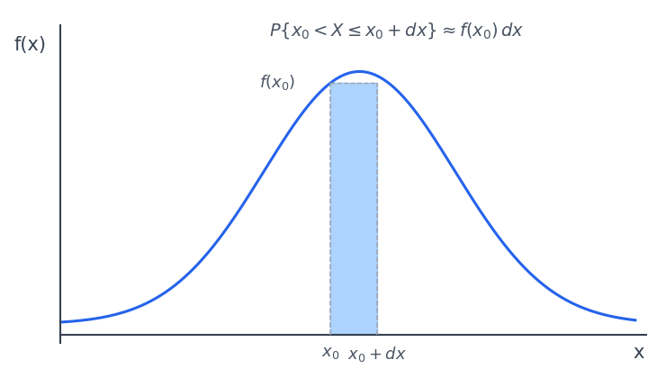
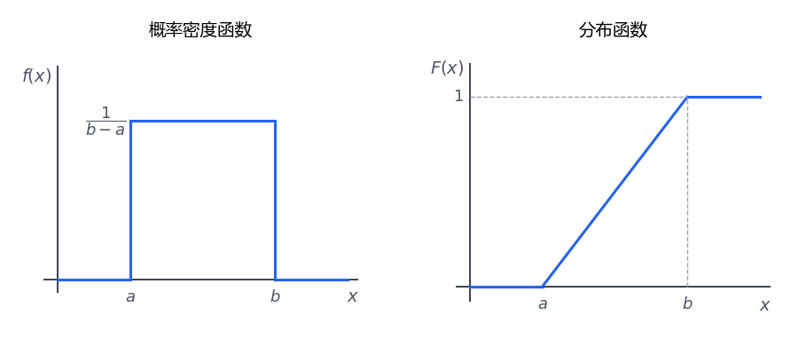
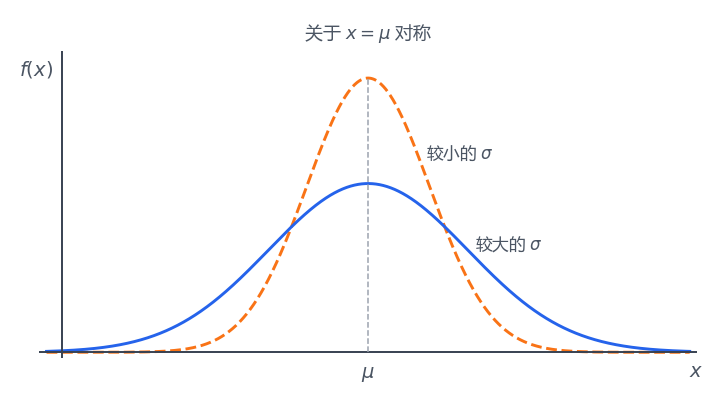

# 第 2 章 随机变量及其分布

## 2.1 随机变量

设随机试验的样本空间为 $\Omega$。若对每一个样本点 $\omega\in\Omega$，都有唯一实数 $X(\omega)$ 与之对应，则称 $X$ 为随机变量。

随机变量把随机试验的结果数值化，使事件可以写成关于 $X$ 的形式，例如：

$$
\{X=x_k\},\qquad
\{X\le x\},\qquad
\{a<X\le b\}
$$

常见随机变量分为两类：

- 离散型随机变量：可能取值为有限个或可列无限个。
- 连续型随机变量：取值充满某个区间或若干区间。

## 2.2 离散型随机变量的概率分布

若离散型随机变量 $X$ 的可能取值为 $x_1,x_2,\cdots$，且：

$$
P\{X=x_k\}=p_k,\qquad k=1,2,\cdots
$$

则称上式为 $X$ 的概率分布律。

常用表格形式为：

$$
\begin{array}{c|cccc}
X & x_1 & x_2 & x_3 & \cdots\\
\hline
P & p_1 & p_2 & p_3 & \cdots
\end{array}
$$

分布律必须满足：

$$
p_k\ge0,\qquad k=1,2,\cdots
$$

$$
\sum_{k=1}^{\infty}p_k=1
$$

### 0-1 分布

若随机变量 $X$ 只取 $0,1$ 两个值，且 $P\{X=1\}=p$，$P\{X=0\}=1-p$，则称 $X$ 服从0-1 分布。

其分布律可写为：

$$
P\{X=k\}=p^k(1-p)^{1-k},\qquad k=0,1
$$

0-1 分布是二项分布在 $n=1$ 时的特例。

### 二项分布

在 $n$ 次伯努利试验中，每次事件 $A$ 发生的概率为 $p$。令 $X$ 表示事件 $A$ 发生的次数，则 $X$ 服从二项分布，记为：

$$
X\sim B(n,p)
$$

分布律为：

$$
P\{X=k\}=C_n^k p^k(1-p)^{n-k},
\qquad k=0,1,\cdots,n
$$

若记 $q=1-p$，也可写为：

$$
P\{X=k\}=C_n^k p^kq^{n-k}
$$

由二项式定理可验证：

$$
\sum_{k=0}^{n}C_n^kp^kq^{n-k}=(p+q)^n=1
$$

常用补事件计算：

$$
P\{X\ge1\}=1-P\{X=0\}=1-q^n
$$

### 泊松分布

若随机变量 $X$ 的分布律为：

$$
P\{X=k\}=\frac{e^{-\lambda}\lambda^k}{k!},
\qquad k=0,1,2,\cdots,\quad \lambda>0
$$

则称 $X$ 服从参数为 $\lambda$ 的泊松分布，记为：

$$
X\sim P(\lambda)
$$

该分布满足：

$$
P\{X=k\}\ge0
$$

并且：

$$
\sum_{k=0}^{\infty}\frac{e^{-\lambda}\lambda^k}{k!}
=e^{-\lambda}\sum_{k=0}^{\infty}\frac{\lambda^k}{k!}
=e^{-\lambda}e^\lambda=1
$$

当 $n$ 足够大、$p$ 充分小，且 $np$ 适当时，二项分布可用泊松分布近似：

$$
B(n,p)\approx P(\lambda),
\qquad \lambda=np
$$

通常 $p<0.1$ 时可考虑这种近似。

### 帕斯卡分布

设独立重复试验中每次成功概率为 $p$，令 $X$ 表示第 $r$ 次成功出现时的试验次数，则 $X$ 服从帕斯卡分布，也称负二项分布，记为：

$$
X\sim NB(r,p)
$$

分布律为：

$$
P\{X=k\}=C_{k-1}^{r-1}p^r(1-p)^{k-r},
\qquad k=r,r+1,r+2,\cdots
$$

### 几何分布

帕斯卡分布在 $r=1$ 时得到几何分布。若 $X$ 表示第一次成功出现时的试验次数，则：

$$
P\{X=k\}=(1-p)^{k-1}p,
\qquad k=1,2,\cdots
$$

记为：

$$
X\sim G(p)
$$

它满足：

$$
\sum_{k=1}^{\infty}(1-p)^{k-1}p
=\frac{p}{1-(1-p)}=1
$$

### 超几何分布

设总体共有 $N$ 个元素，其中 $a$ 个为某类元素，$b=N-a$ 个为另一类元素。从中不放回抽取 $n$ 个，令 $X$ 表示抽到的某类元素个数，则 $X$ 服从超几何分布，记为：

$$
X\sim H(n,a,N)
$$

分布律为：

$$
P\{X=k\}
=\frac{C_a^kC_b^{n-k}}{C_N^n},
\qquad
k=\ell_1,\ell_1+1,\cdots,\ell_2
$$

其中：

$$
\ell_1=\max\{0,n-b\},\qquad
\ell_2=\min\{a,n\}
$$

当 $N$ 很大且 $n$ 相对于 $N$ 很小时，不放回抽样可近似看成有放回抽样。此时若 $p=\dfrac{a}{N}$，则：

$$
\frac{C_a^kC_b^{n-k}}{C_N^n}
\approx C_n^kp^k(1-p)^{n-k}
$$

即超几何分布可近似为二项分布。

## 2.3 随机变量的分布函数

随机变量 $X$ 的分布函数定义为：

$$
F(x)=P\{X\le x\}
$$

分布函数有以下基本性质：

$$
0\le F(x)\le1,\qquad
F(-\infty)=0,\qquad
F(+\infty)=1
$$

若 $x_1<x_2$，则：

$$
F(x_1)\le F(x_2)
$$

因为：

$$
F(x_2)-F(x_1)=P\{x_1<X\le x_2\}\ge0
$$

分布函数右连续：

$$
F(x+0)=F(x)
$$

离散型随机变量的分布函数通常是阶梯函数，因此一般不连续。

## 2.4 连续型随机变量及其密度函数

若存在非负函数 $f(x)$，使得对任意 $a\le b$：

$$
P\{a<X\le b\}=\int_a^b f(x)\,\mathrm{d}x
$$

则称 $X$ 为连续型随机变量，$f(x)$ 称为 $X$ 的概率密度函数。

{ .fig-medium }

概率密度函数满足：

$$
f(x)\ge0
$$

$$
\int_{-\infty}^{+\infty}f(x)\,\mathrm{d}x=1
$$

单点概率为：

$$
P\{X=x_0\}=0
$$

分布函数与密度函数的关系为：

$$
F(x)=P\{X\le x\}=\int_{-\infty}^{x}f(t)\,\mathrm{d}t
$$

因此：

$$
P\{a<X\le b\}=\int_a^b f(x)\,\mathrm{d}x
$$

若 $f(x)$ 在点 $x$ 连续，则：

$$
F'(x)=f(x)
$$

连续型随机变量的分布函数连续；离散型随机变量的分布函数一般不连续。

### 均匀分布

若 $X$ 在区间 $[a,b]$ 上等可能取值，则称 $X$ 服从均匀分布，记为：

$$
X\sim U(a,b)
$$

密度函数为：

$$
f(x)=
\begin{cases}
\dfrac{1}{b-a},& a\le x\le b,\\
0,& \text{其他}.
\end{cases}
$$

分布函数为：

$$
F(x)=
\begin{cases}
0,& x<a,\\
\dfrac{x-a}{b-a},& a\le x<b,\\
1,& x\ge b.
\end{cases}
$$

{ .fig-medium }

### 指数分布

若随机变量 $X$ 的密度函数为：

$$
f(x)=
\begin{cases}
\lambda e^{-\lambda x},& x>0,\\
0,& x\le0,
\end{cases}
\qquad \lambda>0
$$

则称 $X$ 服从参数为 $\lambda$ 的指数分布，记为：

$$
X\sim E(\lambda)
$$

分布函数为：

$$
F(x)=
\begin{cases}
0,& x\le0,\\
1-e^{-\lambda x},& x>0.
\end{cases}
$$

指数分布具有无记忆性：

$$
P\{X>s+t\mid X>s\}=P\{X>t\},
\qquad s,t>0
$$

### 正态分布

若随机变量 $X$ 的密度函数为：

$$
f(x)=\frac{1}{\sqrt{2\pi}\sigma}
e^{-\frac{(x-\mu)^2}{2\sigma^2}},
\qquad -\infty<x<+\infty,\quad \sigma>0
$$

则称 $X$ 服从参数为 $\mu,\sigma^2$ 的正态分布，记为：

$$
X\sim N(\mu,\sigma^2)
$$

正态密度函数具有以下特征：

- 曲线关于直线 $x=\mu$ 对称。
- 当 $x<\mu$ 时，$f(x)$ 随 $x$ 增大而增大；当 $x>\mu$ 时，$f(x)$ 随 $x$ 增大而减小。
- 最大值点为 $\left(\mu,\dfrac{1}{\sqrt{2\pi}\sigma}\right)$。
- $\sigma$ 越小，曲线越高越窄；$\sigma$ 越大，曲线越低越宽。
- $\mu$ 控制图像的左右平移。

{ .fig-medium }

标准正态分布为：

$$
X\sim N(0,1)
$$

其密度函数记为 $\varphi(x)$：

$$
\varphi(x)=\frac{1}{\sqrt{2\pi}}e^{-\frac{x^2}{2}}
$$

分布函数记为 $\Phi(x)$：

$$
\Phi(x)=\int_{-\infty}^{x}\varphi(t)\,\mathrm{d}t
$$

标准正态分布的常用性质：

$$
\varphi(-x)=\varphi(x)
$$

$$
\Phi(-x)=1-\Phi(x),
\qquad
\Phi(0)=\frac{1}{2}
$$

$$
P\{|X|\le x\}=2\Phi(x)-1
\qquad (x>0)
$$

若 $X\sim N(\mu,\sigma^2)$，则其密度函数和分布函数可由标准正态分布表示为：

$$
f(x)=\frac{1}{\sigma}\varphi\left(\frac{x-\mu}{\sigma}\right)
$$

$$
F(x)=\Phi\left(\frac{x-\mu}{\sigma}\right)
$$

标准化变换：

$$
Y=\frac{X-\mu}{\sigma}
$$

则：

$$
Y\sim N(0,1)
$$

因此：

$$
P\{a\le X\le b\}
=\Phi\left(\frac{b-\mu}{\sigma}\right)
-\Phi\left(\frac{a-\mu}{\sigma}\right)
$$

若 $0<\alpha<1$，并且：

$$
\Phi(x_\alpha)=1-\alpha
$$

则称 $x_\alpha$ 为标准正态分布的上 $\alpha$ 分位数。

## 2.5 随机变量函数的分布

设 $Y=g(X)$。求 $Y$ 的分布常用两种方法：分布函数法和公式法。

### 分布函数法

先写出：

$$
F_Y(y)=P\{Y\le y\}=P\{g(X)\le y\}
$$

再把关于 $Y$ 的事件转化为关于 $X$ 的事件，最后由 $F_Y(y)$ 求密度：

$$
f_Y(y)=F_Y'(y)
$$

??? example "例题：均匀分布的线性变换"

    设 $X\sim U[1,5]$，密度函数为：

    $$
    f_X(x)=
    \begin{cases}
    \dfrac14,& 1\le x\le5,\\
    0,& \text{其他}.
    \end{cases}
    $$

    令 $Y=2X+3$，则 $5\le Y\le13$。

    对 $5\le y<13$：

    $$
    F_Y(y)
    =P\{2X+3\le y\}
    =P\left\{X\le\frac{y-3}{2}\right\}
    =\int_1^{\frac{y-3}{2}}\frac14\,\mathrm{d}x
    =\frac{y-5}{8}
    $$

    因此：

    $$
    F_Y(y)=
    \begin{cases}
    0,& y<5,\\
    \dfrac{y-5}{8},& 5\le y<13,\\
    1,& y\ge13,
    \end{cases}
    $$

    $$
    f_Y(y)=
    \begin{cases}
    \dfrac18,& 5\le y\le13,\\
    0,& \text{其他}.
    \end{cases}
    $$

    所以 $Y\sim U[5,13]$。

一般地，若 $X\sim U[a,b]$，$Y=cX+d$，则 $Y$ 仍服从均匀分布。区间端点随线性变换改变，写作：

$$
Y\sim U\bigl(\min\{ac+d,bc+d\},\max\{ac+d,bc+d\}\bigr)
$$

??? example "例题：正态分布的线性变换"

    设 $X\sim N(\mu,\sigma^2)$，$Y=aX+b$，其中 $a\ne0$。

    当 $a>0$ 时：

    $$
    F_Y(y)=P\{aX+b\le y\}
    =F_X\left(\frac{y-b}{a}\right)
    $$

    两边求导：

    $$
    f_Y(y)
    =f_X\left(\frac{y-b}{a}\right)\frac{1}{a}
    $$

    当 $a<0$ 时需要注意不等号方向，但最终结论一致：

    $$
    Y\sim N(a\mu+b,a^2\sigma^2)
    $$

??? example "例题：平方变换"

    设 $X\sim N(0,1)$，$Y=X^2$。显然 $Y\ge0$。

    当 $y>0$ 时：

    $$
    F_Y(y)=P\{X^2\le y\}
    =P\{-\sqrt y\le X\le \sqrt y\}
    =\Phi(\sqrt y)-\Phi(-\sqrt y)
    $$

    两边求导：

    $$
    f_Y(y)
    =\varphi(\sqrt y)\frac{1}{2\sqrt y}
    +\varphi(-\sqrt y)\frac{1}{2\sqrt y}
    =\frac{1}{\sqrt{2\pi}}y^{-1/2}e^{-y/2}
    $$

    因此：

    $$
    f_Y(y)=
    \begin{cases}
    \dfrac{1}{\sqrt{2\pi}}y^{-1/2}e^{-y/2},& y>0,\\
    0,& y\le0.
    \end{cases}
    $$

    这就是自由度为 $1$ 的 $\chi^2$ 分布，记为：

    $$
    Y\sim \chi^2(1)
    $$

### 公式法

设 $Y=g(X)$，若 $g(x)$ 在区间内单调可导，值域为 $[\alpha,\beta]$，且 $g'(x)\ne0$。记反函数为 $x=h(y)$，则：

$$
f_Y(y)=
\begin{cases}
f_X[h(y)]\,|h'(y)|,& \alpha\le y\le\beta,\\
0,& \text{其他}.
\end{cases}
$$

特别地，若 $Y=aX+b$，$a\ne0$，则：

$$
x=\frac{y-b}{a},\qquad
\left|\frac{\mathrm{d}x}{\mathrm{d}y}\right|=\frac{1}{|a|}
$$

所以：

$$
f_Y(y)=f_X\left(\frac{y-b}{a}\right)\frac{1}{|a|}
$$

??? example "例题：指数变换"

    设 $X\sim U(0,1)$，$Y=e^X$，求 $Y$ 的密度。

    由于 $0<X<1$，所以：

    $$
    1<Y<e
    $$

    分布函数法：

    $$
    F_Y(y)=P\{e^X\le y\}=P\{X\le \ln y\}
    $$

    因此：

    $$
    F_Y(y)=
    \begin{cases}
    0,& y<1,\\
    \ln y,& 1\le y<e,\\
    1,& y\ge e.
    \end{cases}
    $$

    两边求导得：

    $$
    f_Y(y)=
    \begin{cases}
    \dfrac{1}{y},& 1\le y\le e,\\
    0,& \text{其他}.
    \end{cases}
    $$

    公式法同样给出该结果：$x=\ln y$，$x'=\dfrac1y$。
