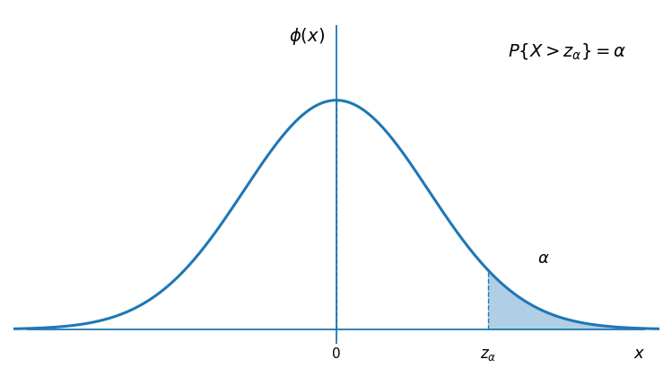
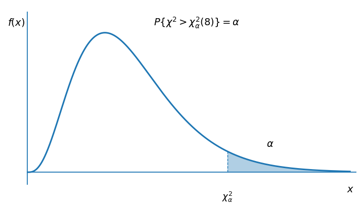
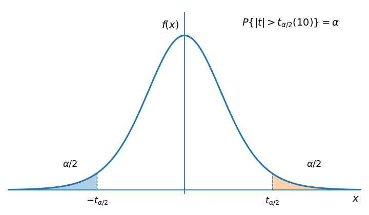
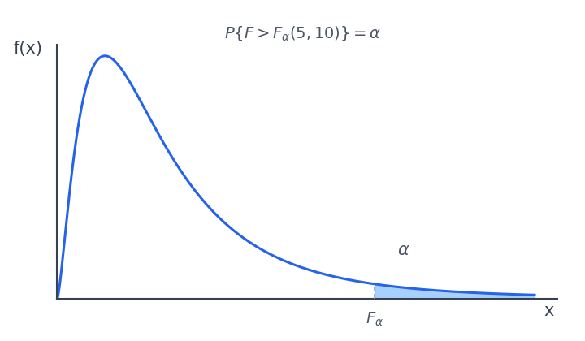

# 第 6 章 数理统计基本概念

## 6.1 随机样本与统计量

总体是研究对象的全体。总体中的每个对象称为个体；在数理统计中，总体通常用某个具有确定分布的随机变量表示。

从总体中抽取有限个个体的过程称为抽样。设抽得的随机结果为：

$$
X_1,X_2,\cdots,X_n
$$

则称其为容量为 $n$ 的样本。

若样本满足：

- 代表性：每个 $X_i$ 与总体 $X$ 同分布；
- 独立性：$X_1,X_2,\cdots,X_n$ 相互独立；

则称 $X_1,X_2,\cdots,X_n$ 为来自总体 $X$ 的简单随机样本。

由样本构造、不含未知参数的函数称为统计量。常用统计量如下。

### 样本均值

$$
\overline{X}=\frac{1}{n}\sum_{i=1}^{n}X_i
$$

样本均值反映总体均值的样本估计。

### 样本方差

$$
S^2=\frac{1}{n-1}\sum_{i=1}^{n}(X_i-\overline{X})^2
$$

其中 $S$ 称为样本标准差或样本均方差。

### 样本矩

样本 $k$ 阶原点矩：

$$
A_k=\frac{1}{n}\sum_{i=1}^{n}X_i^k,
\qquad k=1,2,\cdots
$$

样本 $k$ 阶中心矩：

$$
B_k=\frac{1}{n}\sum_{i=1}^{n}(X_i-\overline{X})^k,
\qquad k=2,3,4,\cdots
$$

特别地：

$$
A_1=\frac{1}{n}\sum_{i=1}^{n}X_i=\overline{X}
$$

$$
B_2=\frac{1}{n}\sum_{i=1}^{n}(X_i-\overline{X})^2
=\frac{n-1}{n}S^2
$$

### 标准正态分布的上侧分位数

设 $X\sim N(0,1)$。若 $0<\alpha<1$，并且：

$$
P\{X>z_\alpha\}=\alpha
$$

则称 $z_\alpha$ 为标准正态分布的上侧 $\alpha$ 分位数。

由对称性可得：

$$
z_{1-\alpha}=-z_\alpha
$$

{ .fig-medium }

## 6.2 常用的分布

### $\chi^2$ 分布

设随机变量 $X_1,X_2,\cdots,X_n$ 相互独立，且：

$$
X_i\sim N(0,1),\qquad i=1,2,\cdots,n
$$

则：

$$
X=\sum_{i=1}^{n}X_i^2
$$

服从自由度为 $n$ 的$\chi^2$ 分布，记为 $X\sim \chi^2(n)$。自由度表示独立标准正态随机变量的个数。

密度函数：

$$
f(x)=
\begin{cases}
\dfrac{1}{2^{n/2}\Gamma(n/2)}x^{n/2-1}e^{-x/2},& x>0,\\
0,& x\le0.
\end{cases}
$$

其中：

$$
\Gamma(\alpha)=\int_0^{+\infty}t^{\alpha-1}e^{-t}\,\mathrm{d}t
$$

Gamma 函数常用值：

$$
\Gamma(\alpha+1)=\alpha\Gamma(\alpha),\qquad
\Gamma(n+1)=n!,\qquad
\Gamma\left(\frac12\right)=\sqrt{\pi}
$$

上侧 $\alpha$ 分位数：

$$
\int_{\chi^2_\alpha(n)}^{+\infty}f(x)\,\mathrm{d}x=\alpha
$$

{ .fig-medium }

性质：

- 可加性：若 $Y_1\sim\chi^2(n_1)$，$Y_2\sim\chi^2(n_2)$，且 $Y_1,Y_2$ 相互独立，则 $Y_1+Y_2\sim\chi^2(n_1+n_2)$。
- 数字特征：若 $Y\sim\chi^2(n)$，则 $E(Y)=n$，$\operatorname{Var}(Y)=2n$。
- 大样本近似：若 $n$ 足够大，则 $\chi^2(n)\approx N(n,2n)$。

### $t$ 分布

设：

$$
X\sim N(0,1),\qquad Y\sim\chi^2(n)
$$

且 $X,Y$ 相互独立，则：

$$
t=\frac{X}{\sqrt{Y/n}}
$$

服从自由度为 $n$ 的$t$ 分布，记为 $t\sim t(n)$。

密度函数：

$$
f(t)=
\frac{\Gamma\left(\frac{n+1}{2}\right)}
{\sqrt{n\pi}\,\Gamma\left(\frac{n}{2}\right)}
\left(1+\frac{t^2}{n}\right)^{-\frac{n+1}{2}},
\qquad -\infty<t<+\infty
$$

上侧 $\alpha$ 分位数：

$$
\int_{t_\alpha(n)}^{+\infty}f(t)\,\mathrm{d}t=\alpha
$$

{ .fig-medium }

性质：

- 极限关系：$\displaystyle \lim_{n\to\infty}f(t)=\frac{1}{\sqrt{2\pi}}e^{-t^2/2}=\varphi(t)$。
- 数字特征：若 $X\sim t(n)$，则 $E(X)=0$，$\displaystyle \operatorname{Var}(X)=\frac{n}{n-2}\ (n>2)$。
- 对称性：$t_{1-\alpha}(n)=-t_\alpha(n)$。
- 大样本近似：当 $n$ 充分大时，$t_\alpha(n)\approx z_\alpha$，$t(n)\approx N(0,1)$。

### $F$ 分布

设：

$$
X\sim\chi^2(n_1),\qquad Y\sim\chi^2(n_2)
$$

且 $X,Y$ 相互独立，则：

$$
F=\frac{X/n_1}{Y/n_2}
$$

服从自由度为 $(n_1,n_2)$ 的$F$ 分布，记为 $F\sim F(n_1,n_2)$。其中 $n_1$ 为第一自由度，$n_2$ 为第二自由度。

上侧 $\alpha$ 分位数：

$$
\int_{F_\alpha(n_1,n_2)}^{+\infty}f(x)\,\mathrm{d}x=\alpha
$$

{ .fig-medium }

性质：

- 倒数性质：若 $F\sim F(n_1,n_2)$，则 $\displaystyle \frac{1}{F}\sim F(n_2,n_1)$。
- 与 $t$ 分布关系：若 $t\sim t(n)$，则 $t^2\sim F(1,n)$。
- 分位数关系：$\displaystyle \left[t_{\alpha/2}(n)\right]^2=F_\alpha(1,n)$。
- 互补分位数：$\displaystyle F_{1-\alpha}(n_1,n_2)=\frac{1}{F_\alpha(n_2,n_1)}$。

## 6.3 正态总体下的抽样分布

设 $X_1,X_2,\cdots,X_n$ 是来自总体 $N(\mu,\sigma^2)$ 的样本，样本均值与样本方差分别为 $\overline{X}$ 和 $S^2$。

### 单个正态总体

抽样分布结论：

- 样本均值：$\displaystyle \overline{X}\sim N\left(\mu,\frac{\sigma^2}{n}\right)$。
- 标准化样本均值：$\displaystyle \frac{\overline{X}-\mu}{\sigma/\sqrt n}\sim N(0,1)$。
- 样本方差：$\displaystyle \frac{(n-1)S^2}{\sigma^2}\sim \chi^2(n-1)$。
- 独立性：$\overline{X}$ 与 $S^2$ 相互独立。
- 方差未知时：$\displaystyle \frac{\overline{X}-\mu}{S/\sqrt n}\sim t(n-1)$。

### 两个正态总体

设：

$$
X_1,\cdots,X_{n_1}\sim N(\mu_1,\sigma_1^2)
$$

$$
Y_1,\cdots,Y_{n_2}\sim N(\mu_2,\sigma_2^2)
$$

两个样本相互独立，样本方差分别为 $S_1^2,S_2^2$。

抽样分布结论：

- 方差比：$\displaystyle F=\frac{S_1^2/\sigma_1^2}{S_2^2/\sigma_2^2}\sim F(n_1-1,n_2-1)$

- $\sigma_1^2,\sigma_2^2$ 已知时：$\displaystyle \frac{(\overline{X}-\overline{Y})-(\mu_1-\mu_2)}{\sqrt{\dfrac{\sigma_1^2}{n_1}+\dfrac{\sigma_2^2}{n_2}}}\sim N(0,1)$

若 $\sigma_1^2=\sigma_2^2=\sigma^2$ 未知，则使用合并样本方差：

$$
S_w^2=
\frac{(n_1-1)S_1^2+(n_2-1)S_2^2}
{n_1+n_2-2}
$$

其中：

$$
S_w=\sqrt{S_w^2}
$$

此时：

$$
\frac{(\overline{X}-\overline{Y})-(\mu_1-\mu_2)}
{S_w\sqrt{\dfrac{1}{n_1}+\dfrac{1}{n_2}}}
\sim t(n_1+n_2-2)
$$
