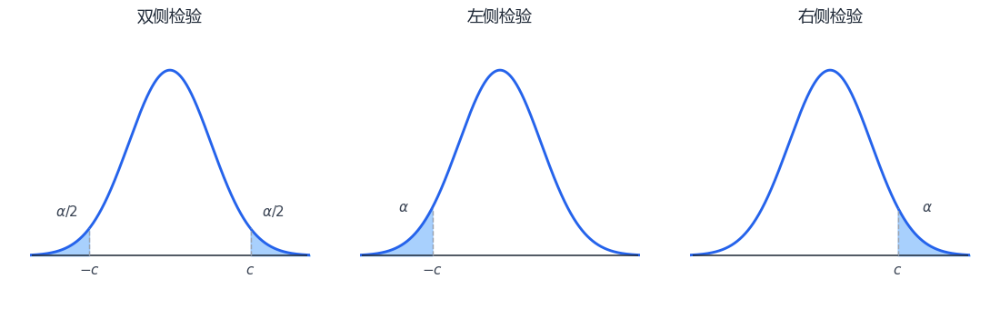

# 第 8 章 假设检验

## 8.1 假设检验基本思想

假设检验用样本判断原假设 $H_0$ 是否应被拒绝。检验统计量记为：

$$
T=T(X_1,\cdots,X_n)
$$

拒绝 $H_0$ 的样本值范围称为拒绝域，记为 $W$；其补集 $\overline W$ 为接受域。

两类错误：

| 错误 | 含义 | 概率 |
| --- | --- | --- |
| 第一类错误 | $H_0$ 为真却拒绝 $H_0$ | $\alpha=P\{\text{拒绝 }H_0\mid H_0\text{ 为真}\}$ |
| 第二类错误 | $H_0$ 为假却接受 $H_0$ | $\beta=P\{\text{接受 }H_0\mid H_0\text{ 为假}\}$ |

显著性检验原则：先控制第一类错误 $\alpha$ 不超过给定显著性水平，再尽量减小第二类错误。若要同时减小 $\alpha$ 与 $\beta$，通常需要增大样本容量。

常见假设类型：

| 类型 | 原假设 $H_0$ | 备择假设 $H_1$ | 拒绝域方向 |
| --- | --- | --- | --- |
| 双边检验 | $\theta=\theta_0$ | $\theta\ne\theta_0$ | 两侧 |
| 左边检验 | $\theta\ge\theta_0$ | $\theta<\theta_0$ | 左侧 |
| 右边检验 | $\theta\le\theta_0$ | $\theta>\theta_0$ | 右侧 |

{ .fig-wide }

### 典型双边 $Z$ 检验

设总体 $X\sim N(\mu,\sigma^2)$，$\sigma^2$ 已知，检验：

$$
H_0:\mu=\mu_0,\qquad H_1:\mu\ne\mu_0
$$

取统计量：

$$
Z=\frac{\overline X-\mu_0}{\sigma/\sqrt n}
$$

显著性水平为 $\alpha$ 时，拒绝域为：

$$
W=\left\{
\left|
\frac{\overline X-\mu_0}{\sigma/\sqrt n}
\right|
\ge z_{\alpha/2}
\right\}
$$

### $P$ 值

$P$ 值是在 $H_0$ 为真时，检验统计量取得当前样本结果或更极端结果的概率。判别规则：

$$
P\le\alpha\Rightarrow \text{拒绝 }H_0,
\qquad
P>\alpha\Rightarrow \text{接受 }H_0
$$

常用 $P$ 值形式：

| 检验类型 | 统计量观测值 | $P$ 值 |
| --- | --- | --- |
| 双边 $Z$ 检验 | $z_0$ | $P=2[1-\Phi(\lvert z_0\lvert)]$ |
| 左边 $Z$ 检验 | $z_0$ | $P=\Phi(z_0)$ |
| 右边 $Z$ 检验 | $z_0$ | $P=1-\Phi(z_0)$ |

参数假设检验的一般步骤：

1. 写出 $H_0,H_1$。
2. 选择检验统计量，要求其在 $H_0$ 成立时分布已知。
3. 按显著性水平 $\alpha$ 确定拒绝域。
4. 代入样本值计算统计量或 $P$ 值。
5. 作出“拒绝 $H_0$”或“接受 $H_0$”的结论。

## 8.2 单个正态总体参数的假设检验

设样本来自 $N(\mu,\sigma^2)$。

### 均值 $\mu$ 的检验

| 条件 | 假设 | 统计量 | 拒绝域 |
| --- | --- | --- | --- |
| $\sigma^2$ 已知，双边 | $H_0:\mu=\mu_0,\ H_1:\mu\ne\mu_0$ | $\displaystyle Z=\frac{\overline X-\mu_0}{\sigma/\sqrt n}$ | $\lvert Z\lvert\ge z_{\alpha/2}$ |
| $\sigma^2$ 已知，左边 | $H_0:\mu\ge\mu_0,\ H_1:\mu<\mu_0$ | $\displaystyle Z=\frac{\overline X-\mu_0}{\sigma/\sqrt n}$ | $Z\le -z_\alpha$ |
| $\sigma^2$ 已知，右边 | $H_0:\mu\le\mu_0,\ H_1:\mu>\mu_0$ | $\displaystyle Z=\frac{\overline X-\mu_0}{\sigma/\sqrt n}$ | $Z\ge z_\alpha$ |
| $\sigma^2$ 未知，双边 | $H_0:\mu=\mu_0,\ H_1:\mu\ne\mu_0$ | $\displaystyle t=\frac{\overline X-\mu_0}{S/\sqrt n}$ | $\lvert t\lvert\ge t_{\alpha/2}(n-1)$ |
| $\sigma^2$ 未知，左边 | $H_0:\mu\ge\mu_0,\ H_1:\mu<\mu_0$ | $\displaystyle t=\frac{\overline X-\mu_0}{S/\sqrt n}$ | $t\le -t_\alpha(n-1)$ |
| $\sigma^2$ 未知，右边 | $H_0:\mu\le\mu_0,\ H_1:\mu>\mu_0$ | $\displaystyle t=\frac{\overline X-\mu_0}{S/\sqrt n}$ | $t\ge t_\alpha(n-1)$ |

对应 $P$ 值计算：

| 类型 | $Z$ 检验 | $t$ 检验 |
| --- | --- | --- |
| 双边 | $P=2[1-\Phi(\lvert z_0\lvert)]$ | $P=P\{\lvert t(n-1)\lvert \ge \lvert t_0\lvert\}$ |
| 左边 | $P=\Phi(z_0)$ | $P=P\{t(n-1)\le t_0\}$ |
| 右边 | $P=1-\Phi(z_0)$ | $P=P\{t(n-1)\ge t_0\}$ |

??? example "例题：单正态总体均值右边检验"

    某元件寿命服从正态分布，$\sigma^2$ 未知。样本容量 $n=16$，$\overline x=241.5$，$s=98.7259$。检验平均寿命是否大于 $225$ 小时，取 $\alpha=0.05$。

    $$
    H_0:\mu\le225,\qquad H_1:\mu>225
    $$

    取：

    $$
    t=\frac{\overline X-\mu_0}{S/\sqrt n}
    $$

    计算得：

    $$
    t_0=0.6685,\qquad t_{0.05}(15)=1.7531
    $$

    因为 $t_0<t_{0.05}(15)$，故接受 $H_0$，即不能认为平均寿命大于 $225$ 小时。

### 成对数据的 $t$ 检验

成对样本转化为差值：

$$
D_i=X_i-Y_i,\qquad \mu_D=E(D)
$$

检验：

$$
H_0:\mu_D=0,\qquad H_1:\mu_D\ne0
$$

即可转化为单个正态总体均值的 $t$ 检验：

$$
t=\frac{\overline D}{S_D/\sqrt n}\sim t(n-1)
$$

### 方差 $\sigma^2$ 的检验

当 $\mu$ 未知时，检验：

$$
H_0:\sigma^2=\sigma_0^2,\qquad H_1:\sigma^2\ne\sigma_0^2
$$

取：

$$
\chi^2=\frac{(n-1)S^2}{\sigma_0^2}
$$

双边拒绝域：

$$
\chi^2\le\chi^2_{1-\alpha/2}(n-1)
\quad 或 \quad
\chi^2\ge\chi^2_{\alpha/2}(n-1)
$$

单边检验：

| 假设 | 拒绝域 |
| --- | --- |
| $H_0:\sigma^2\ge\sigma_0^2,\ H_1:\sigma^2<\sigma_0^2$ | $\displaystyle \chi^2\le\chi^2_{1-\alpha}(n-1)$ |
| $H_0:\sigma^2\le\sigma_0^2,\ H_1:\sigma^2>\sigma_0^2$ | $\displaystyle \chi^2\ge\chi^2_{\alpha}(n-1)$ |

双边 $P$ 值：

$$
P=2\min\{P_0,1-P_0\},
\qquad
P_0=P\{\chi^2(n-1)\le\chi_0^2\}
$$

## 8.3 两个正态总体参数的假设检验

设两独立样本分别来自：

$$
N(\mu_1,\sigma_1^2),\qquad N(\mu_2,\sigma_2^2)
$$

### 均值差 $\mu_1-\mu_2$ 的检验

| 条件 | 假设 | 统计量 | 双边拒绝域 |
| --- | --- | --- | --- |
| $\sigma_1^2,\sigma_2^2$ 已知 | $H_0:\mu_1-\mu_2=\delta$ | $\displaystyle Z=\frac{\overline X-\overline Y-\delta}{\sqrt{\sigma_1^2/n_1+\sigma_2^2/n_2}}$ | $\lvert Z\lvert\ge z_{\alpha/2}$ |
| $\sigma_1^2=\sigma_2^2$ 未知 | $H_0:\mu_1-\mu_2=\delta$ | $\displaystyle t=\frac{\overline X-\overline Y-\delta}{S_w\sqrt{1/n_1+1/n_2}}$ | $\lvert t\lvert\ge t_{\alpha/2}(n_1+n_2-2)$ |

其中：

$$
S_w^2=\frac{(n_1-1)S_1^2+(n_2-1)S_2^2}{n_1+n_2-2}
$$

单边拒绝域按备择假设方向改为左侧或右侧。例如：

| 备择假设 | $t$ 检验拒绝域 |
| --- | --- |
| $H_1:\mu_1-\mu_2>\delta$ | $\displaystyle t\ge t_\alpha(n_1+n_2-2)$ |
| $H_1:\mu_1-\mu_2<\delta$ | $\displaystyle t\le -t_\alpha(n_1+n_2-2)$ |

### 方差比 $\sigma_1^2/\sigma_2^2$ 的检验

检验：

$$
H_0:\sigma_1^2=\sigma_2^2,\qquad H_1:\sigma_1^2\ne\sigma_2^2
$$

取统计量：

$$
F=\frac{S_1^2}{S_2^2}\sim F(n_1-1,n_2-1)
\quad (H_0\text{ 成立时})
$$

双边拒绝域：

$$
F\le F_{1-\alpha/2}(n_1-1,n_2-1)
\quad 或 \quad
F\ge F_{\alpha/2}(n_1-1,n_2-1)
$$

单边拒绝域：

| 假设 | 拒绝域 |
| --- | --- |
| $H_0:\sigma_1^2\ge\sigma_2^2,\ H_1:\sigma_1^2<\sigma_2^2$ | $\displaystyle F\le F_{1-\alpha}(n_1-1,n_2-1)$ |
| $H_0:\sigma_1^2\le\sigma_2^2,\ H_1:\sigma_1^2>\sigma_2^2$ | $\displaystyle F\ge F_{\alpha}(n_1-1,n_2-1)$ |

双边 $P$ 值：

$$
P=2\min\{P_0,1-P_0\},
\qquad
P_0=P\{F(n_1-1,n_2-1)\le f_0\}
$$

## 8.4 假设检验与区间估计

双侧置信区间与双边假设检验可以互相对应。若检验：

$$
H_0:\theta=\theta_0,\qquad H_1:\theta\ne\theta_0
$$

显著性水平为 $\alpha$，则接受域等价于置信水平 $1-\alpha$ 的置信区间。

判断规则：

$$
\theta_0\in(\hat\theta_L,\hat\theta_U)
\Rightarrow
\text{接受 }H_0
$$

$$
\theta_0\notin(\hat\theta_L,\hat\theta_U)
\Rightarrow
\text{拒绝 }H_0
$$

换言之，把原假设成立时的参数值代入置信区间判断即可。

## 8.5 拟合优度检验

拟合优度检验用于判断总体分布函数是否为给定形式：

$$
H_0:X\text{ 的分布函数为 }F(x),
\qquad
H_1:X\text{ 的分布函数不是 }F(x)
$$

当 $F(x)$ 含未知参数时，应先用样本求极大似然估计。

### 皮尔逊 $\chi^2$ 检验

步骤：

1. 将样本空间分成 $k$ 个两两不相交的子集 $A_1,\cdots,A_k$。
2. 记 $n_i$ 为落入 $A_i$ 的观测频数，$n_1+\cdots+n_k=n$。
3. 在 $H_0$ 成立时，计算理论概率 $p_i=P_{H_0}(A_i)$，理论频数为 $np_i$。
4. 构造统计量：

$$
\chi^2
=\sum_{i=1}^{k}\frac{(n_i-np_i)^2}{np_i}
=\sum_{i=1}^{k}\frac{n_i^2}{np_i}-n
$$

若 $n$ 充分大且 $np_i\ge5$，在 $H_0$ 成立时：

$$
\chi^2\overset{\cdot}{\sim}\chi^2(k-1)
$$

拒绝域为：

$$
\chi^2\ge\chi^2_{\alpha}(k-1)
$$

若 $F(x)$ 中有 $r$ 个未知参数并先由样本估计，则自由度减少为：

$$
\chi^2\overset{\cdot}{\sim}\chi^2(k-r-1),
\qquad
拒绝域:\ \chi^2\ge\chi^2_\alpha(k-r-1)
$$
